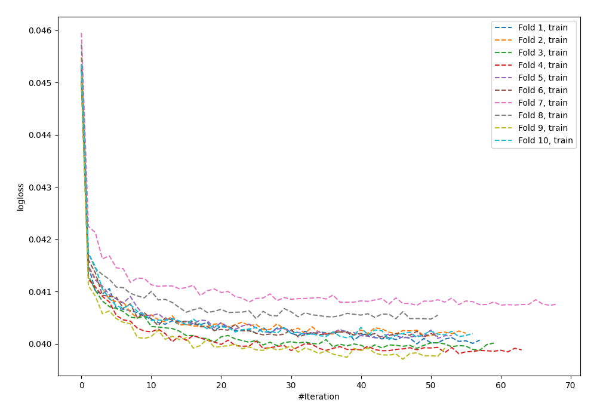
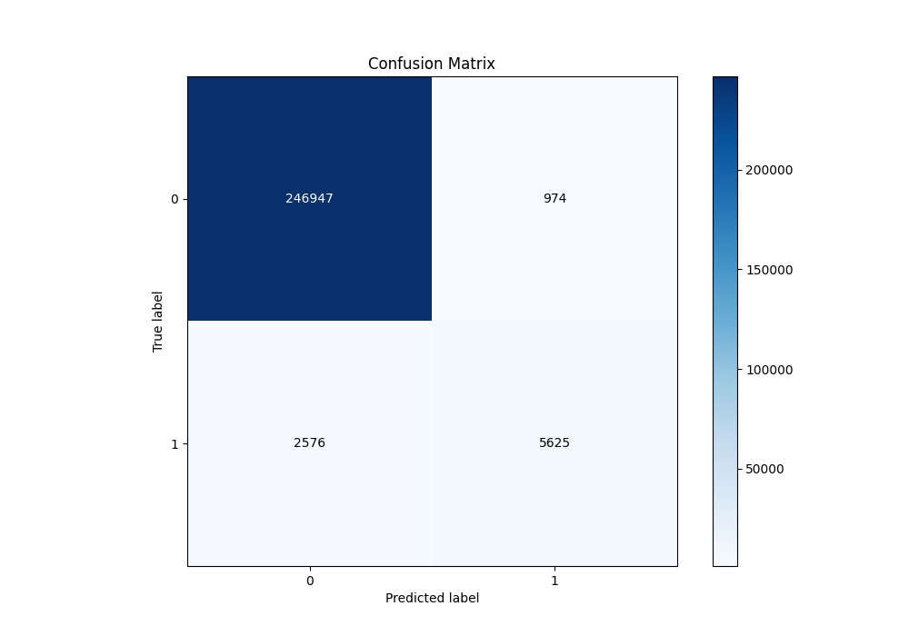
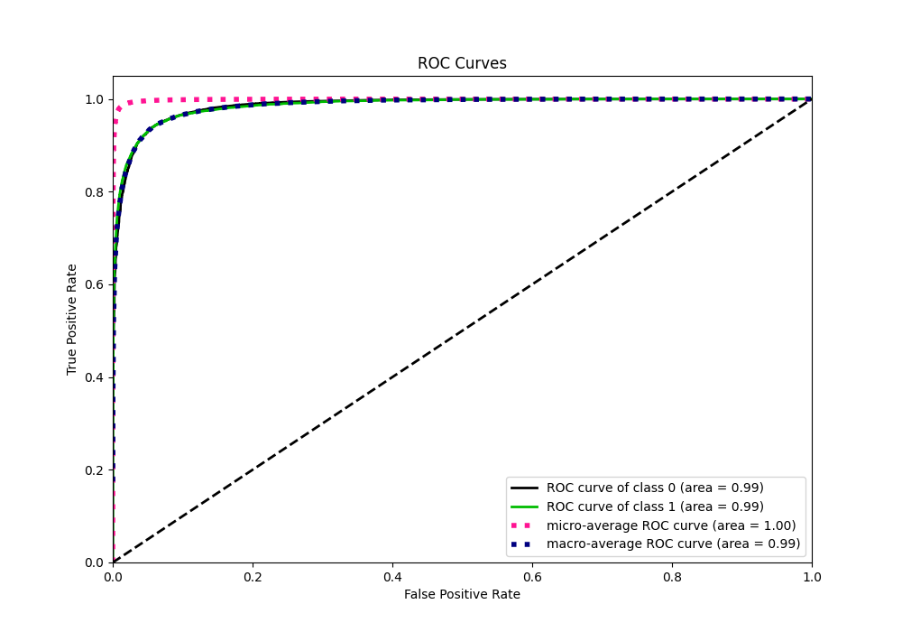
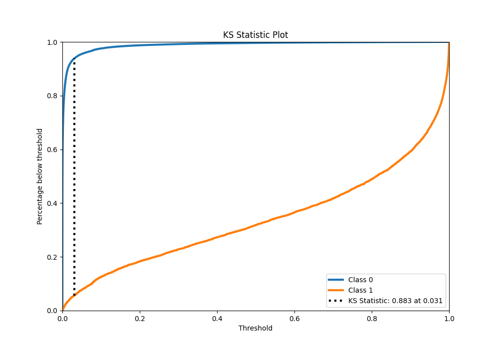
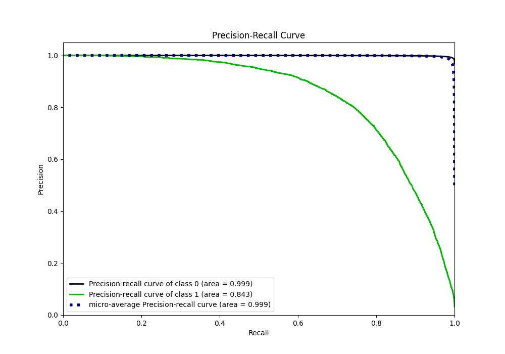
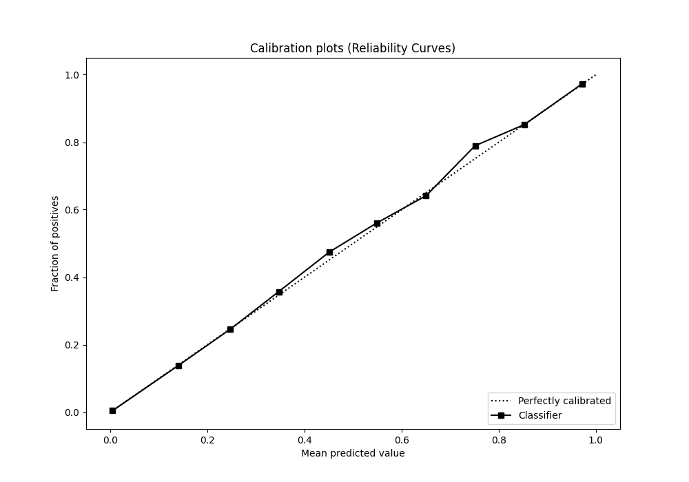
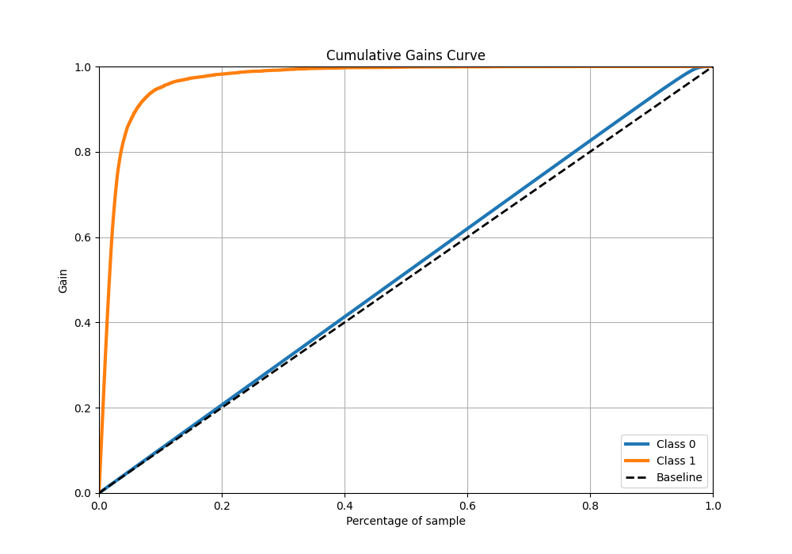
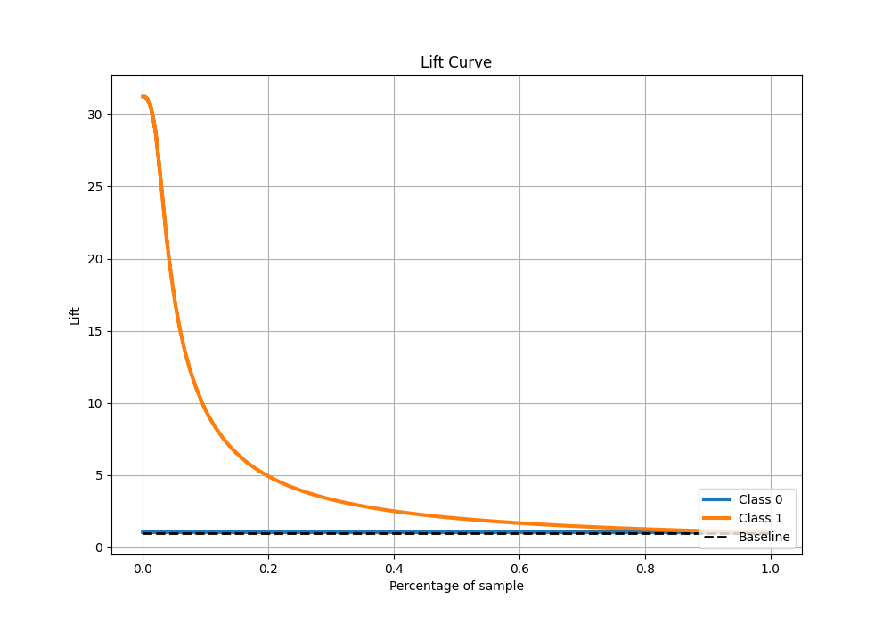

# Summary of 59_NeuralNetwork

[<< Go back](../README.md)

## Neural Network
- **n_jobs**: -1
- **dense_1_size**: 64
- **dense_2_size**: 16
- **learning_rate**: 0.01
- **explain_level**: 0

## Validation
 - **validation_type**: kfold
 - **shuffle**: True
 - **stratify**: True
 - **k_folds**: 10

## Optimized metric
f1

## Training time

529.5 seconds

## Metric details
|           |     score |     threshold |
|:----------|----------:|--------------:|
| logloss   | 0.0404888 | nan           |
| auc       | 0.985733  | nan           |
| f1        | 0.760135  |   0.492218    |
| accuracy  | 0.986139  |   0.492218    |
| precision | 0.852402  |   0.492218    |
| recall    | 1         |   2.58174e-11 |
| mcc       | 0.757804  |   0.492218    |

## Metric details with threshold from accuracy metric
|           |     score |   threshold |
|:----------|----------:|------------:|
| logloss   | 0.0404888 |  nan        |
| auc       | 0.985733  |  nan        |
| f1        | 0.760135  |    0.492218 |
| accuracy  | 0.986139  |    0.492218 |
| precision | 0.852402  |    0.492218 |
| recall    | 0.685892  |    0.492218 |
| mcc       | 0.757804  |    0.492218 |

## Confusion matrix (at threshold=0.492218)
|              |   Predicted as 0 |   Predicted as 1 |
|:-------------|-----------------:|-----------------:|
| Labeled as 0 |           246947 |              974 |
| Labeled as 1 |             2576 |             5625 |

## Learning curves

## Confusion Matrix

## Normalized Confusion Matrix

## ROC Curve

## Kolmogorov-Smirnov Statistic

## Precision-Recall Curve

## Calibration Curve

## Cumulative Gains Curve

## Lift Curve

[<< Go back](../README.md)
