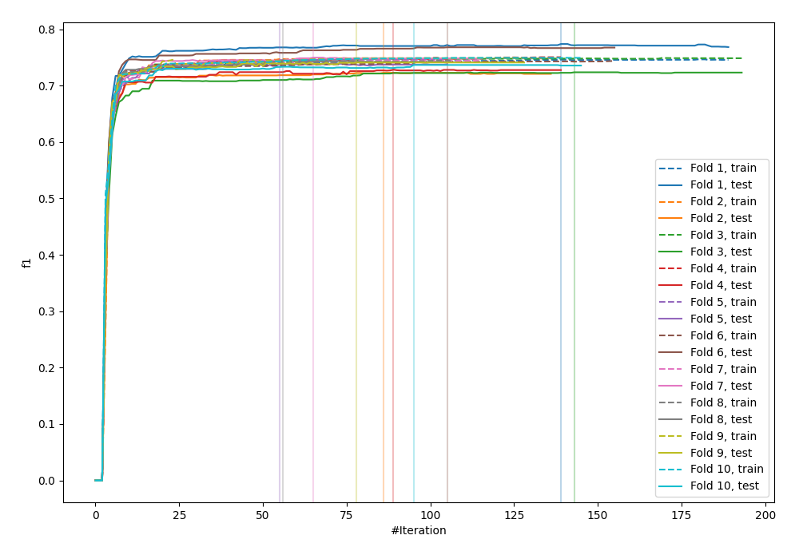
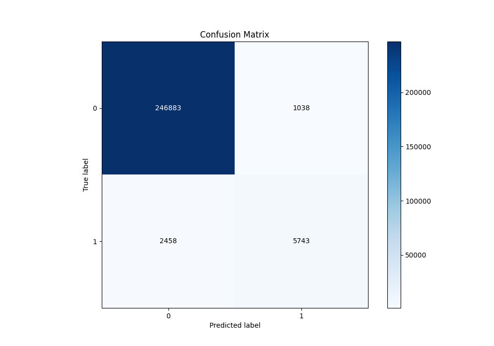
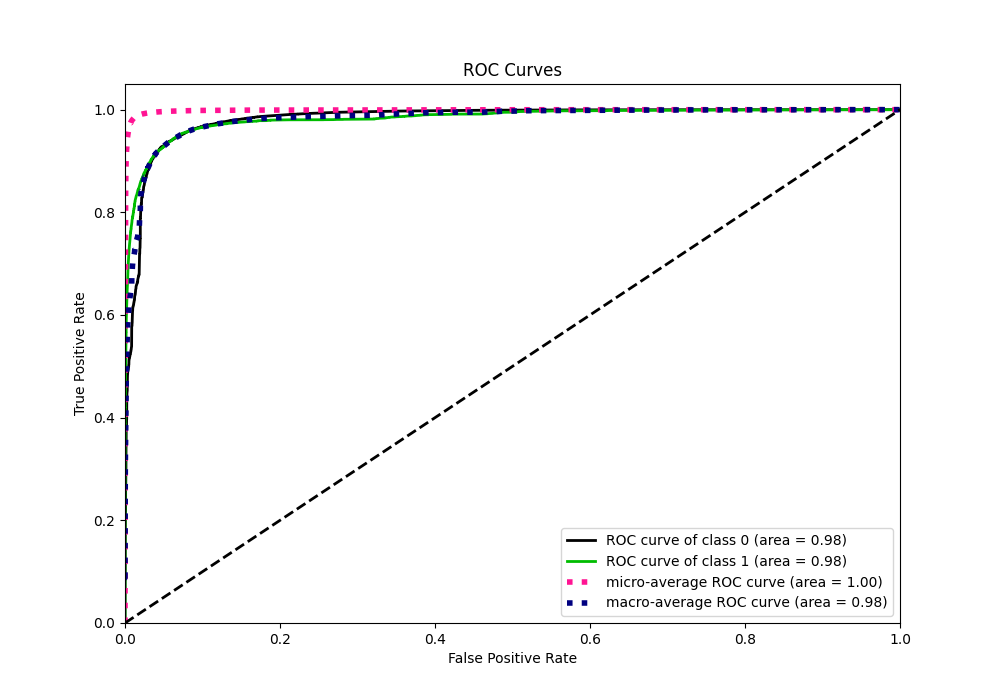
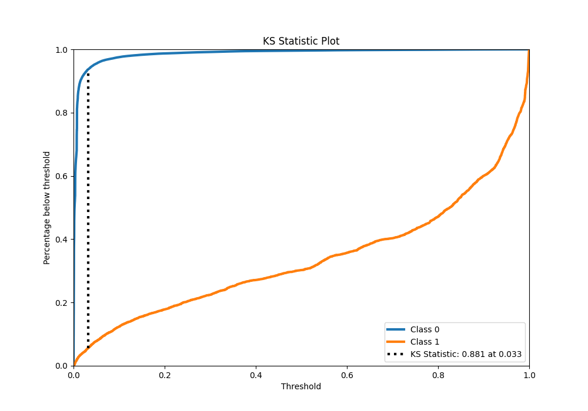
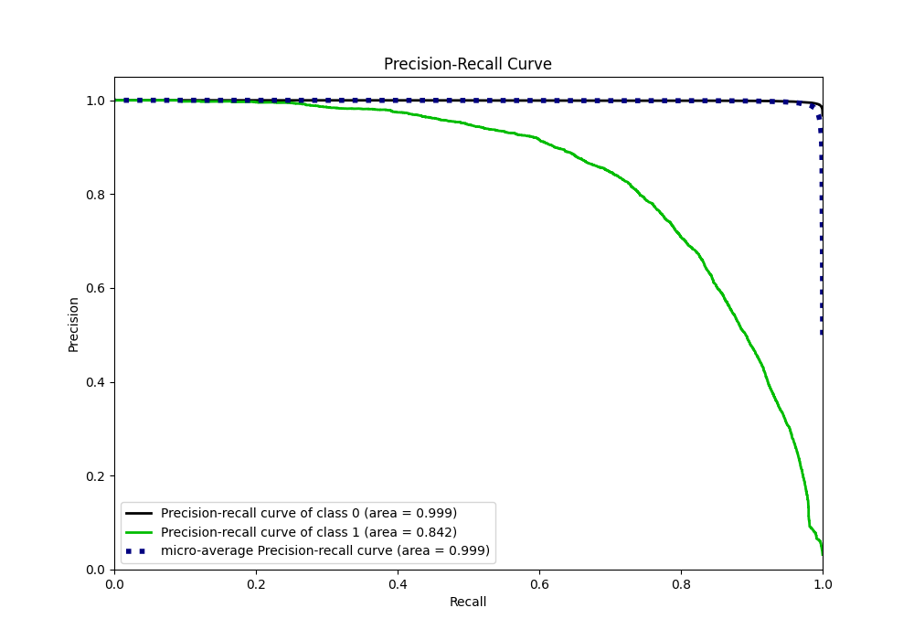
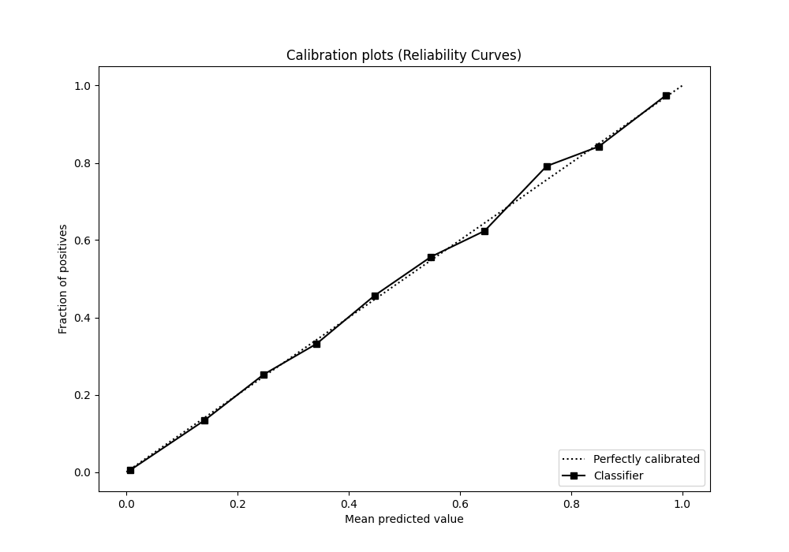
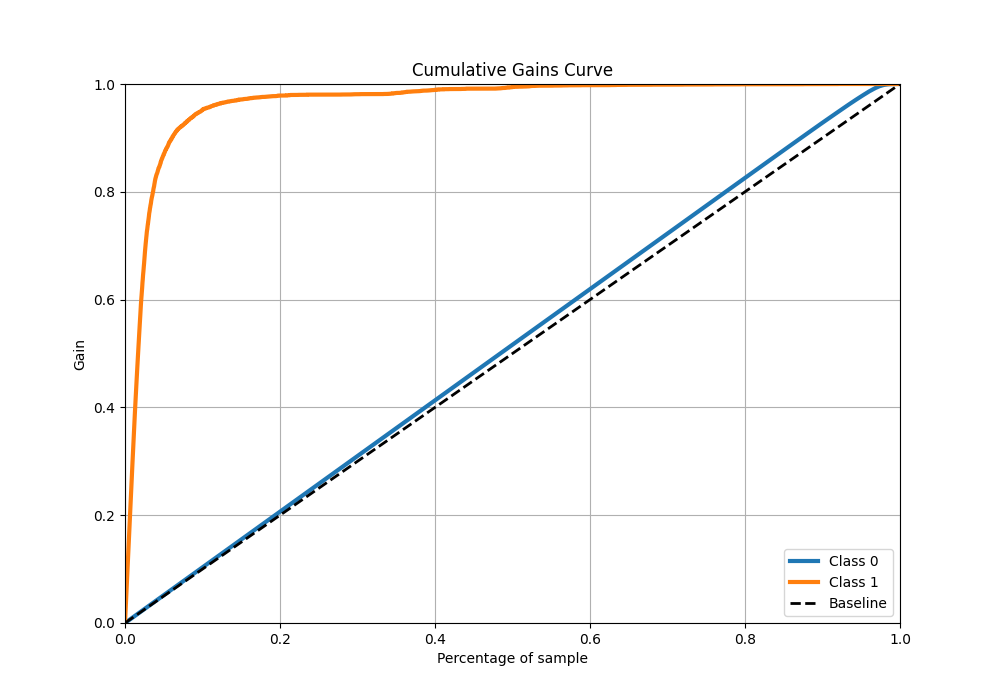
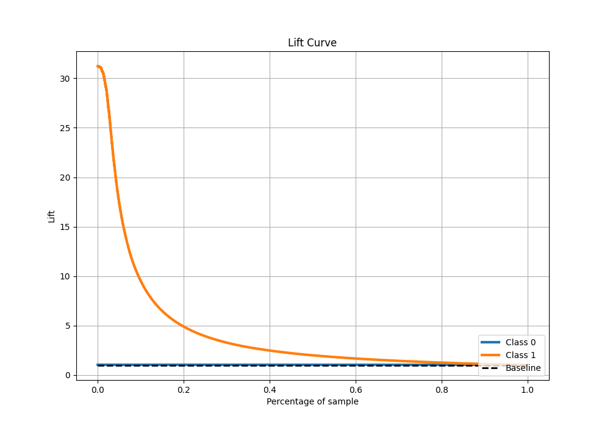

# Summary of 5_Default_Xgboost

[<< Go back](../README.md)

## Extreme Gradient Boosting (Xgboost)
- **n_jobs**: -1
- **objective**: binary:logistic
- **eta**: 0.075
- **max_depth**: 6
- **min_child_weight**: 1
- **subsample**: 1.0
- **colsample_bytree**: 1.0
- **eval_metric**: f1
- **explain_level**: 0

## Validation
 - **validation_type**: kfold
 - **shuffle**: True
 - **stratify**: True
 - **k_folds**: 10

## Optimized metric
f1

## Training time

216.9 seconds

## Metric details
|           |     score |     threshold |
|:----------|----------:|--------------:|
| logloss   | 0.0417719 | nan           |
| auc       | 0.982483  | nan           |
| f1        | 0.766653  |   0.487384    |
| accuracy  | 0.98635   |   0.487384    |
| precision | 0.846925  |   0.487384    |
| recall    | 1         |   2.69339e-05 |
| mcc       | 0.763333  |   0.487384    |

## Metric details with threshold from accuracy metric
|           |     score |   threshold |
|:----------|----------:|------------:|
| logloss   | 0.0417719 |  nan        |
| auc       | 0.982483  |  nan        |
| f1        | 0.766653  |    0.487384 |
| accuracy  | 0.98635   |    0.487384 |
| precision | 0.846925  |    0.487384 |
| recall    | 0.70028   |    0.487384 |
| mcc       | 0.763333  |    0.487384 |

## Confusion matrix (at threshold=0.487384)
|              |   Predicted as 0 |   Predicted as 1 |
|:-------------|-----------------:|-----------------:|
| Labeled as 0 |           246883 |             1038 |
| Labeled as 1 |             2458 |             5743 |

## Learning curves

## Confusion Matrix

## Normalized Confusion Matrix

## ROC Curve

## Kolmogorov-Smirnov Statistic

## Precision-Recall Curve

## Calibration Curve

## Cumulative Gains Curve

## Lift Curve

[<< Go back](../README.md)
