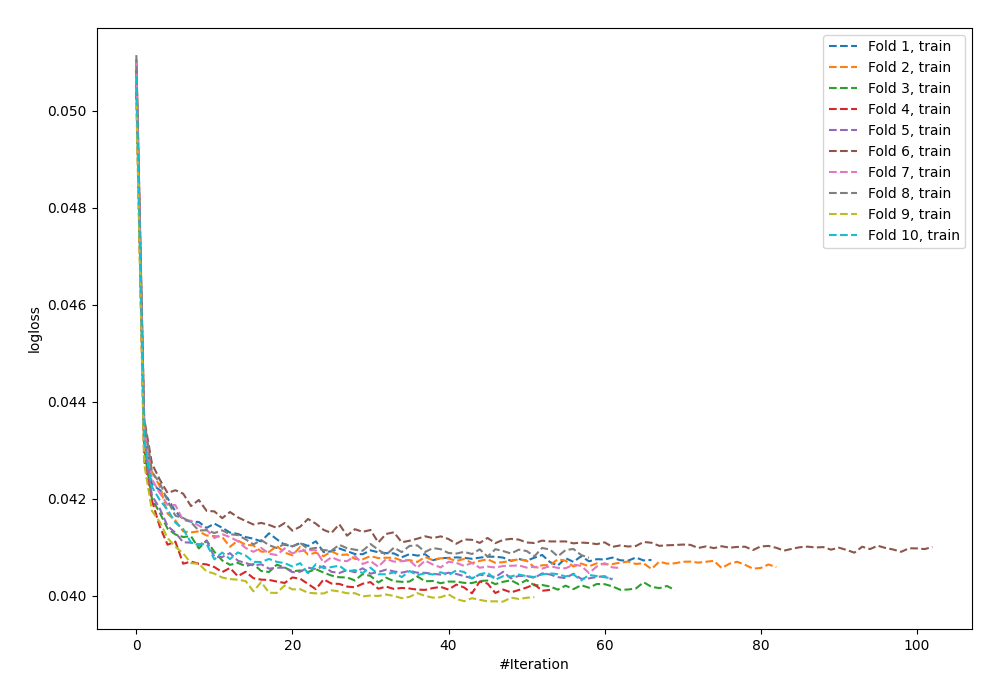
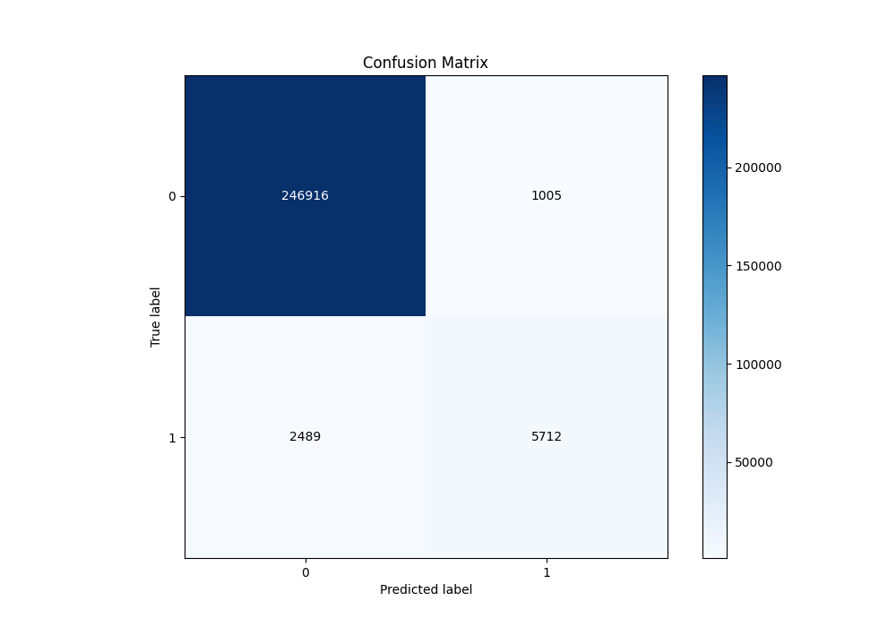
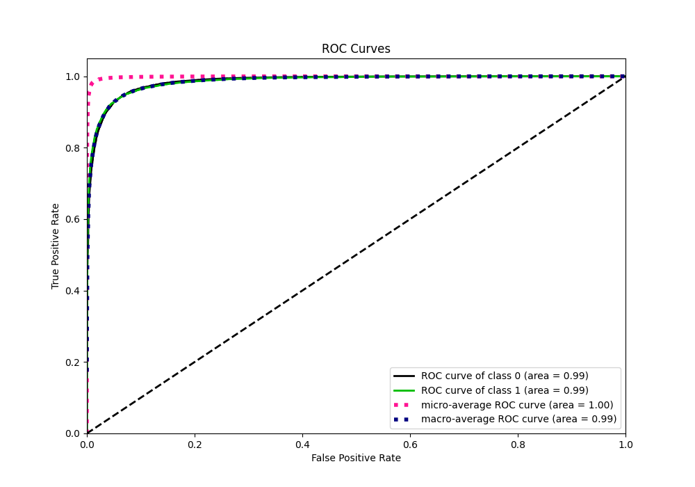
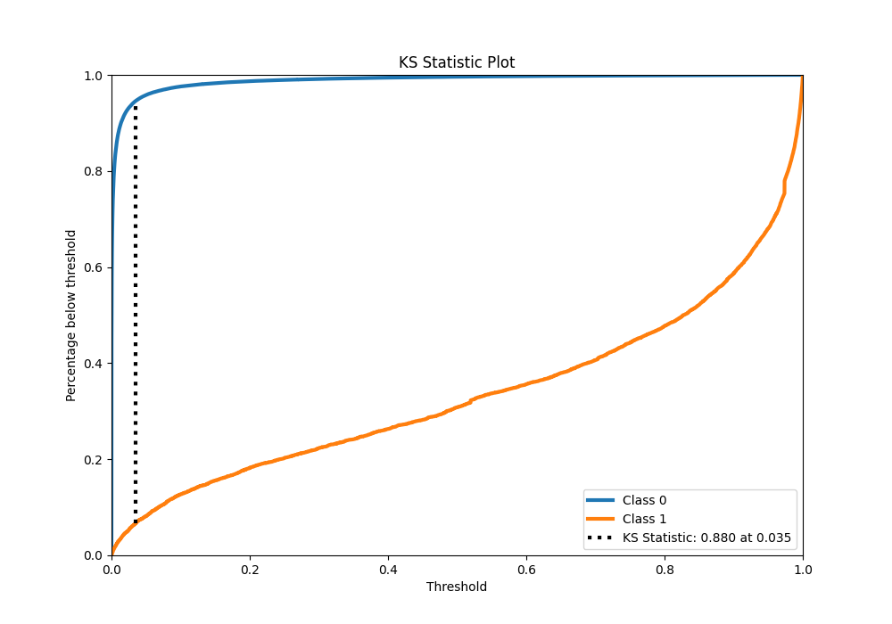
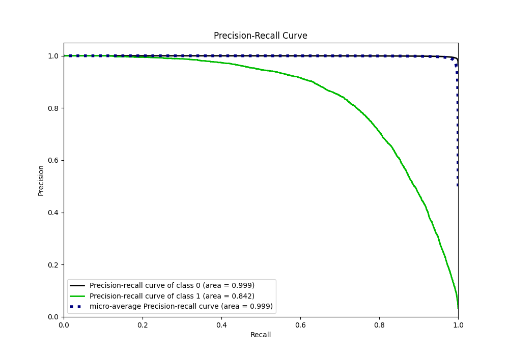
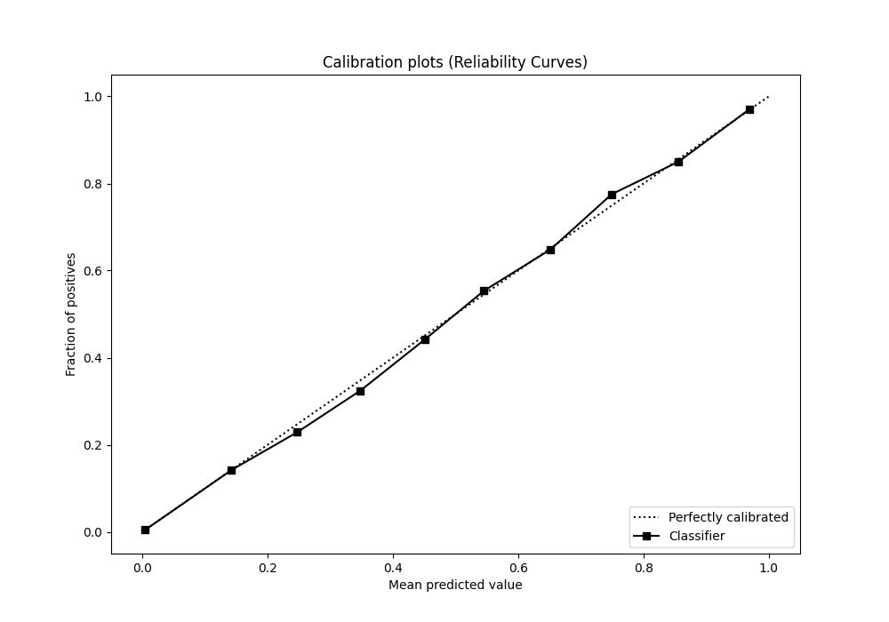
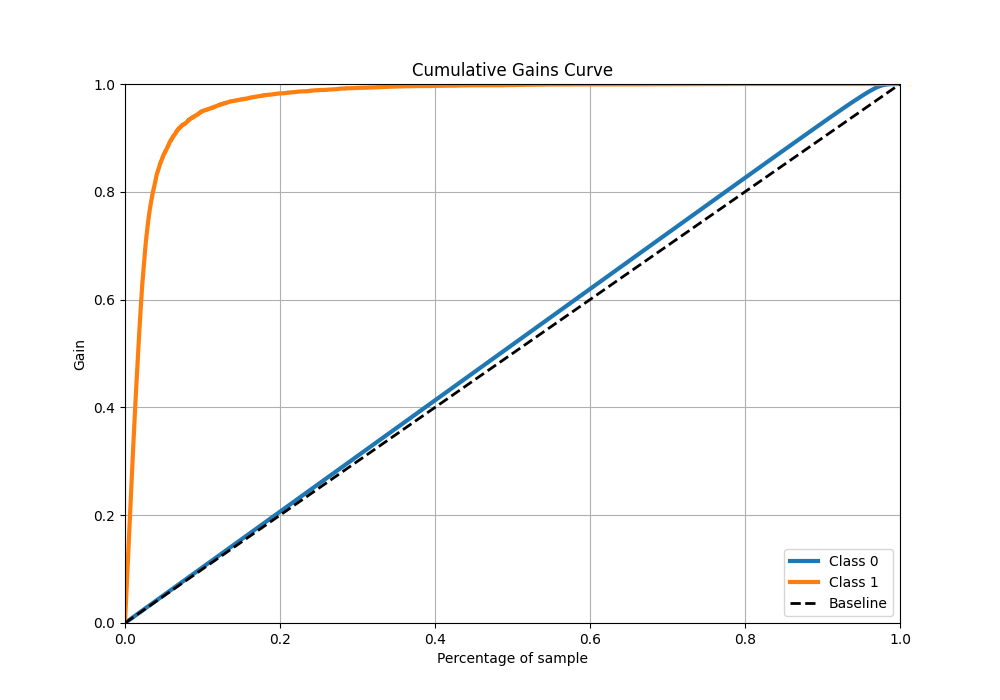
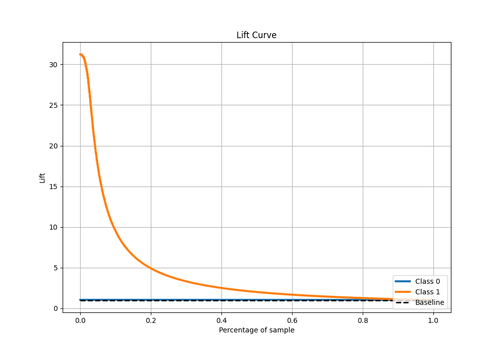

# Summary of 60_NeuralNetwork

[<< Go back](../README.md)

## Neural Network
- **n_jobs**: -1
- **dense_1_size**: 64
- **dense_2_size**: 4
- **learning_rate**: 0.01
- **explain_level**: 0

## Validation
 - **validation_type**: kfold
 - **shuffle**: True
 - **stratify**: True
 - **k_folds**: 10

## Optimized metric
f1

## Training time

517.6 seconds

## Metric details
|           |     score |     threshold |
|:----------|----------:|--------------:|
| logloss   | 0.0406316 | nan           |
| auc       | 0.985486  | nan           |
| f1        | 0.765786  |   0.491468    |
| accuracy  | 0.986358  |   0.491468    |
| precision | 0.85038   |   0.491468    |
| recall    | 1         |   7.90394e-11 |
| mcc       | 0.762845  |   0.491468    |

## Metric details with threshold from accuracy metric
|           |     score |   threshold |
|:----------|----------:|------------:|
| logloss   | 0.0406316 |  nan        |
| auc       | 0.985486  |  nan        |
| f1        | 0.765786  |    0.491468 |
| accuracy  | 0.986358  |    0.491468 |
| precision | 0.85038   |    0.491468 |
| recall    | 0.6965    |    0.491468 |
| mcc       | 0.762845  |    0.491468 |

## Confusion matrix (at threshold=0.491468)
|              |   Predicted as 0 |   Predicted as 1 |
|:-------------|-----------------:|-----------------:|
| Labeled as 0 |           246916 |             1005 |
| Labeled as 1 |             2489 |             5712 |

## Learning curves

## Confusion Matrix

## Normalized Confusion Matrix

## ROC Curve

## Kolmogorov-Smirnov Statistic

## Precision-Recall Curve

## Calibration Curve

## Cumulative Gains Curve

## Lift Curve

[<< Go back](../README.md)
