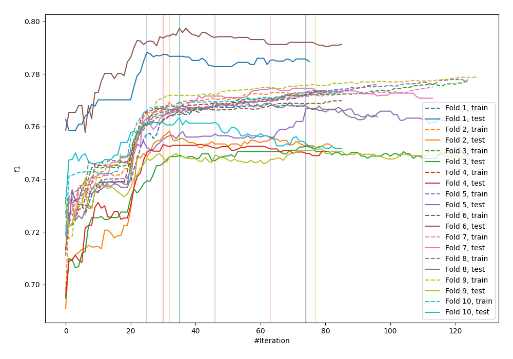
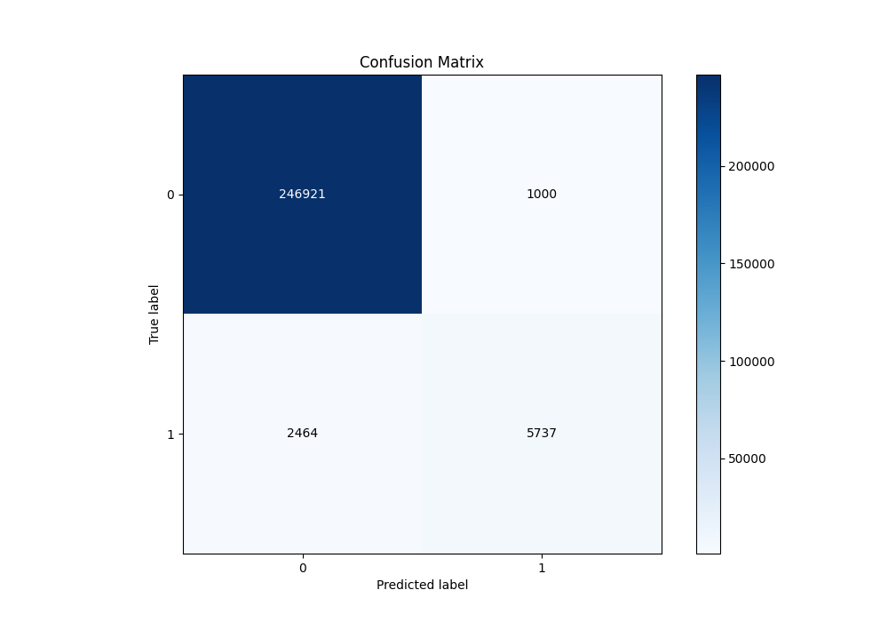
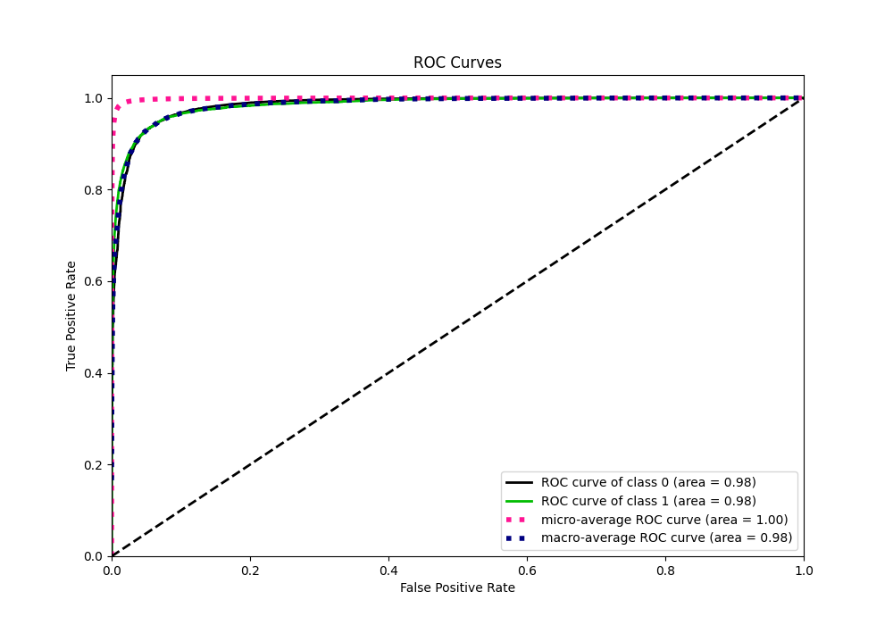
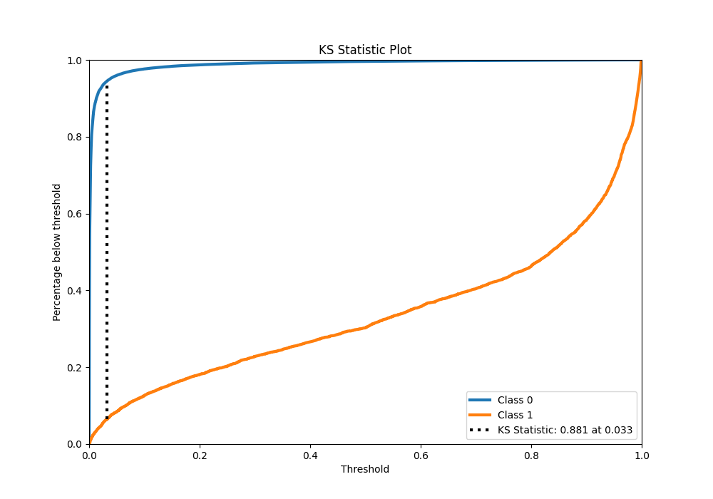
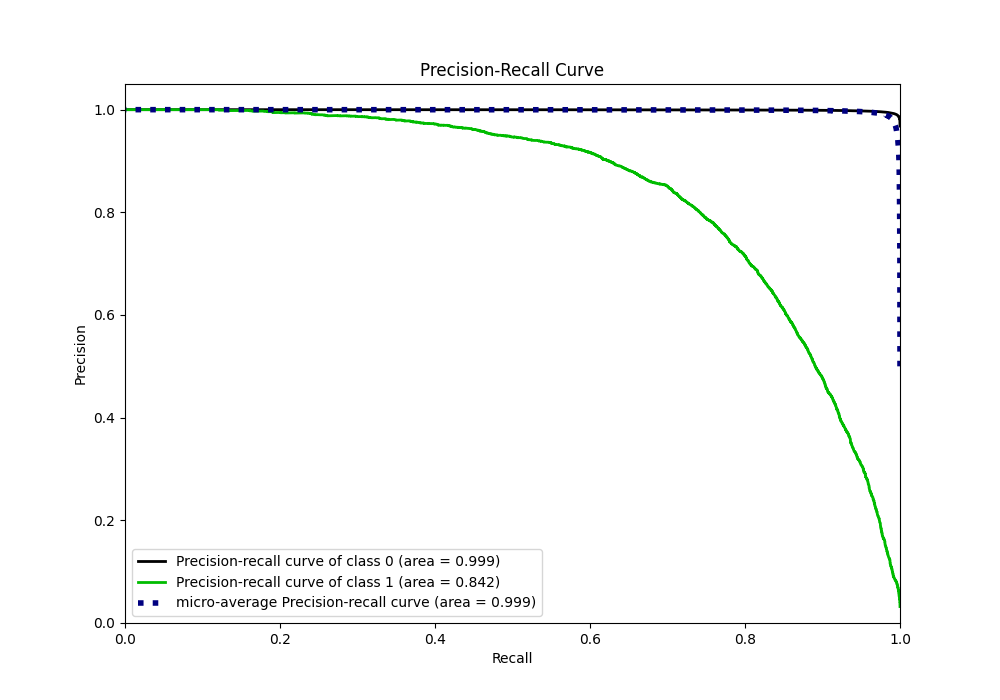
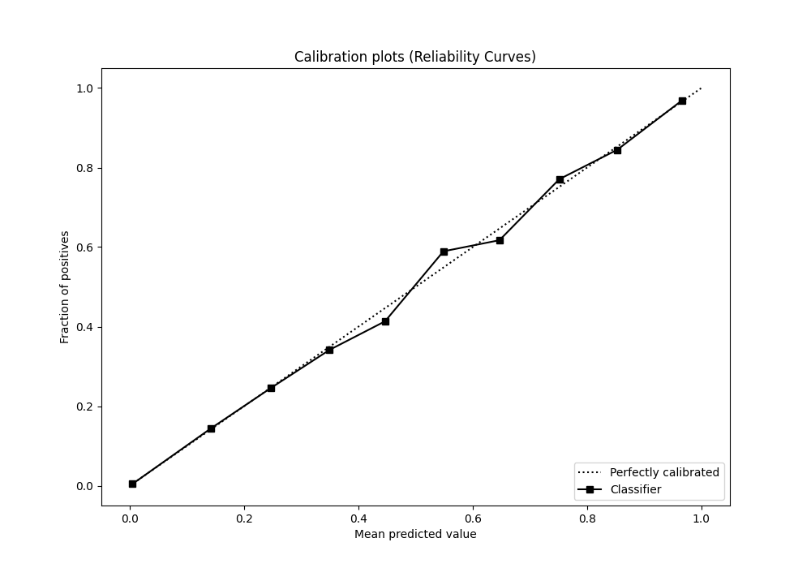
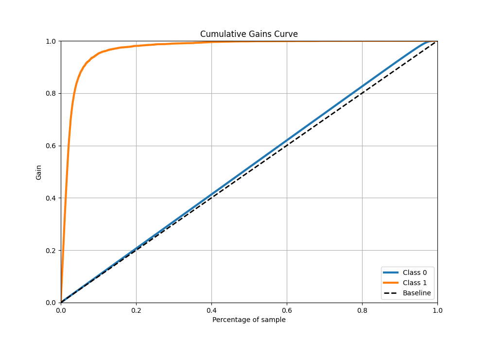
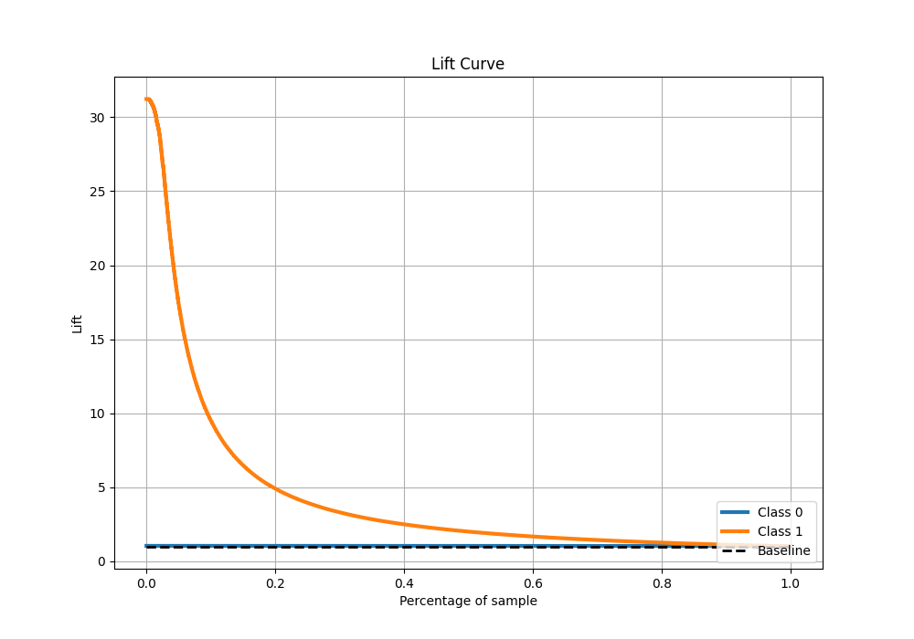

# Summary of 61_CatBoost

[<< Go back](../README.md)

## CatBoost
- **n_jobs**: -1
- **learning_rate**: 0.2
- **depth**: 7
- **rsm**: 1.0
- **loss_function**: Logloss
- **eval_metric**: F1
- **explain_level**: 0

## Validation
 - **validation_type**: kfold
 - **shuffle**: True
 - **stratify**: True
 - **k_folds**: 10

## Optimized metric
f1

## Training time

127.3 seconds

## Metric details
|           |     score |   threshold |
|:----------|----------:|------------:|
| logloss   | 0.0407597 | nan         |
| auc       | 0.984859  | nan         |
| f1        | 0.768108  |   0.492475  |
| accuracy  | 0.986475  |   0.492475  |
| precision | 0.851566  |   0.492475  |
| recall    | 1         |   3.212e-06 |
| mcc       | 0.765118  |   0.492475  |

## Metric details with threshold from accuracy metric
|           |     score |   threshold |
|:----------|----------:|------------:|
| logloss   | 0.0407597 |  nan        |
| auc       | 0.984859  |  nan        |
| f1        | 0.768108  |    0.492475 |
| accuracy  | 0.986475  |    0.492475 |
| precision | 0.851566  |    0.492475 |
| recall    | 0.699549  |    0.492475 |
| mcc       | 0.765118  |    0.492475 |

## Confusion matrix (at threshold=0.492475)
|              |   Predicted as 0 |   Predicted as 1 |
|:-------------|-----------------:|-----------------:|
| Labeled as 0 |           246921 |             1000 |
| Labeled as 1 |             2464 |             5737 |

## Learning curves

## Confusion Matrix

## Normalized Confusion Matrix

## ROC Curve

## Kolmogorov-Smirnov Statistic

## Precision-Recall Curve

## Calibration Curve

## Cumulative Gains Curve

## Lift Curve

[<< Go back](../README.md)
