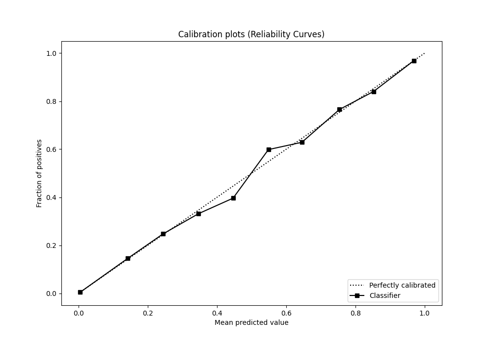

# Summary of 62_CatBoost

[<< Go back](../README.md)

## CatBoost
- **n_jobs**: -1
- **learning_rate**: 0.2
- **depth**: 9
- **rsm**: 1.0
- **loss_function**: Logloss
- **eval_metric**: F1
- **explain_level**: 0

## Validation
 - **validation_type**: kfold
 - **shuffle**: True
 - **stratify**: True
 - **k_folds**: 10

## Optimized metric
f1

## Training time

143.4 seconds

## Metric details
|           |    score |     threshold |
|:----------|---------:|--------------:|
| logloss   | 0.040664 | nan           |
| auc       | 0.98515  | nan           |
| f1        | 0.768059 |   0.492721    |
| accuracy  | 0.986448 |   0.492721    |
| precision | 0.849645 |   0.492721    |
| recall    | 1        |   1.70533e-06 |
| mcc       | 0.764894 |   0.492721    |

## Metric details with threshold from accuracy metric
|           |    score |   threshold |
|:----------|---------:|------------:|
| logloss   | 0.040664 |  nan        |
| auc       | 0.98515  |  nan        |
| f1        | 0.768059 |    0.492721 |
| accuracy  | 0.986448 |    0.492721 |
| precision | 0.849645 |    0.492721 |
| recall    | 0.700768 |    0.492721 |
| mcc       | 0.764894 |    0.492721 |

## Confusion matrix (at threshold=0.492721)
|              |   Predicted as 0 |   Predicted as 1 |
|:-------------|-----------------:|-----------------:|
| Labeled as 0 |           246904 |             1017 |
| Labeled as 1 |             2454 |             5747 |

## Learning curves

## Confusion Matrix

## Normalized Confusion Matrix

## ROC Curve

## Kolmogorov-Smirnov Statistic

## Precision-Recall Curve

## Calibration Curve

## Cumulative Gains Curve

## Lift Curve

[<< Go back](../README.md)
