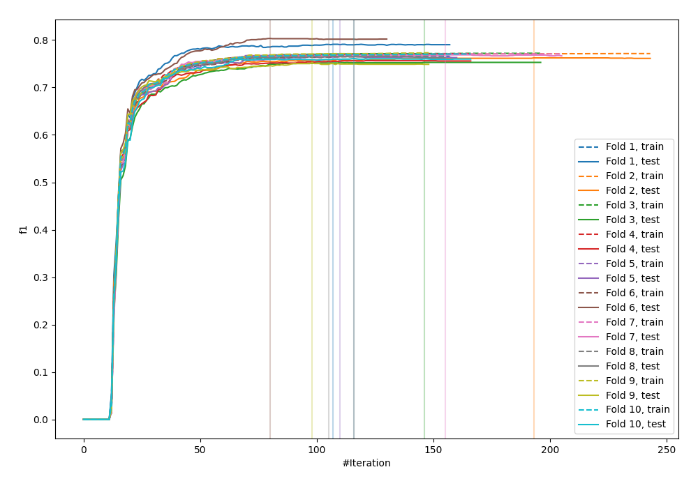
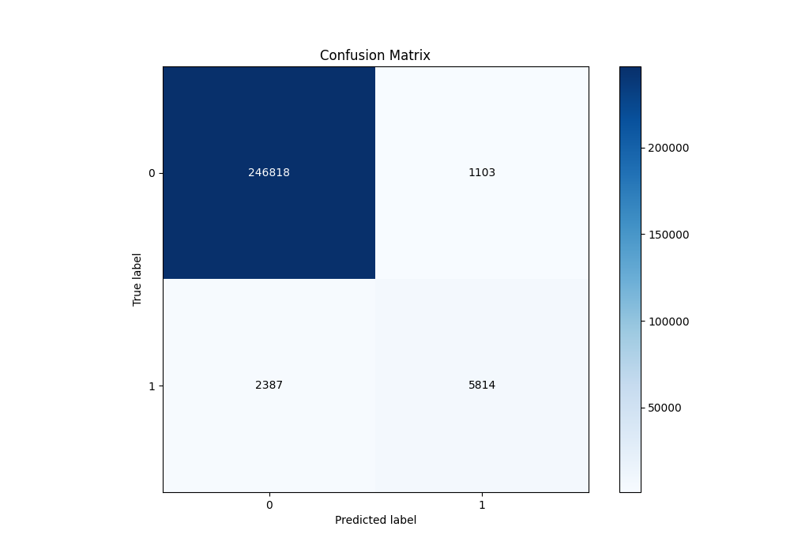
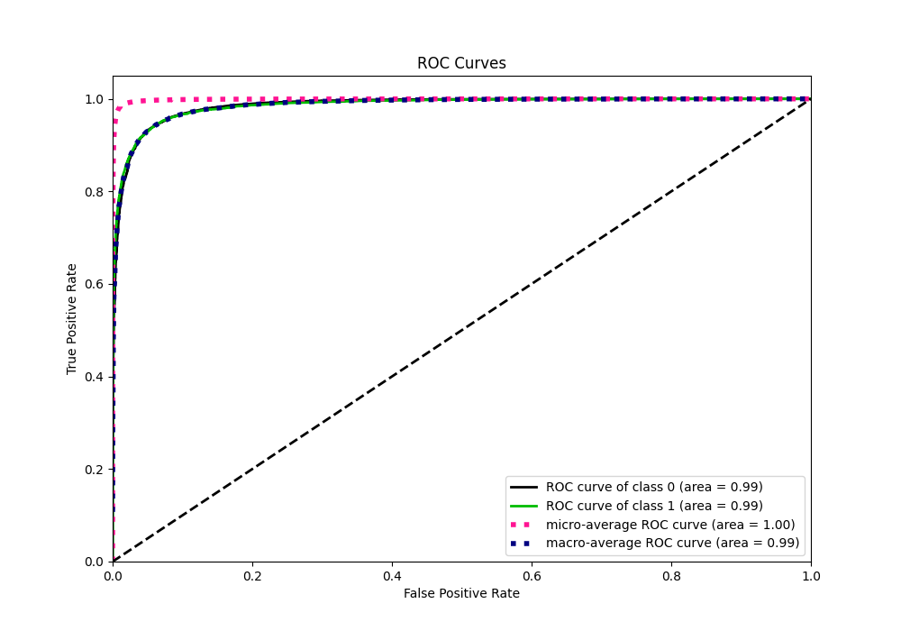
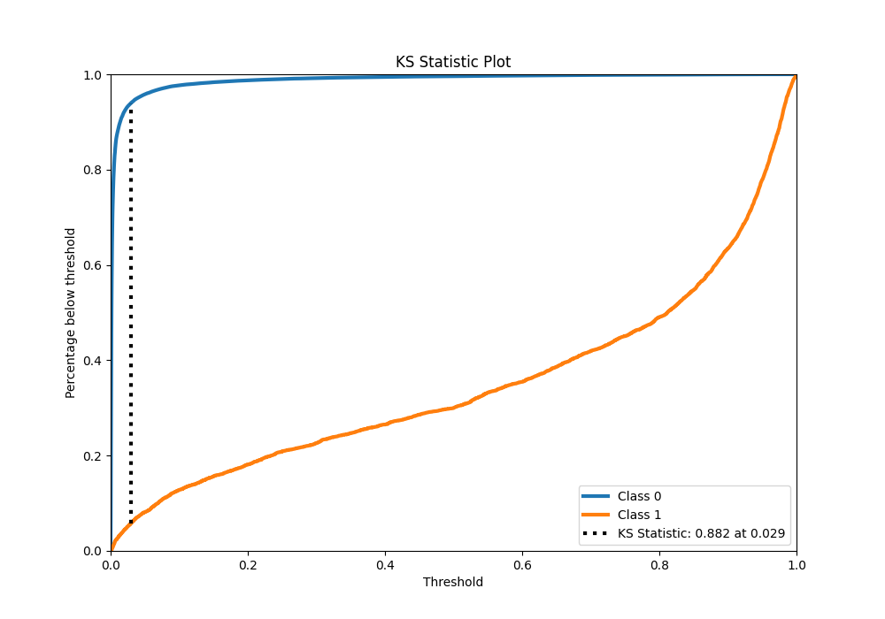
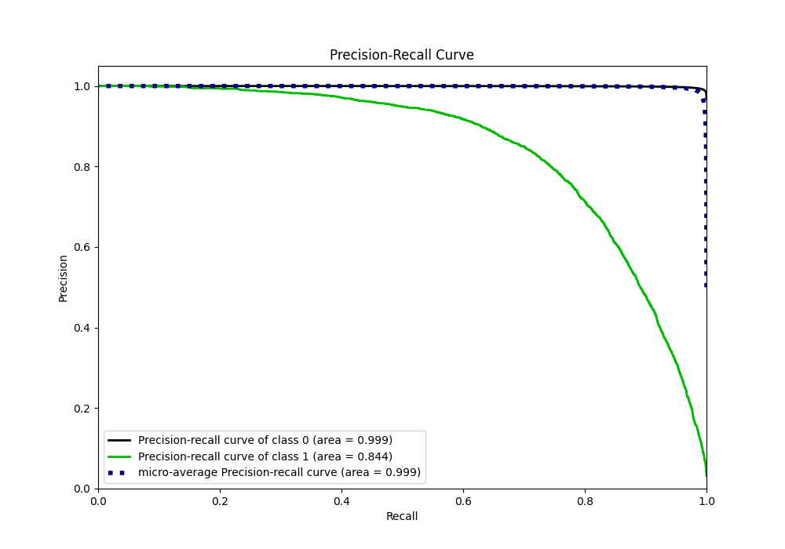
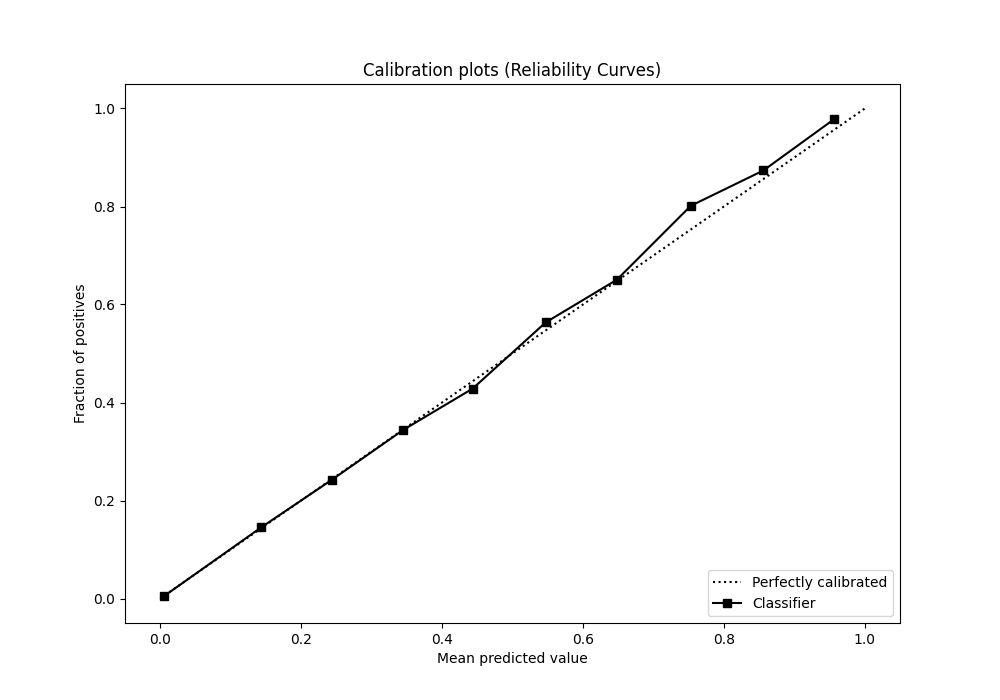
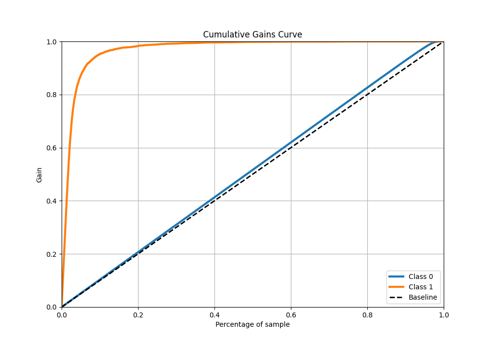
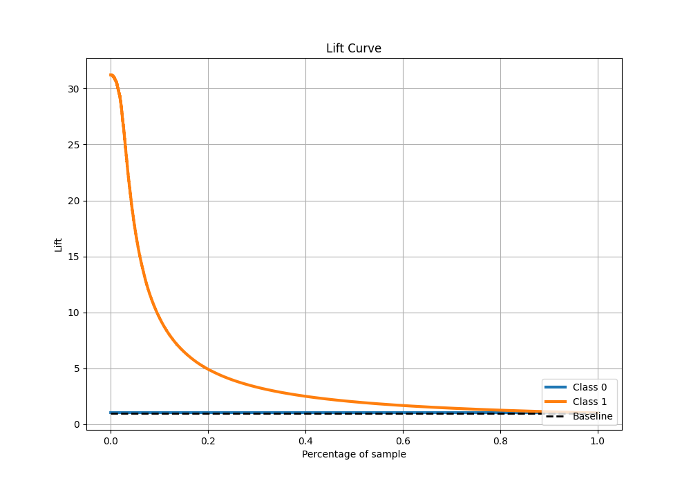

# Summary of 65_LightGBM

[<< Go back](../README.md)

## LightGBM
- **n_jobs**: -1
- **objective**: binary
- **num_leaves**: 15
- **learning_rate**: 0.05
- **feature_fraction**: 0.5
- **bagging_fraction**: 0.5
- **min_data_in_leaf**: 50
- **metric**: custom
- **custom_eval_metric_name**: f1
- **explain_level**: 0

## Validation
 - **validation_type**: kfold
 - **shuffle**: True
 - **stratify**: True
 - **k_folds**: 10

## Optimized metric
f1

## Training time

279.1 seconds

## Metric details
|           |     score |     threshold |
|:----------|----------:|--------------:|
| logloss   | 0.0407132 | nan           |
| auc       | 0.985673  | nan           |
| f1        | 0.769149  |   0.463818    |
| accuracy  | 0.986374  |   0.463818    |
| precision | 0.840538  |   0.463818    |
| recall    | 1         |   6.37287e-06 |
| mcc       | 0.765115  |   0.463818    |

## Metric details with threshold from accuracy metric
|           |     score |   threshold |
|:----------|----------:|------------:|
| logloss   | 0.0407132 |  nan        |
| auc       | 0.985673  |  nan        |
| f1        | 0.769149  |    0.463818 |
| accuracy  | 0.986374  |    0.463818 |
| precision | 0.840538  |    0.463818 |
| recall    | 0.708938  |    0.463818 |
| mcc       | 0.765115  |    0.463818 |

## Confusion matrix (at threshold=0.463818)
|              |   Predicted as 0 |   Predicted as 1 |
|:-------------|-----------------:|-----------------:|
| Labeled as 0 |           246818 |             1103 |
| Labeled as 1 |             2387 |             5814 |

## Learning curves

## Confusion Matrix

## Normalized Confusion Matrix

## ROC Curve

## Kolmogorov-Smirnov Statistic

## Precision-Recall Curve

## Calibration Curve

## Cumulative Gains Curve

## Lift Curve

[<< Go back](../README.md)
