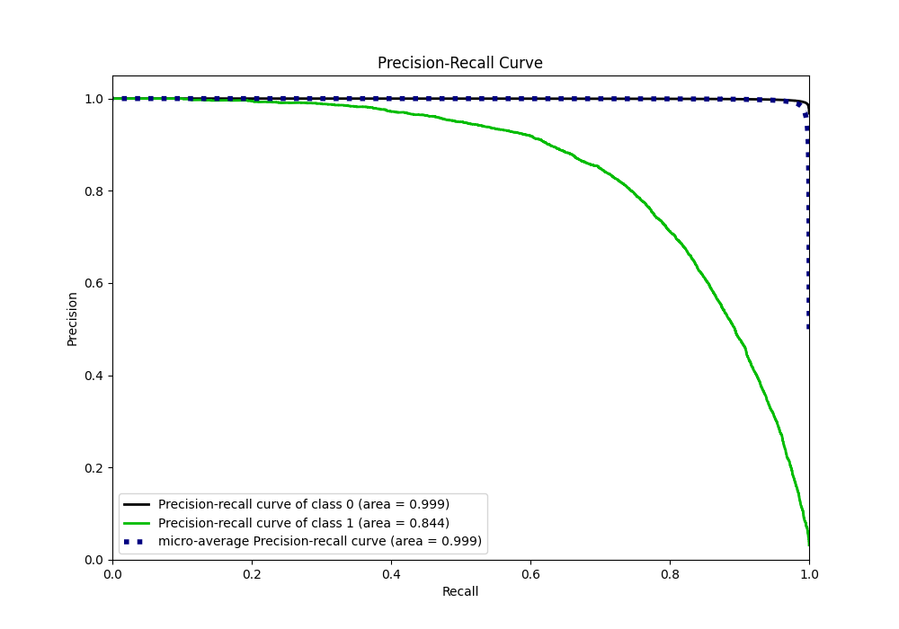

# Summary of 68_CatBoost_GoldenFeatures

[<< Go back](../README.md)

## CatBoost
- **n_jobs**: -1
- **learning_rate**: 0.1
- **depth**: 7
- **rsm**: 0.7
- **loss_function**: Logloss
- **eval_metric**: F1
- **explain_level**: 0

## Validation
 - **validation_type**: kfold
 - **shuffle**: True
 - **stratify**: True
 - **k_folds**: 10

## Optimized metric
f1

## Training time

139.7 seconds

## Metric details
|           |     score |     threshold |
|:----------|----------:|--------------:|
| logloss   | 0.0405526 | nan           |
| auc       | 0.985199  | nan           |
| f1        | 0.767343  |   0.482198    |
| accuracy  | 0.986381  |   0.482198    |
| precision | 0.847003  |   0.482198    |
| recall    | 1         |   2.26742e-06 |
| mcc       | 0.763984  |   0.482198    |

## Metric details with threshold from accuracy metric
|           |     score |   threshold |
|:----------|----------:|------------:|
| logloss   | 0.0405526 |  nan        |
| auc       | 0.985199  |  nan        |
| f1        | 0.767343  |    0.482198 |
| accuracy  | 0.986381  |    0.482198 |
| precision | 0.847003  |    0.482198 |
| recall    | 0.701378  |    0.482198 |
| mcc       | 0.763984  |    0.482198 |

## Confusion matrix (at threshold=0.482198)
|              |   Predicted as 0 |   Predicted as 1 |
|:-------------|-----------------:|-----------------:|
| Labeled as 0 |           246882 |             1039 |
| Labeled as 1 |             2449 |             5752 |

## Learning curves

## Confusion Matrix

## Normalized Confusion Matrix

## ROC Curve

## Kolmogorov-Smirnov Statistic

## Precision-Recall Curve

## Calibration Curve

## Cumulative Gains Curve

## Lift Curve

[<< Go back](../README.md)
