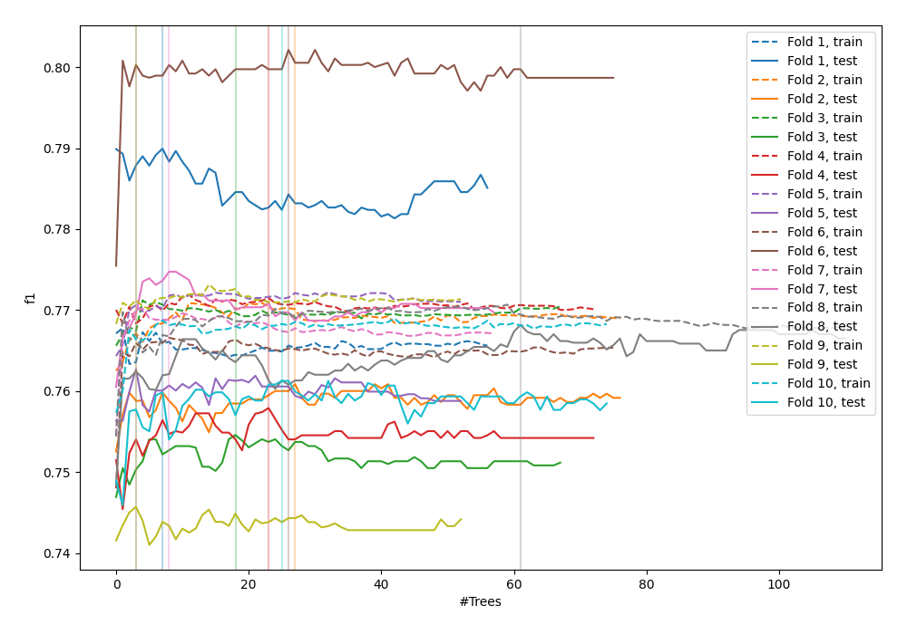
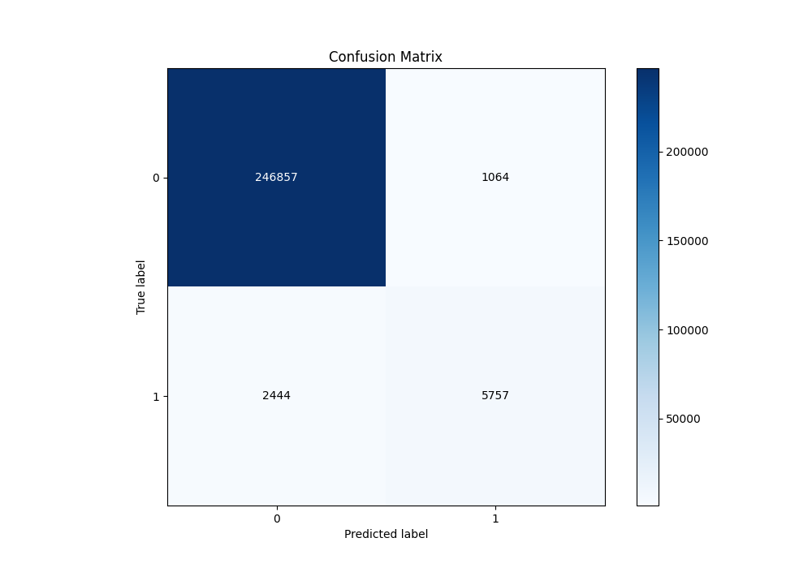
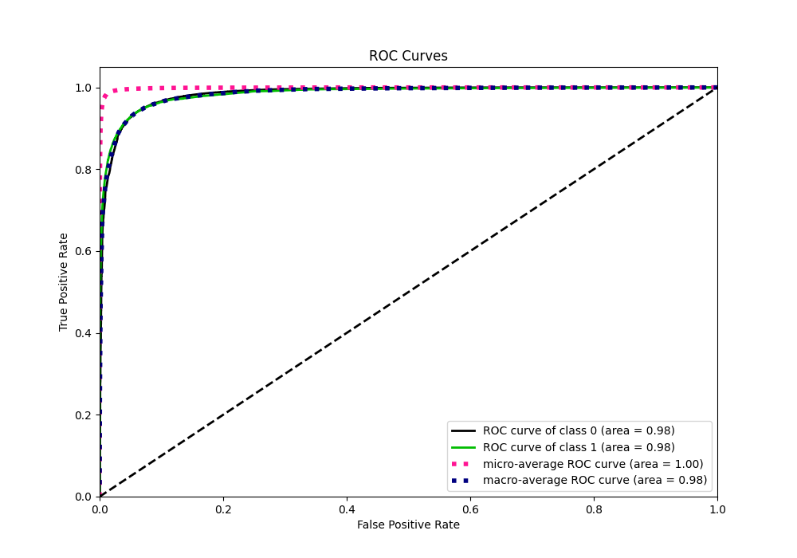
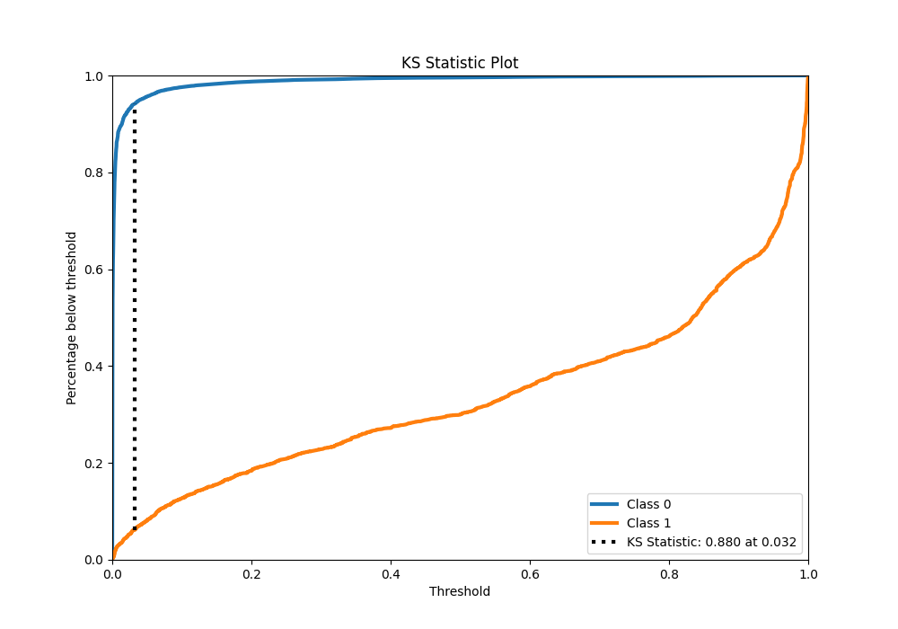
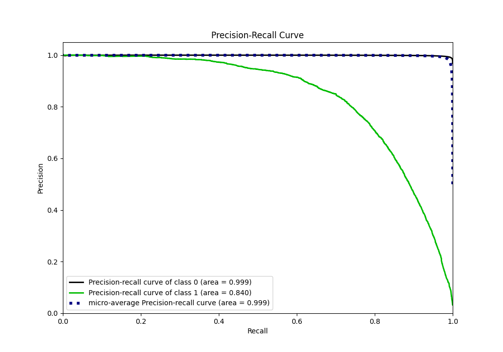
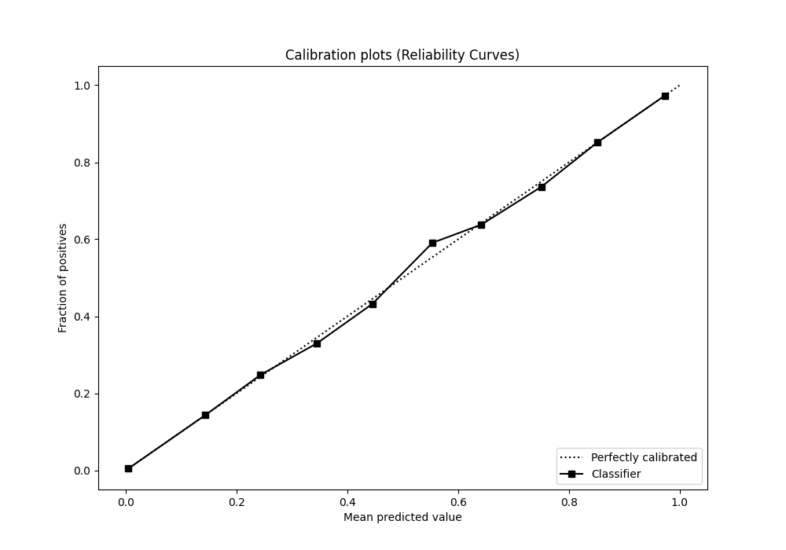
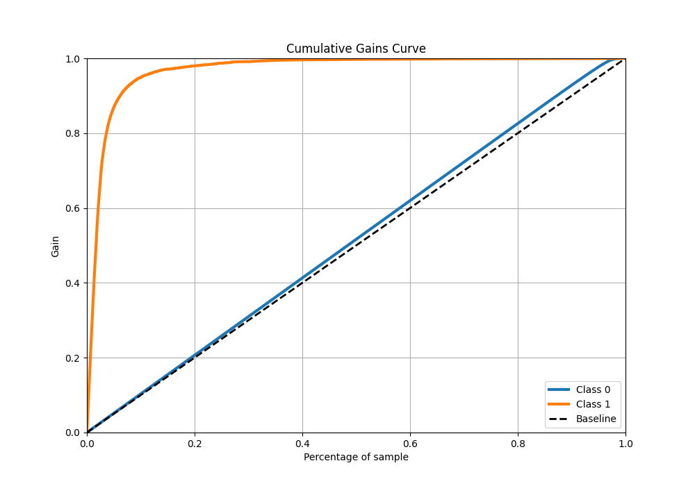
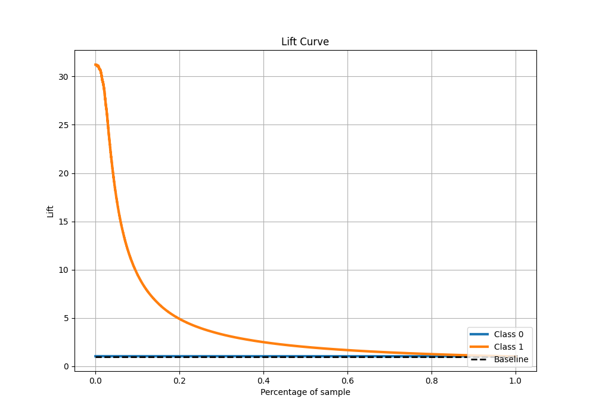

# Summary of 69_RandomForest

[<< Go back](../README.md)

## Random Forest
- **n_jobs**: -1
- **criterion**: gini
- **max_features**: 0.9
- **min_samples_split**: 40
- **max_depth**: 7
- **eval_metric_name**: f1
- **explain_level**: 0

## Validation
 - **validation_type**: kfold
 - **shuffle**: True
 - **stratify**: True
 - **k_folds**: 10

## Optimized metric
f1

## Training time

137.9 seconds

## Metric details
|           |     score |   threshold |
|:----------|----------:|------------:|
| logloss   | 0.0409857 |  nan        |
| auc       | 0.984563  |  nan        |
| f1        | 0.766476  |    0.485894 |
| accuracy  | 0.986303  |    0.485894 |
| precision | 0.844011  |    0.485894 |
| recall    | 0.999756  |    0        |
| mcc       | 0.762905  |    0.485894 |

## Metric details with threshold from accuracy metric
|           |     score |   threshold |
|:----------|----------:|------------:|
| logloss   | 0.0409857 |  nan        |
| auc       | 0.984563  |  nan        |
| f1        | 0.766476  |    0.485894 |
| accuracy  | 0.986303  |    0.485894 |
| precision | 0.844011  |    0.485894 |
| recall    | 0.701988  |    0.485894 |
| mcc       | 0.762905  |    0.485894 |

## Confusion matrix (at threshold=0.485894)
|              |   Predicted as 0 |   Predicted as 1 |
|:-------------|-----------------:|-----------------:|
| Labeled as 0 |           246857 |             1064 |
| Labeled as 1 |             2444 |             5757 |

## Learning curves

## Confusion Matrix

## Normalized Confusion Matrix

## ROC Curve

## Kolmogorov-Smirnov Statistic

## Precision-Recall Curve

## Calibration Curve

## Cumulative Gains Curve

## Lift Curve

[<< Go back](../README.md)
