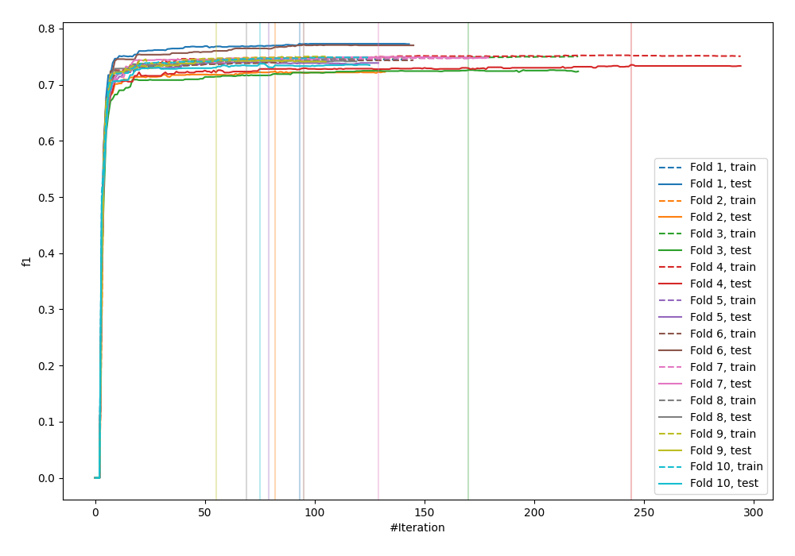
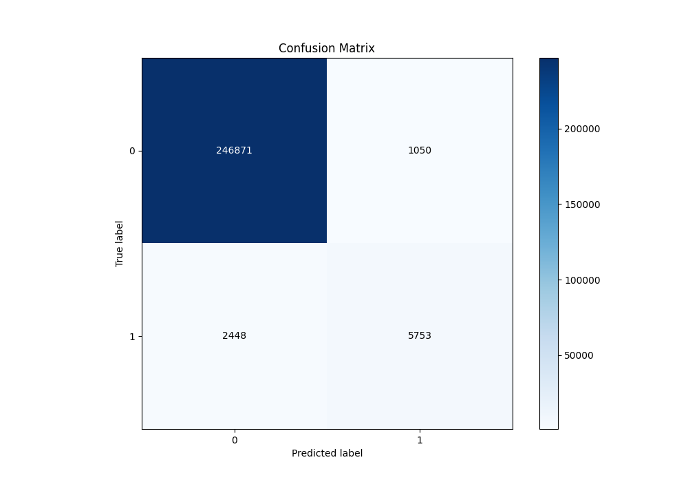
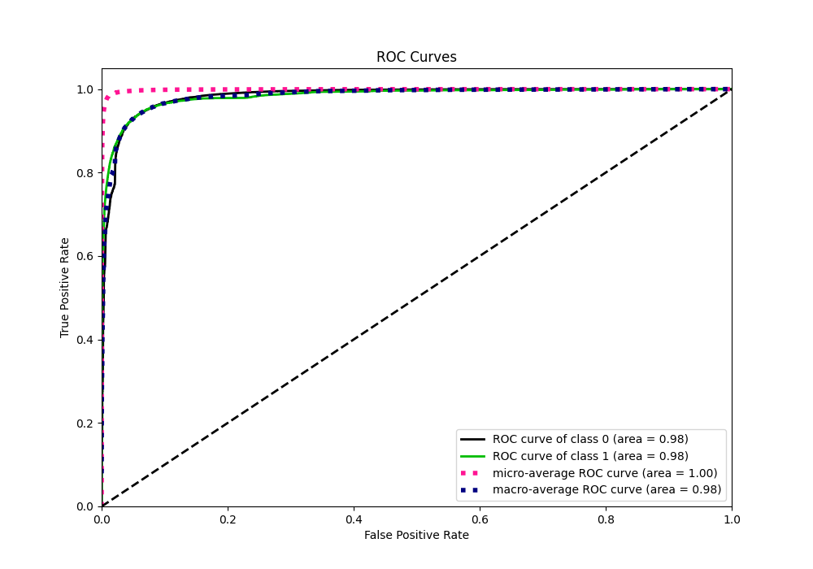
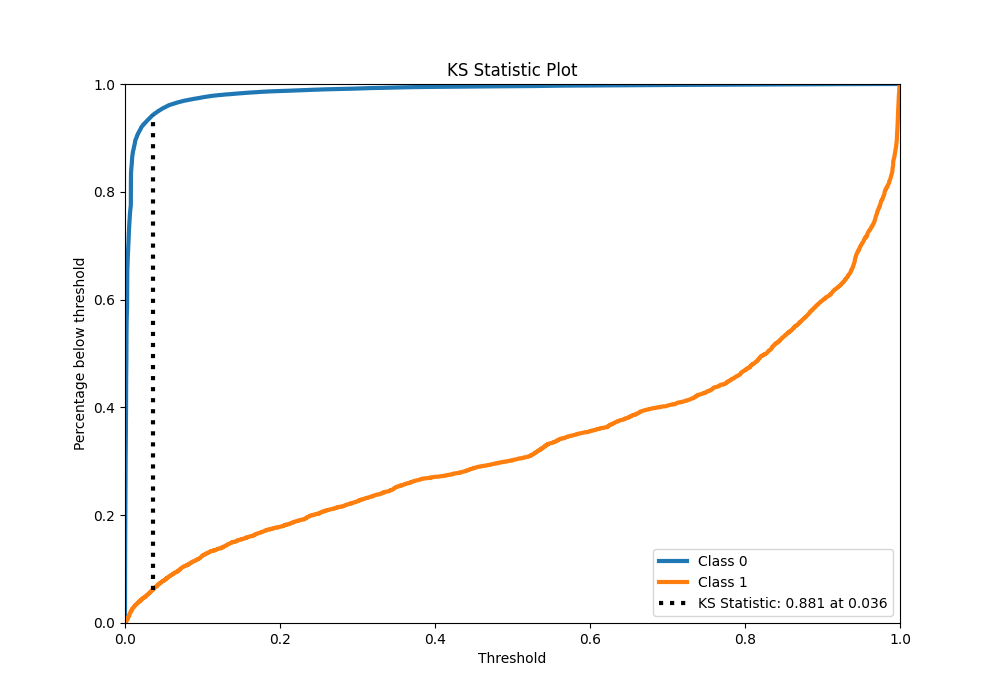
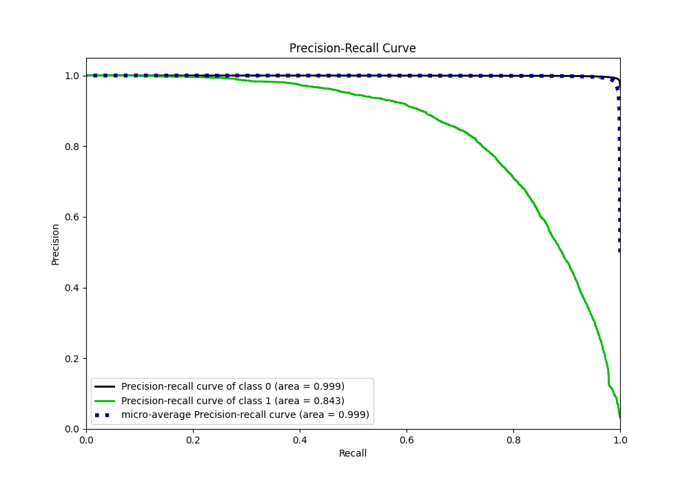
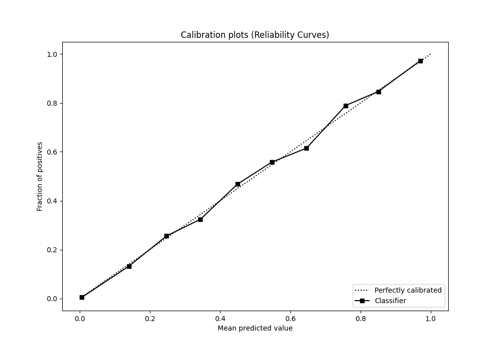
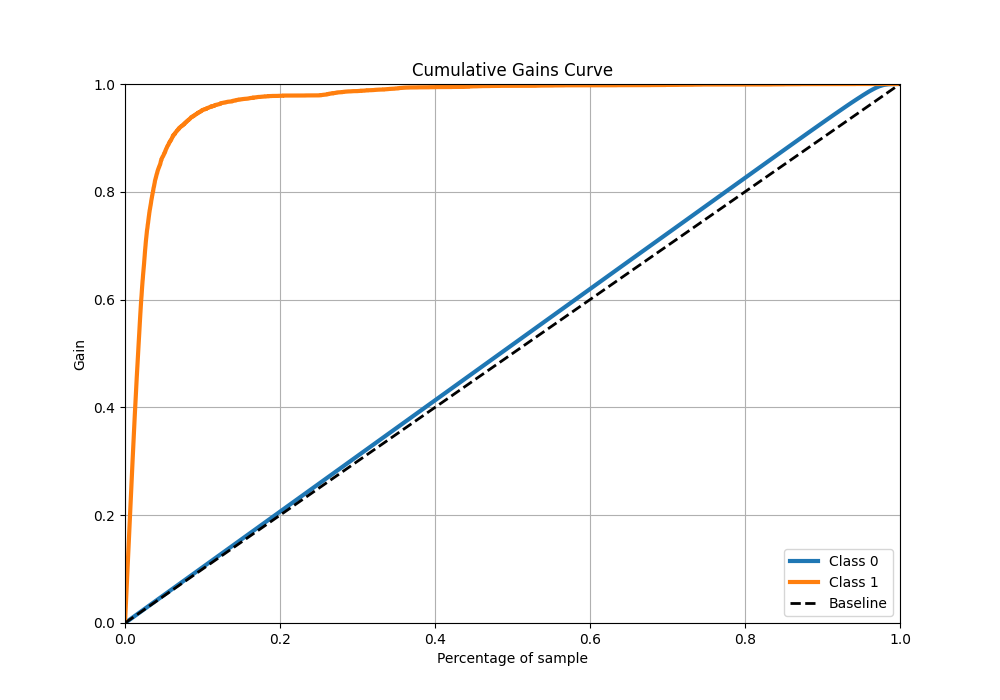
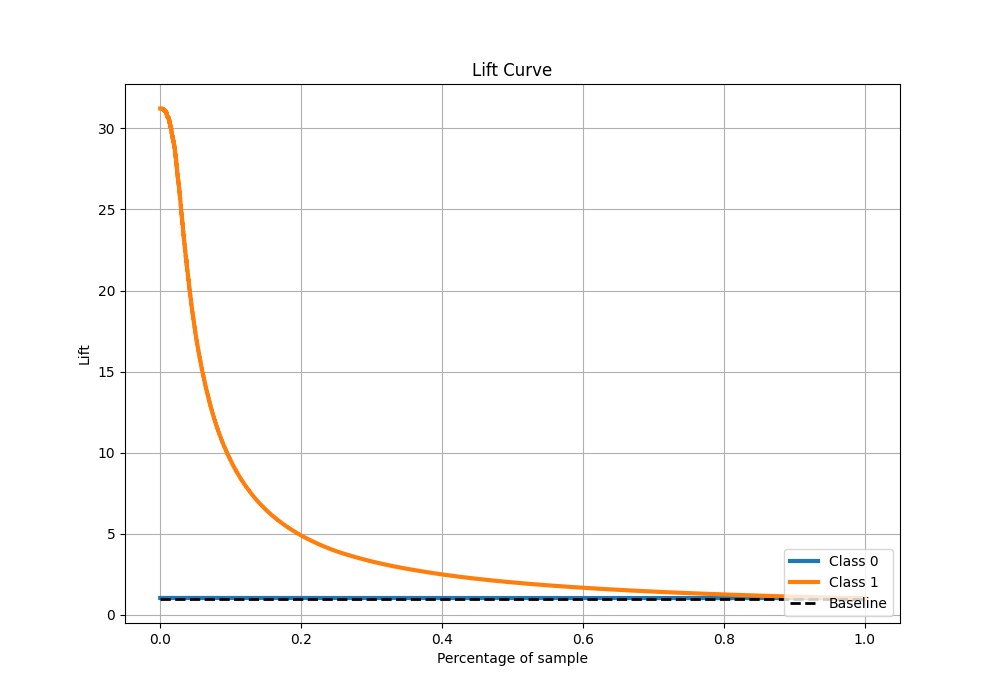

# Summary of 75_Xgboost

[<< Go back](../README.md)

## Extreme Gradient Boosting (Xgboost)
- **n_jobs**: -1
- **objective**: binary:logistic
- **eta**: 0.075
- **max_depth**: 6
- **min_child_weight**: 5
- **subsample**: 1.0
- **colsample_bytree**: 1.0
- **eval_metric**: f1
- **explain_level**: 0

## Validation
 - **validation_type**: kfold
 - **shuffle**: True
 - **stratify**: True
 - **k_folds**: 10

## Optimized metric
f1

## Training time

246.3 seconds

## Metric details
|           |     score |     threshold |
|:----------|----------:|--------------:|
| logloss   | 0.0412718 | nan           |
| auc       | 0.983735  | nan           |
| f1        | 0.766862  |   0.486772    |
| accuracy  | 0.986342  |   0.486772    |
| precision | 0.845656  |   0.486772    |
| recall    | 1         |   1.25067e-05 |
| mcc       | 0.763413  |   0.486772    |

## Metric details with threshold from accuracy metric
|           |     score |   threshold |
|:----------|----------:|------------:|
| logloss   | 0.0412718 |  nan        |
| auc       | 0.983735  |  nan        |
| f1        | 0.766862  |    0.486772 |
| accuracy  | 0.986342  |    0.486772 |
| precision | 0.845656  |    0.486772 |
| recall    | 0.7015    |    0.486772 |
| mcc       | 0.763413  |    0.486772 |

## Confusion matrix (at threshold=0.486772)
|              |   Predicted as 0 |   Predicted as 1 |
|:-------------|-----------------:|-----------------:|
| Labeled as 0 |           246871 |             1050 |
| Labeled as 1 |             2448 |             5753 |

## Learning curves

## Confusion Matrix

## Normalized Confusion Matrix

## ROC Curve

## Kolmogorov-Smirnov Statistic

## Precision-Recall Curve

## Calibration Curve

## Cumulative Gains Curve

## Lift Curve

[<< Go back](../README.md)
