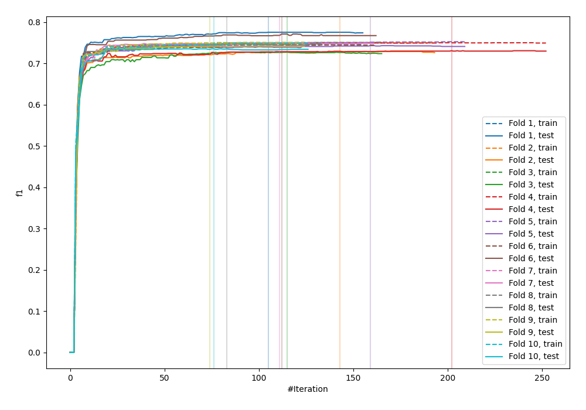
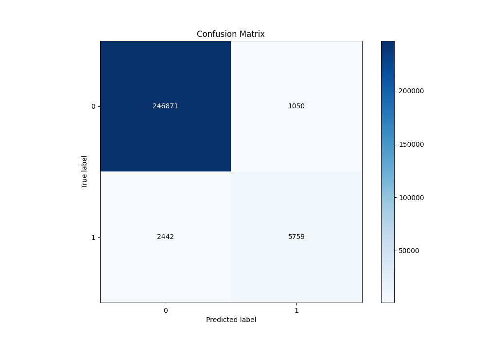
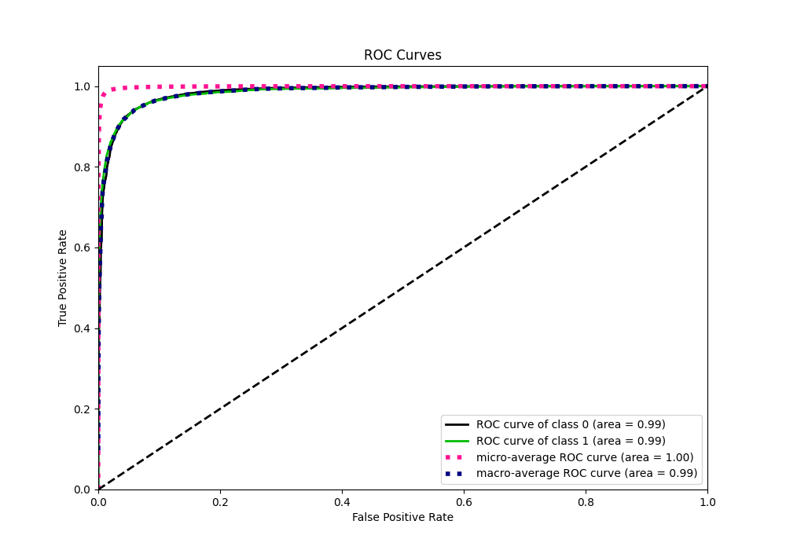
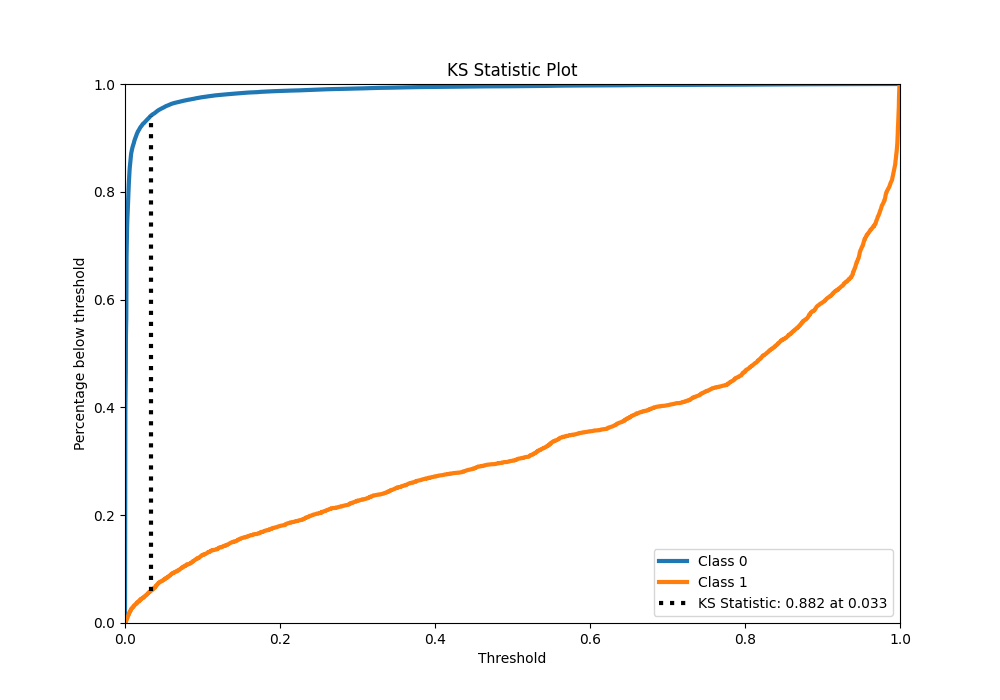
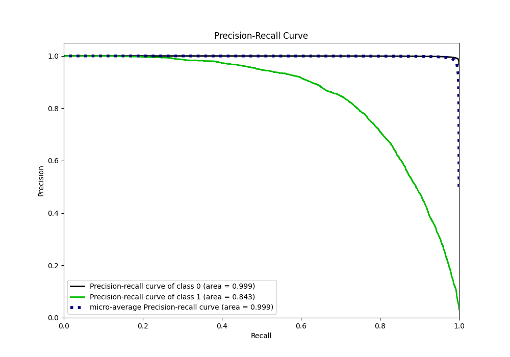
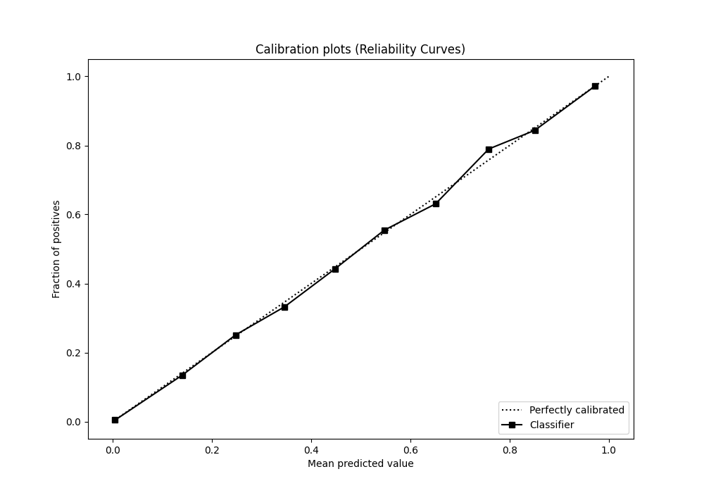
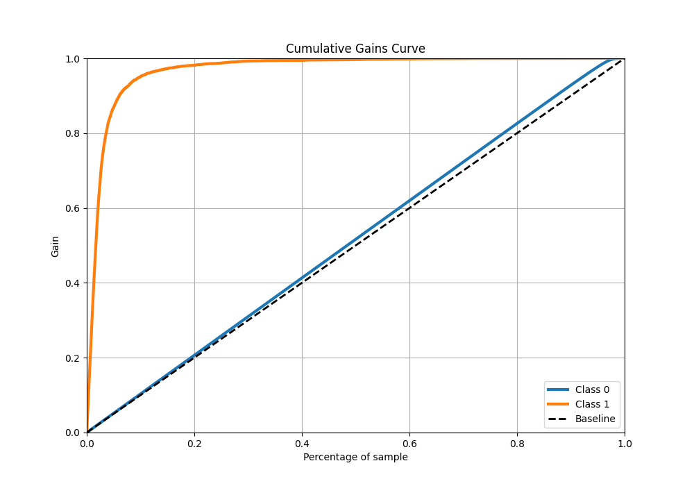
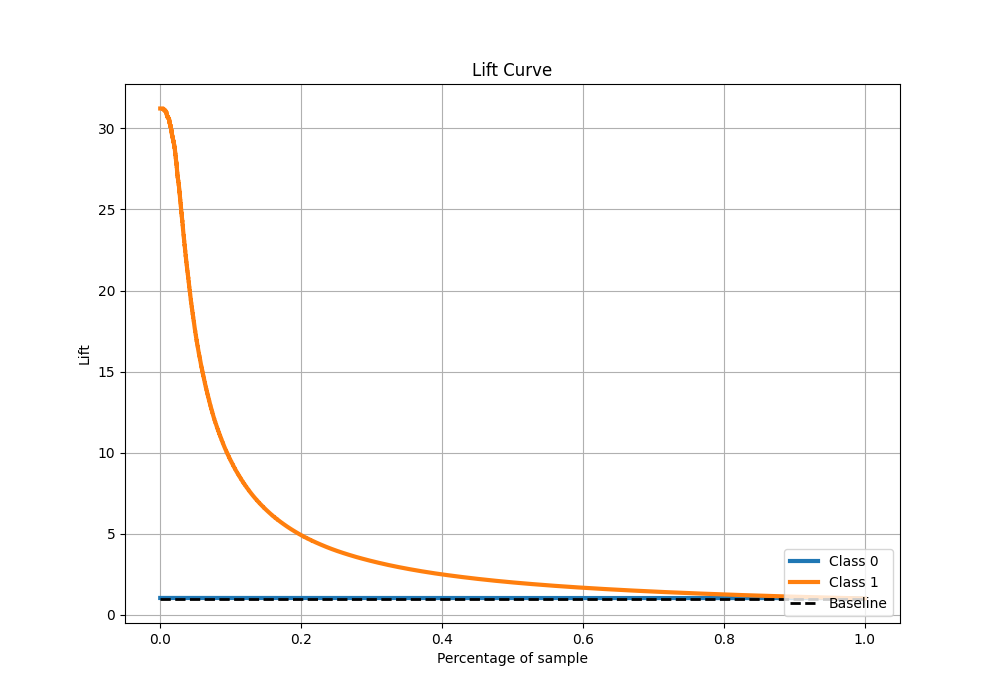

# Summary of 78_Xgboost

[<< Go back](../README.md)

## Extreme Gradient Boosting (Xgboost)
- **n_jobs**: -1
- **objective**: binary:logistic
- **eta**: 0.075
- **max_depth**: 6
- **min_child_weight**: 5
- **subsample**: 1.0
- **colsample_bytree**: 1.0
- **eval_metric**: f1
- **explain_level**: 0

## Validation
 - **validation_type**: kfold
 - **shuffle**: True
 - **stratify**: True
 - **k_folds**: 10

## Optimized metric
f1

## Training time

260.4 seconds

## Metric details
|           |     score |     threshold |
|:----------|----------:|--------------:|
| logloss   | 0.0405905 | nan           |
| auc       | 0.985148  | nan           |
| f1        | 0.767355  |   0.487548    |
| accuracy  | 0.986366  |   0.487548    |
| precision | 0.845792  |   0.487548    |
| recall    | 1         |   1.65639e-05 |
| mcc       | 0.763887  |   0.487548    |

## Metric details with threshold from accuracy metric
|           |     score |   threshold |
|:----------|----------:|------------:|
| logloss   | 0.0405905 |  nan        |
| auc       | 0.985148  |  nan        |
| f1        | 0.767355  |    0.487548 |
| accuracy  | 0.986366  |    0.487548 |
| precision | 0.845792  |    0.487548 |
| recall    | 0.702231  |    0.487548 |
| mcc       | 0.763887  |    0.487548 |

## Confusion matrix (at threshold=0.487548)
|              |   Predicted as 0 |   Predicted as 1 |
|:-------------|-----------------:|-----------------:|
| Labeled as 0 |           246871 |             1050 |
| Labeled as 1 |             2442 |             5759 |

## Learning curves

## Confusion Matrix

## Normalized Confusion Matrix

## ROC Curve

## Kolmogorov-Smirnov Statistic

## Precision-Recall Curve

## Calibration Curve

## Cumulative Gains Curve

## Lift Curve

[<< Go back](../README.md)
