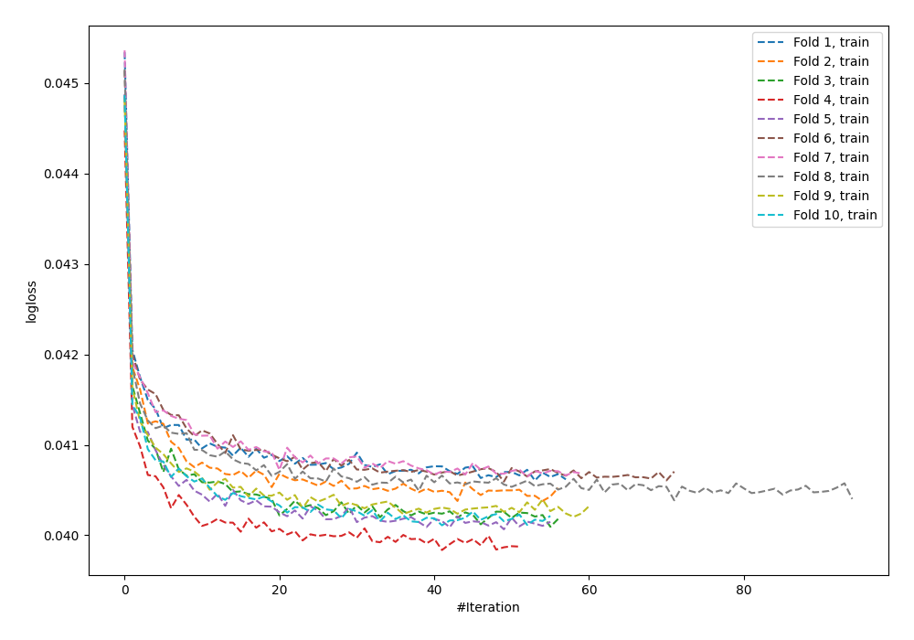
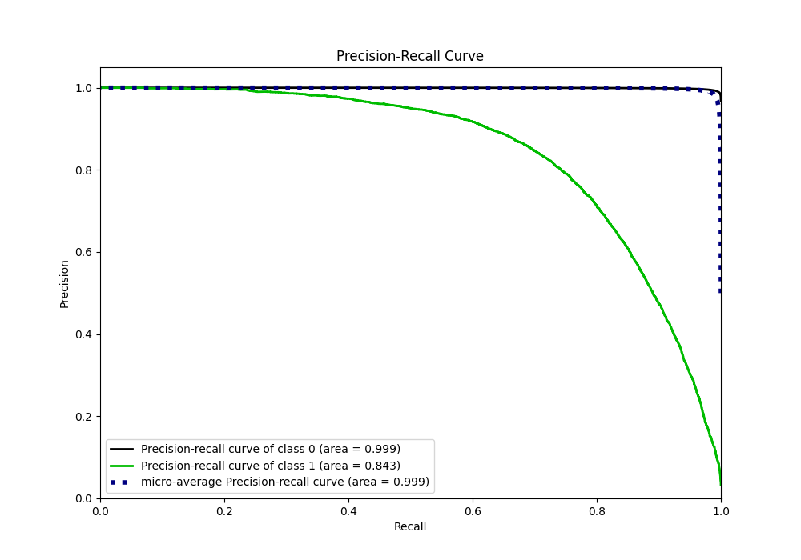

# Summary of 79_NeuralNetwork

[<< Go back](../README.md)

## Neural Network
- **n_jobs**: -1
- **dense_1_size**: 32
- **dense_2_size**: 32
- **learning_rate**: 0.01
- **explain_level**: 0

## Validation
 - **validation_type**: kfold
 - **shuffle**: True
 - **stratify**: True
 - **k_folds**: 10

## Optimized metric
f1

## Training time

590.8 seconds

## Metric details
|           |     score |    threshold |
|:----------|----------:|-------------:|
| logloss   | 0.0404657 | nan          |
| auc       | 0.985596  | nan          |
| f1        | 0.765609  |   0.496653   |
| accuracy  | 0.986354  |   0.496653   |
| precision | 0.850671  |   0.496653   |
| recall    | 1         |   1.8687e-11 |
| mcc       | 0.762708  |   0.496653   |

## Metric details with threshold from accuracy metric
|           |     score |   threshold |
|:----------|----------:|------------:|
| logloss   | 0.0404657 |  nan        |
| auc       | 0.985596  |  nan        |
| f1        | 0.765609  |    0.496653 |
| accuracy  | 0.986354  |    0.496653 |
| precision | 0.850671  |    0.496653 |
| recall    | 0.696013  |    0.496653 |
| mcc       | 0.762708  |    0.496653 |

## Confusion matrix (at threshold=0.496653)
|              |   Predicted as 0 |   Predicted as 1 |
|:-------------|-----------------:|-----------------:|
| Labeled as 0 |           246919 |             1002 |
| Labeled as 1 |             2493 |             5708 |

## Learning curves

## Confusion Matrix

## Normalized Confusion Matrix

## ROC Curve

## Kolmogorov-Smirnov Statistic

## Precision-Recall Curve

## Calibration Curve

## Cumulative Gains Curve

## Lift Curve

[<< Go back](../README.md)
