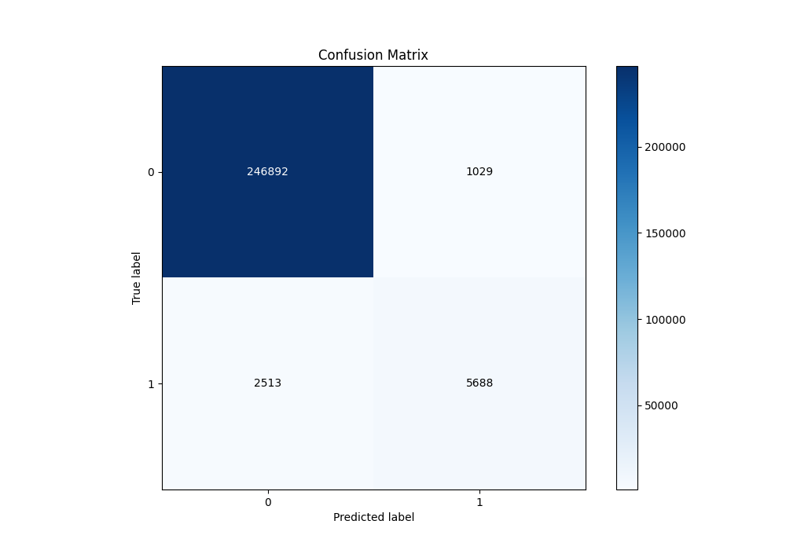

# Summary of 7_Default_NeuralNetwork

[<< Go back](../README.md)

## Neural Network
- **n_jobs**: -1
- **dense_1_size**: 32
- **dense_2_size**: 16
- **learning_rate**: 0.05
- **explain_level**: 0

## Validation
 - **validation_type**: kfold
 - **shuffle**: True
 - **stratify**: True
 - **k_folds**: 10

## Optimized metric
f1

## Training time

492.2 seconds

## Metric details
|           |     score |   threshold |
|:----------|----------:|------------:|
| logloss   | 0.0411543 | nan         |
| auc       | 0.984963  | nan         |
| f1        | 0.762569  |   0.495214  |
| accuracy  | 0.986171  |   0.495214  |
| precision | 0.846807  |   0.495214  |
| recall    | 1         |   1.391e-11 |
| mcc       | 0.759514  |   0.495214  |

## Metric details with threshold from accuracy metric
|           |     score |   threshold |
|:----------|----------:|------------:|
| logloss   | 0.0411543 |  nan        |
| auc       | 0.984963  |  nan        |
| f1        | 0.762569  |    0.495214 |
| accuracy  | 0.986171  |    0.495214 |
| precision | 0.846807  |    0.495214 |
| recall    | 0.693574  |    0.495214 |
| mcc       | 0.759514  |    0.495214 |

## Confusion matrix (at threshold=0.495214)
|              |   Predicted as 0 |   Predicted as 1 |
|:-------------|-----------------:|-----------------:|
| Labeled as 0 |           246892 |             1029 |
| Labeled as 1 |             2513 |             5688 |

## Learning curves

## Confusion Matrix

## Normalized Confusion Matrix

## ROC Curve

## Kolmogorov-Smirnov Statistic

## Precision-Recall Curve

## Calibration Curve

## Cumulative Gains Curve

## Lift Curve

[<< Go back](../README.md)
