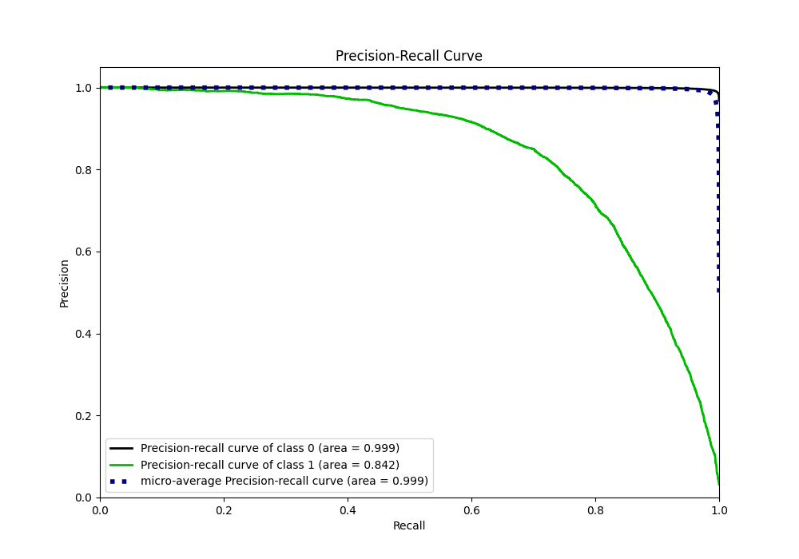
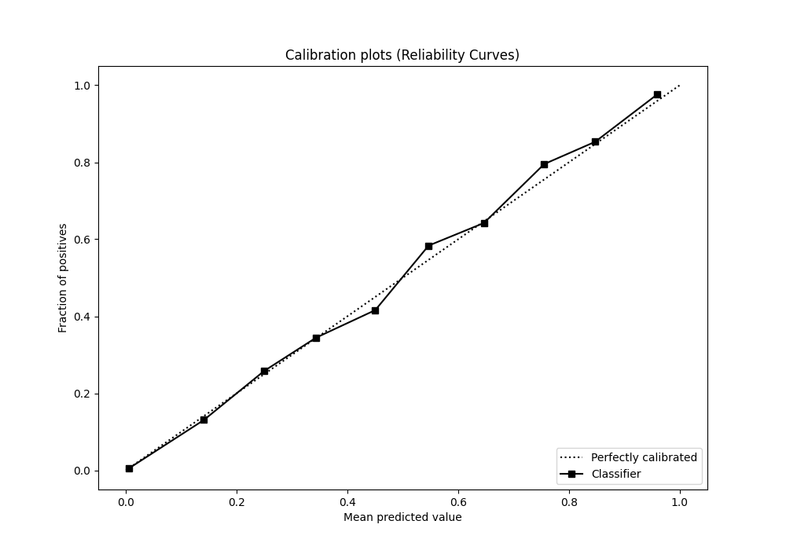

# Summary of 82_LightGBM

[<< Go back](../README.md)

## LightGBM
- **n_jobs**: -1
- **objective**: binary
- **num_leaves**: 31
- **learning_rate**: 0.05
- **feature_fraction**: 0.9
- **bagging_fraction**: 0.5
- **min_data_in_leaf**: 50
- **metric**: custom
- **custom_eval_metric_name**: f1
- **explain_level**: 0

## Validation
 - **validation_type**: kfold
 - **shuffle**: True
 - **stratify**: True
 - **k_folds**: 10

## Optimized metric
f1

## Training time

248.3 seconds

## Metric details
|           |     score |     threshold |
|:----------|----------:|--------------:|
| logloss   | 0.0408345 | nan           |
| auc       | 0.984971  | nan           |
| f1        | 0.767961  |   0.486758    |
| accuracy  | 0.986393  |   0.486758    |
| precision | 0.845849  |   0.486758    |
| recall    | 1         |   1.51505e-05 |
| mcc       | 0.764459  |   0.486758    |

## Metric details with threshold from accuracy metric
|           |     score |   threshold |
|:----------|----------:|------------:|
| logloss   | 0.0408345 |  nan        |
| auc       | 0.984971  |  nan        |
| f1        | 0.767961  |    0.486758 |
| accuracy  | 0.986393  |    0.486758 |
| precision | 0.845849  |    0.486758 |
| recall    | 0.703207  |    0.486758 |
| mcc       | 0.764459  |    0.486758 |

## Confusion matrix (at threshold=0.486758)
|              |   Predicted as 0 |   Predicted as 1 |
|:-------------|-----------------:|-----------------:|
| Labeled as 0 |           246870 |             1051 |
| Labeled as 1 |             2434 |             5767 |

## Learning curves

## Confusion Matrix

## Normalized Confusion Matrix

## ROC Curve

## Kolmogorov-Smirnov Statistic

## Precision-Recall Curve

## Calibration Curve

## Cumulative Gains Curve

## Lift Curve

[<< Go back](../README.md)
