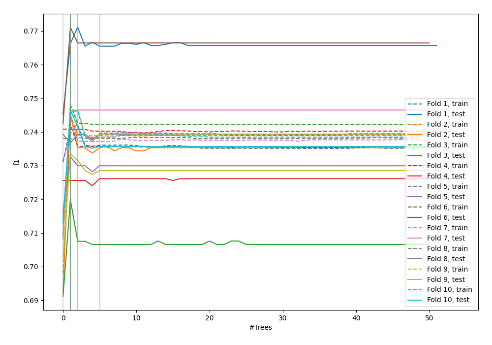
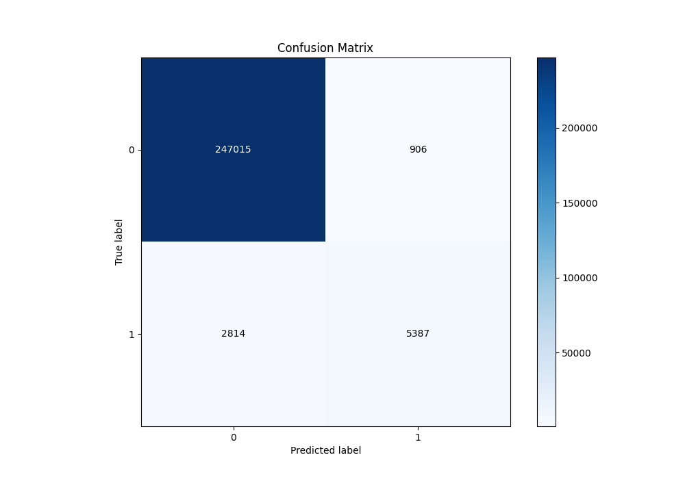
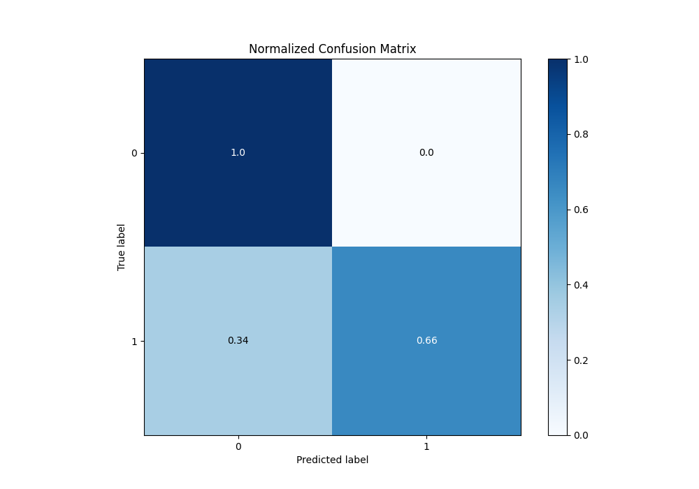
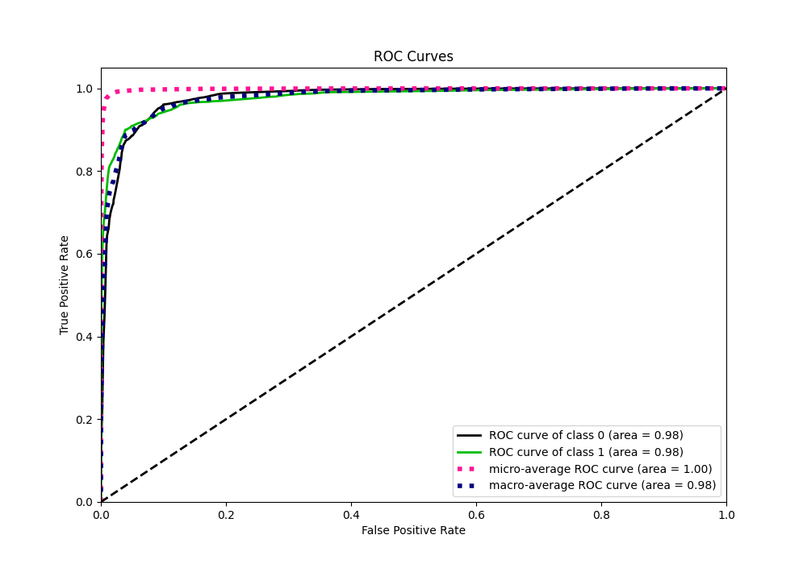
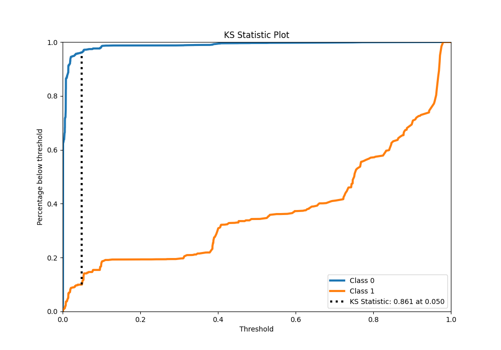
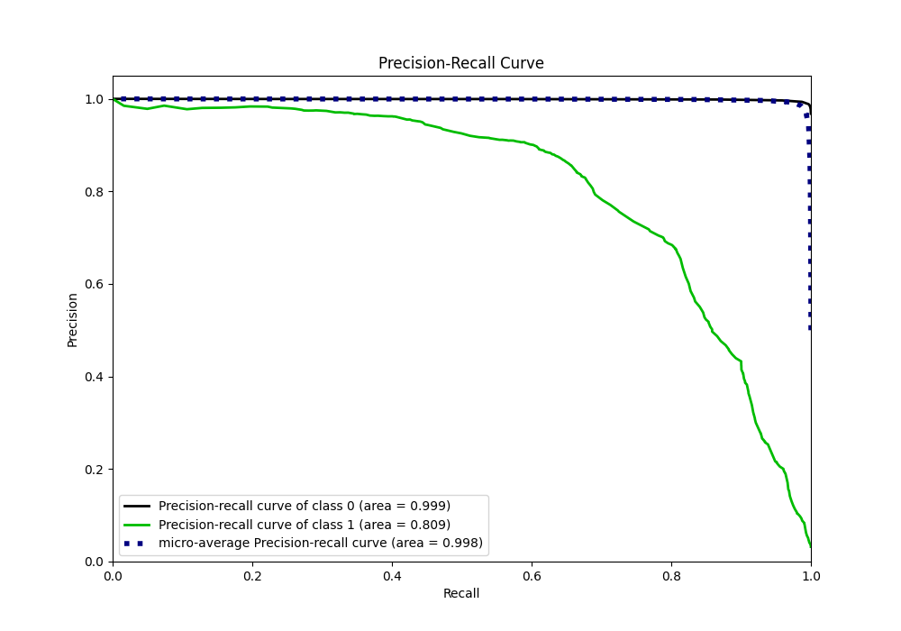
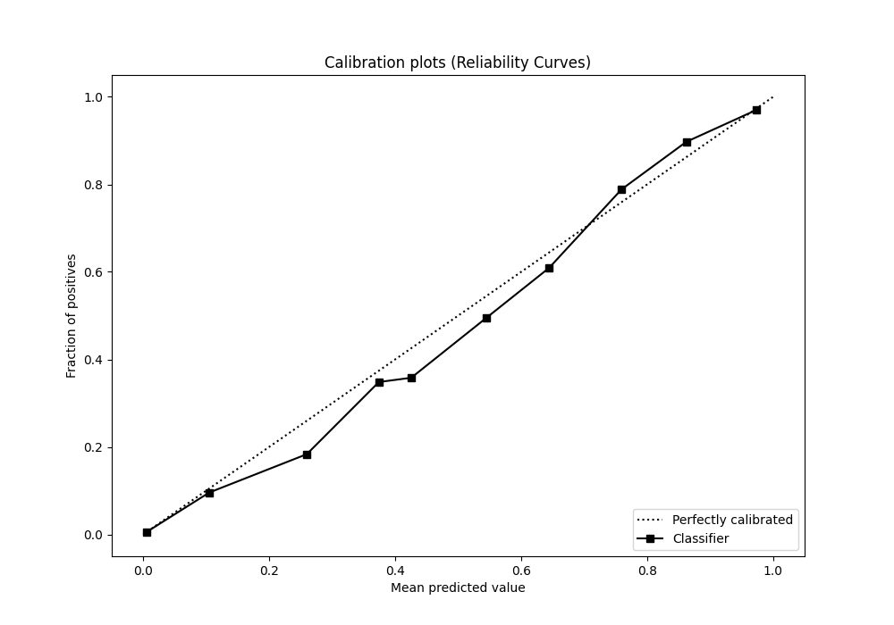
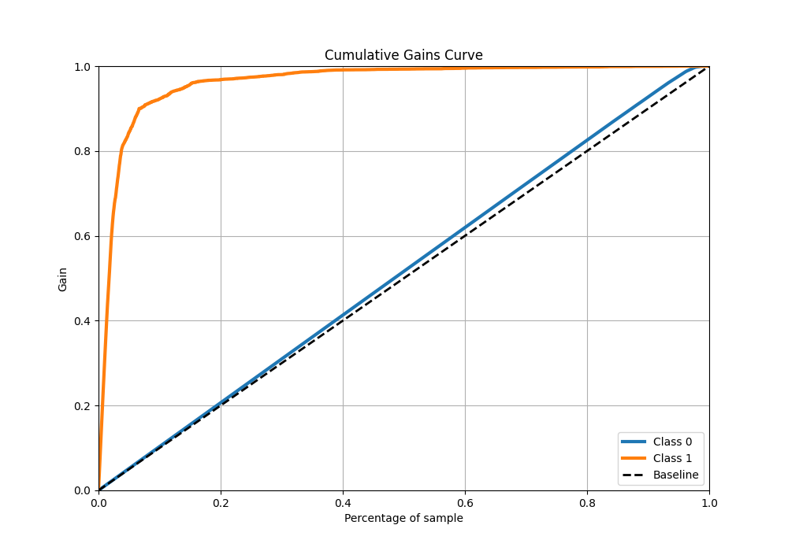
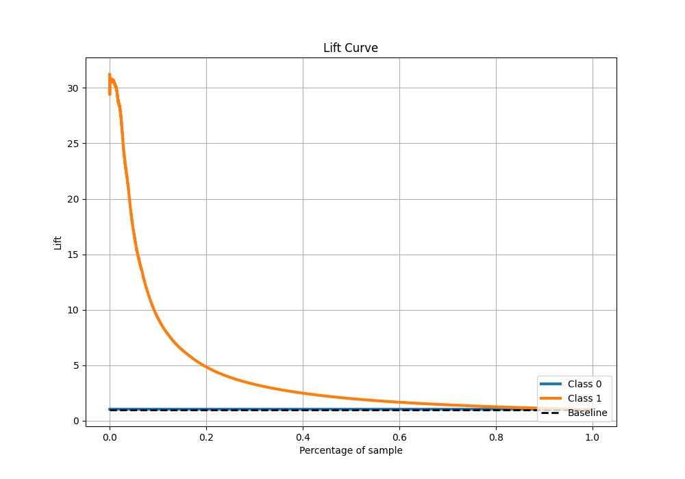

# Summary of 8_Default_RandomForest

[<< Go back](../README.md)

## Random Forest
- **n_jobs**: -1
- **criterion**: gini
- **max_features**: 0.9
- **min_samples_split**: 30
- **max_depth**: 4
- **eval_metric_name**: f1
- **explain_level**: 0

## Validation
 - **validation_type**: kfold
 - **shuffle**: True
 - **stratify**: True
 - **k_folds**: 10

## Optimized metric
f1

## Training time

101.2 seconds

## Metric details
|           |     score |     threshold |
|:----------|----------:|--------------:|
| logloss   | 0.0457164 | nan           |
| auc       | 0.977901  | nan           |
| f1        | 0.743342  |   0.48648     |
| accuracy  | 0.985476  |   0.48648     |
| precision | 0.856031  |   0.48648     |
| recall    | 1         |   0.000165178 |
| mcc       | 0.742843  |   0.48648     |

## Metric details with threshold from accuracy metric
|           |     score |   threshold |
|:----------|----------:|------------:|
| logloss   | 0.0457164 |   nan       |
| auc       | 0.977901  |   nan       |
| f1        | 0.743342  |     0.48648 |
| accuracy  | 0.985476  |     0.48648 |
| precision | 0.856031  |     0.48648 |
| recall    | 0.656871  |     0.48648 |
| mcc       | 0.742843  |     0.48648 |

## Confusion matrix (at threshold=0.48648)
|              |   Predicted as 0 |   Predicted as 1 |
|:-------------|-----------------:|-----------------:|
| Labeled as 0 |           247015 |              906 |
| Labeled as 1 |             2814 |             5387 |

## Learning curves

## Confusion Matrix

## Normalized Confusion Matrix

## ROC Curve

## Kolmogorov-Smirnov Statistic

## Precision-Recall Curve

## Calibration Curve

## Cumulative Gains Curve

## Lift Curve

[<< Go back](../README.md)
