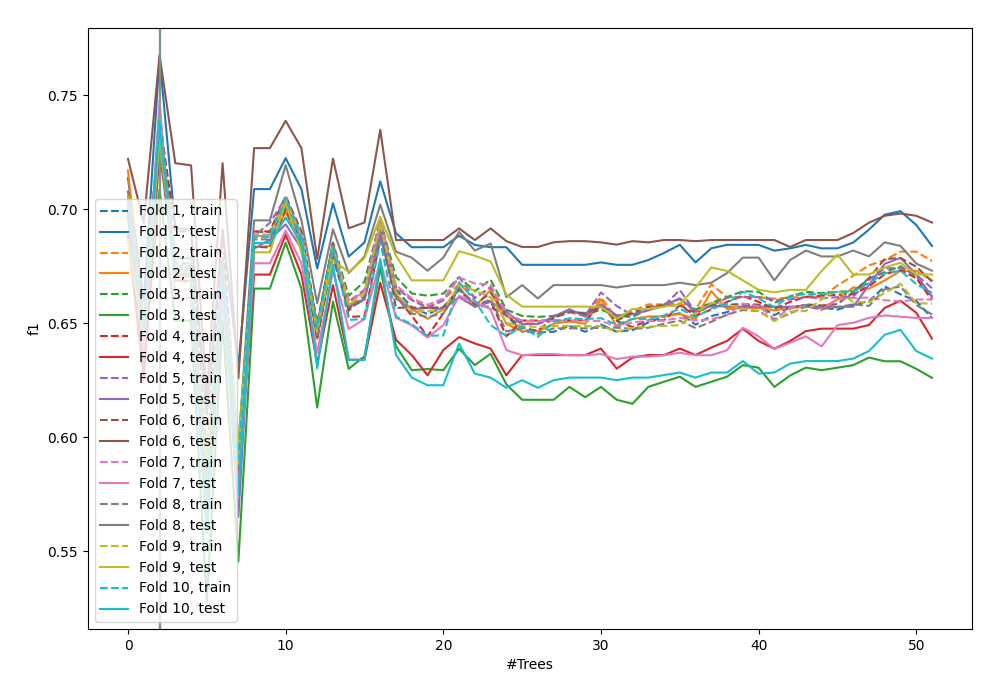
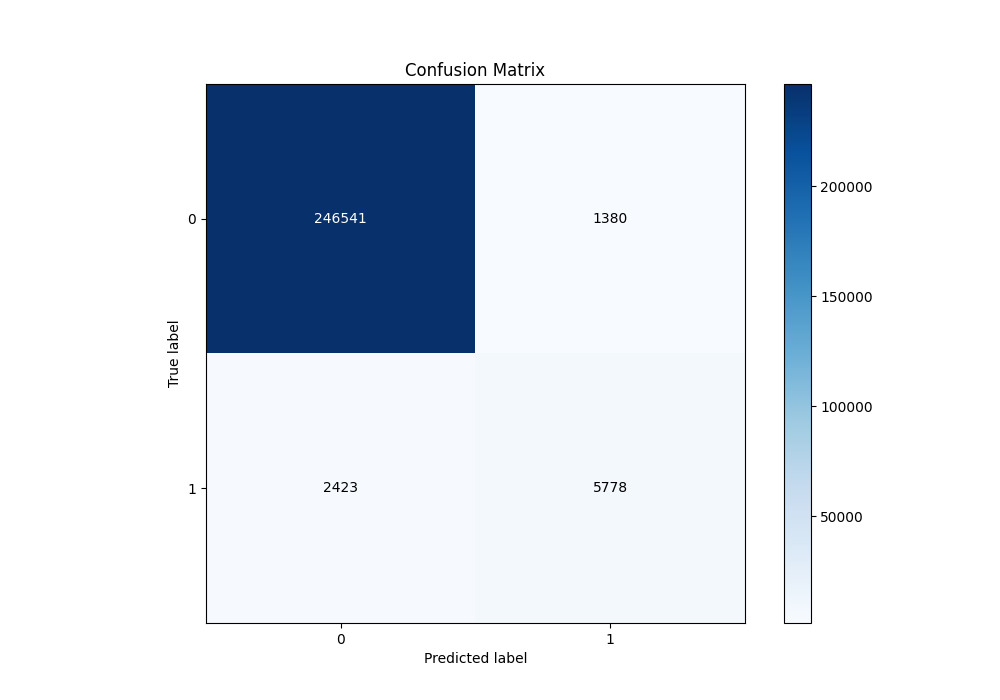
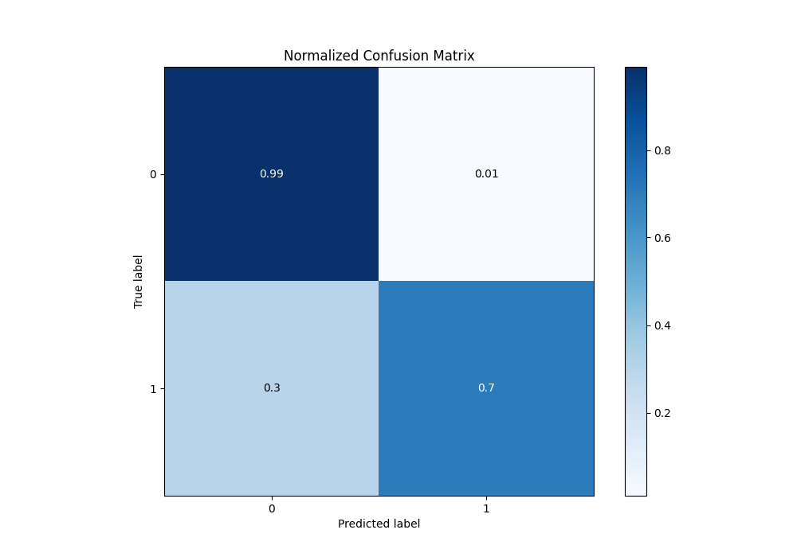
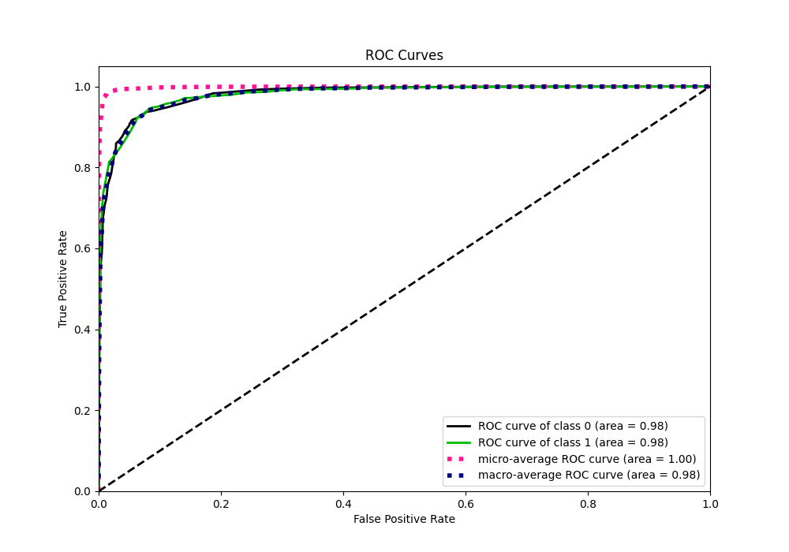
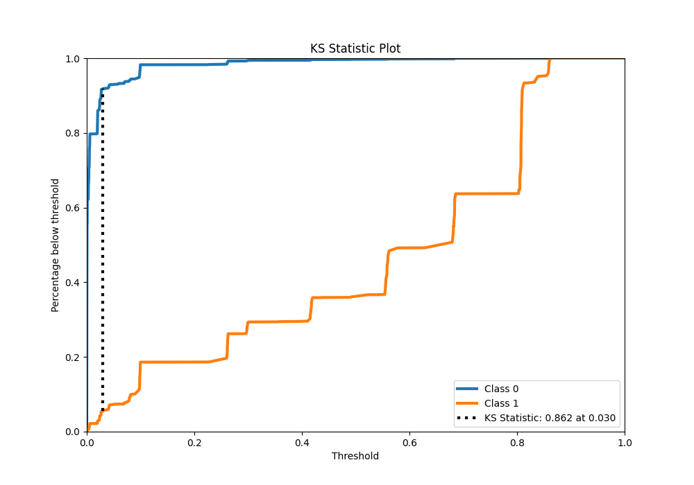
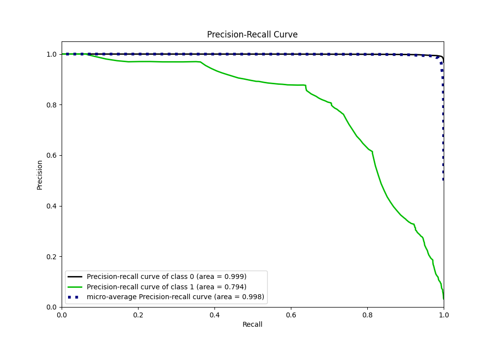
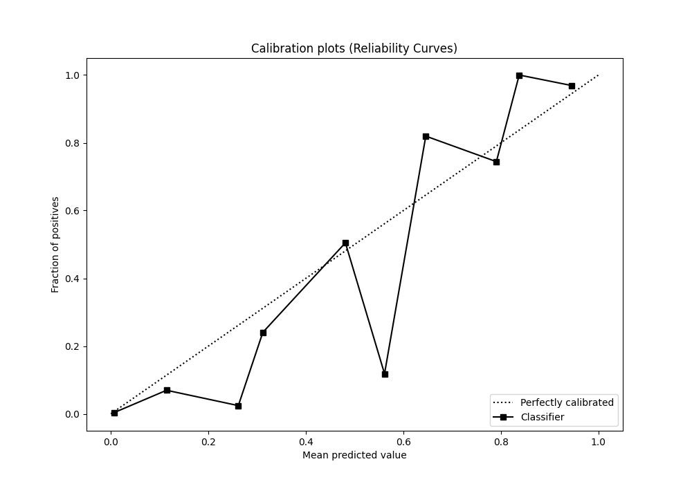
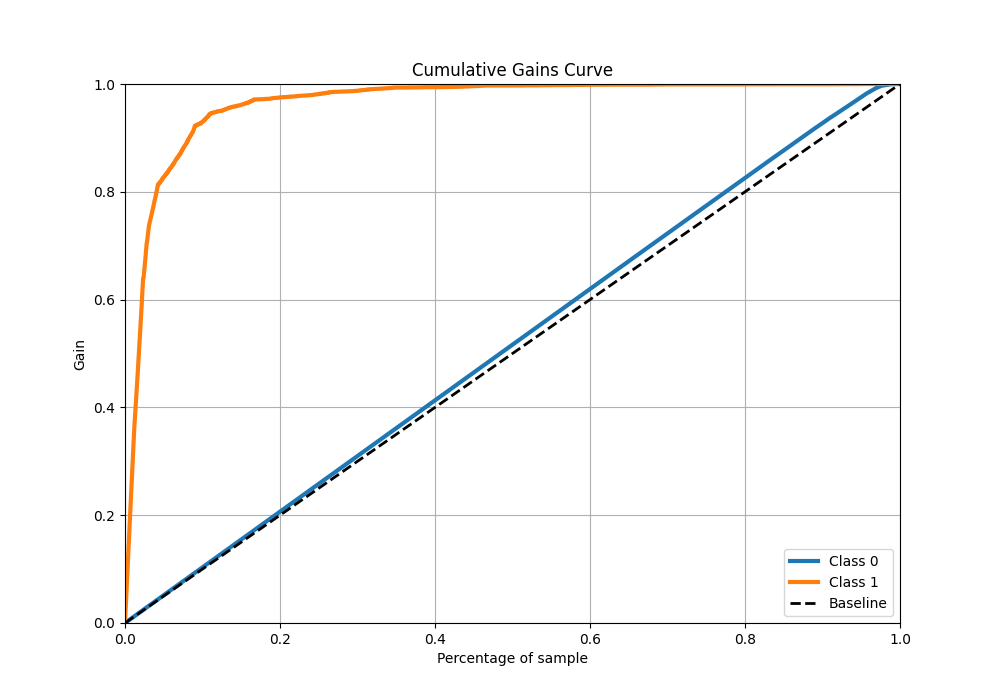
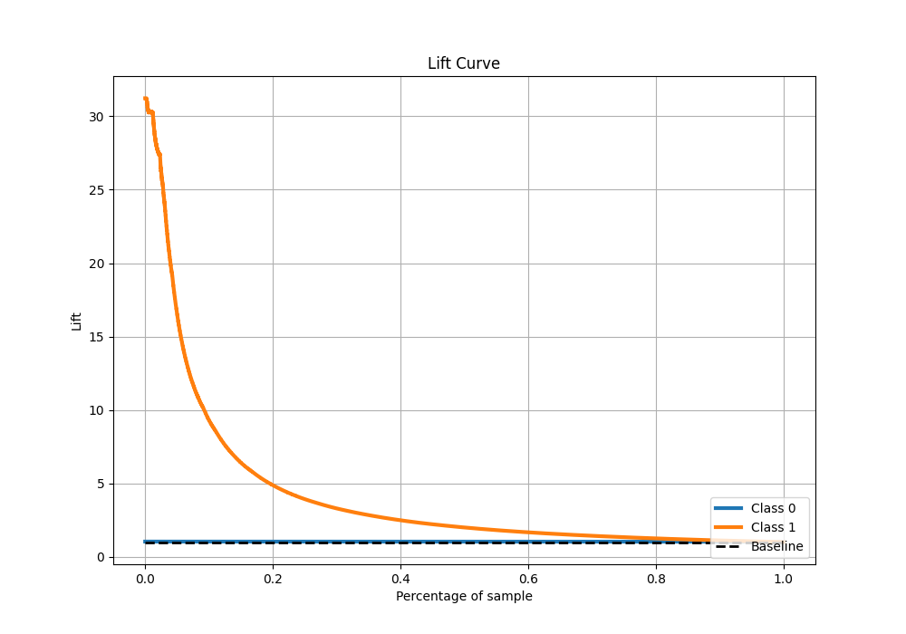

# Summary of 9_Default_ExtraTrees

[<< Go back](../README.md)

## Extra Trees Classifier (Extra Trees)
- **n_jobs**: -1
- **criterion**: gini
- **max_features**: 0.9
- **min_samples_split**: 30
- **max_depth**: 4
- **eval_metric_name**: f1
- **explain_level**: 0

## Validation
 - **validation_type**: kfold
 - **shuffle**: True
 - **stratify**: True
 - **k_folds**: 10

## Optimized metric
f1

## Training time

92.7 seconds

## Metric details
|           |     score |     threshold |
|:----------|----------:|--------------:|
| logloss   | 0.0487307 | nan           |
| auc       | 0.980046  | nan           |
| f1        | 0.752393  |   0.402767    |
| accuracy  | 0.985152  |   0.402767    |
| precision | 0.807209  |   0.402767    |
| recall    | 1         |   7.96942e-05 |
| mcc       | 0.746607  |   0.402767    |

## Metric details with threshold from accuracy metric
|           |     score |   threshold |
|:----------|----------:|------------:|
| logloss   | 0.0487307 |  nan        |
| auc       | 0.980046  |  nan        |
| f1        | 0.752393  |    0.402767 |
| accuracy  | 0.985152  |    0.402767 |
| precision | 0.807209  |    0.402767 |
| recall    | 0.704548  |    0.402767 |
| mcc       | 0.746607  |    0.402767 |

## Confusion matrix (at threshold=0.402767)
|              |   Predicted as 0 |   Predicted as 1 |
|:-------------|-----------------:|-----------------:|
| Labeled as 0 |           246541 |             1380 |
| Labeled as 1 |             2423 |             5778 |

## Learning curves

## Confusion Matrix

## Normalized Confusion Matrix

## ROC Curve

## Kolmogorov-Smirnov Statistic

## Precision-Recall Curve

## Calibration Curve

## Cumulative Gains Curve

## Lift Curve

[<< Go back](../README.md)
