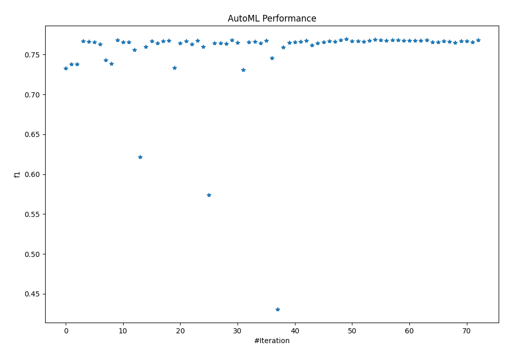
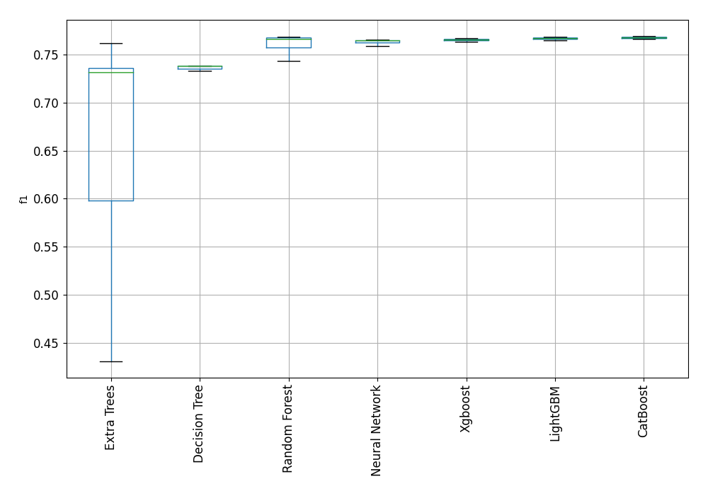
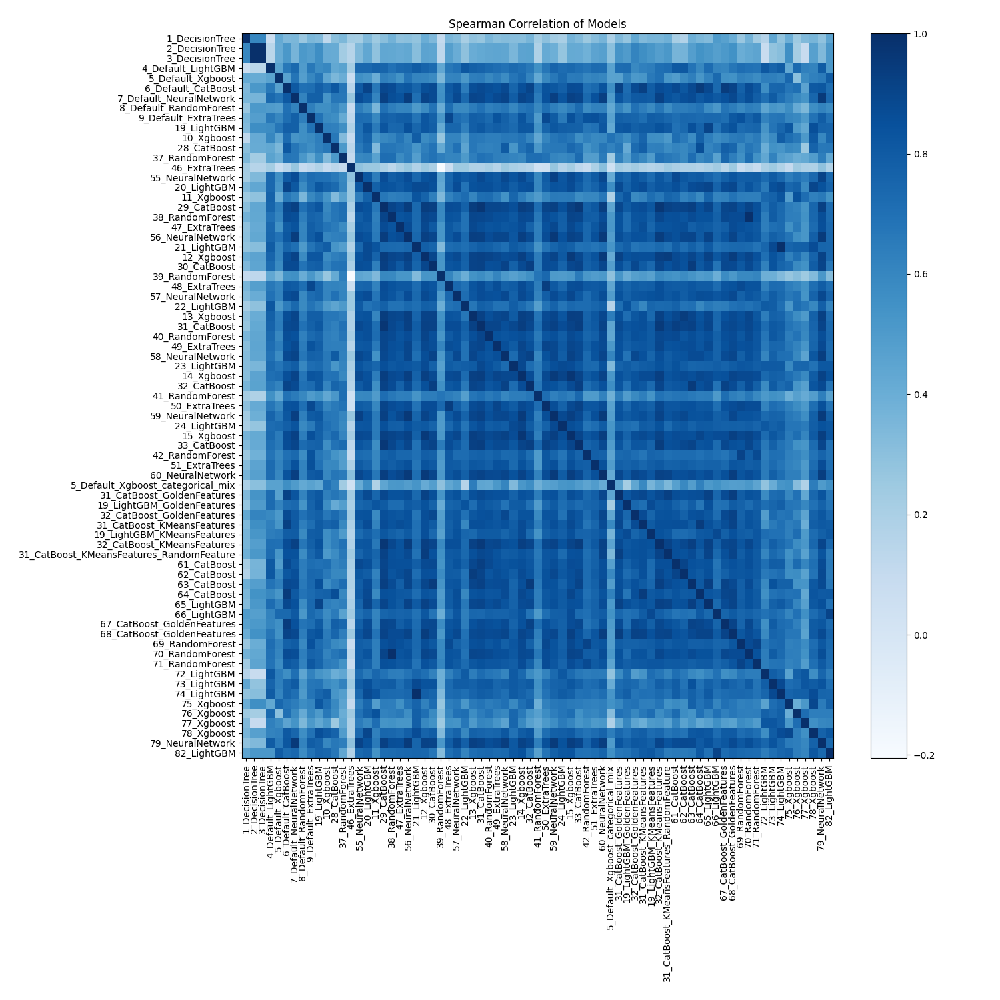

# AutoML Leaderboard

| Best model   | name                                                                                           | model_type     | metric_type   |   metric_value |   train_time |
|:-------------|:-----------------------------------------------------------------------------------------------|:---------------|:--------------|---------------:|-------------:|
|              | [1_DecisionTree](1_DecisionTree/README.md)                                                     | Decision Tree  | f1            |       0.732919 |        37.88 |
|              | [2_DecisionTree](2_DecisionTree/README.md)                                                     | Decision Tree  | f1            |       0.737924 |        37.47 |
|              | [3_DecisionTree](3_DecisionTree/README.md)                                                     | Decision Tree  | f1            |       0.737924 |        37.01 |
|              | [4_Default_LightGBM](4_Default_LightGBM/README.md)                                             | LightGBM       | f1            |       0.766783 |       247.42 |
|              | [5_Default_Xgboost](5_Default_Xgboost/README.md)                                               | Xgboost        | f1            |       0.766069 |       216.9  |
|              | [6_Default_CatBoost](6_Default_CatBoost/README.md)                                             | CatBoost       | f1            |       0.765983 |       121.43 |
|              | [7_Default_NeuralNetwork](7_Default_NeuralNetwork/README.md)                                   | Neural Network | f1            |       0.762826 |       492.15 |
|              | [8_Default_RandomForest](8_Default_RandomForest/README.md)                                     | Random Forest  | f1            |       0.743342 |       101.17 |
|              | [9_Default_ExtraTrees](9_Default_ExtraTrees/README.md)                                         | Extra Trees    | f1            |       0.738891 |        92.74 |
|              | [19_LightGBM](19_LightGBM/README.md)                                                           | LightGBM       | f1            |       0.76817  |       256.06 |
|              | [10_Xgboost](10_Xgboost/README.md)                                                             | Xgboost        | f1            |       0.765989 |       219.38 |
|              | [28_CatBoost](28_CatBoost/README.md)                                                           | CatBoost       | f1            |       0.765757 |       143.86 |
|              | [37_RandomForest](37_RandomForest/README.md)                                                   | Random Forest  | f1            |       0.75617  |       101.46 |
|              | [46_ExtraTrees](46_ExtraTrees/README.md)                                                       | Extra Trees    | f1            |       0.621336 |        88.61 |
|              | [55_NeuralNetwork](55_NeuralNetwork/README.md)                                                 | Neural Network | f1            |       0.759862 |       414.88 |
|              | [20_LightGBM](20_LightGBM/README.md)                                                           | LightGBM       | f1            |       0.767176 |       180.12 |
|              | [11_Xgboost](11_Xgboost/README.md)                                                             | Xgboost        | f1            |       0.764341 |       217.6  |
|              | [29_CatBoost](29_CatBoost/README.md)                                                           | CatBoost       | f1            |       0.766855 |       147.22 |
|              | [38_RandomForest](38_RandomForest/README.md)                                                   | Random Forest  | f1            |       0.767356 |       121.32 |
|              | [47_ExtraTrees](47_ExtraTrees/README.md)                                                       | Extra Trees    | f1            |       0.733611 |       132.12 |
|              | [56_NeuralNetwork](56_NeuralNetwork/README.md)                                                 | Neural Network | f1            |       0.764682 |       631.97 |
|              | [21_LightGBM](21_LightGBM/README.md)                                                           | LightGBM       | f1            |       0.767059 |       221.27 |
|              | [12_Xgboost](12_Xgboost/README.md)                                                             | Xgboost        | f1            |       0.763319 |       289.69 |
|              | [30_CatBoost](30_CatBoost/README.md)                                                           | CatBoost       | f1            |       0.767743 |       137.72 |
|              | [39_RandomForest](39_RandomForest/README.md)                                                   | Random Forest  | f1            |       0.759744 |       100.16 |
|              | [48_ExtraTrees](48_ExtraTrees/README.md)                                                       | Extra Trees    | f1            |       0.574102 |        96.23 |
|              | [57_NeuralNetwork](57_NeuralNetwork/README.md)                                                 | Neural Network | f1            |       0.764274 |      1454.46 |
|              | [22_LightGBM](22_LightGBM/README.md)                                                           | LightGBM       | f1            |       0.764647 |       246.84 |
|              | [13_Xgboost](13_Xgboost/README.md)                                                             | Xgboost        | f1            |       0.763908 |       214.44 |
|              | [31_CatBoost](31_CatBoost/README.md)                                                           | CatBoost       | f1            |       0.76855  |       118.3  |
|              | [40_RandomForest](40_RandomForest/README.md)                                                   | Random Forest  | f1            |       0.764966 |       116.71 |
|              | [49_ExtraTrees](49_ExtraTrees/README.md)                                                       | Extra Trees    | f1            |       0.73111  |       119.86 |
|              | [58_NeuralNetwork](58_NeuralNetwork/README.md)                                                 | Neural Network | f1            |       0.765716 |       597.44 |
|              | [23_LightGBM](23_LightGBM/README.md)                                                           | LightGBM       | f1            |       0.76622  |       155.87 |
|              | [14_Xgboost](14_Xgboost/README.md)                                                             | Xgboost        | f1            |       0.764686 |       269.12 |
|              | [32_CatBoost](32_CatBoost/README.md)                                                           | CatBoost       | f1            |       0.767822 |       116.01 |
|              | [41_RandomForest](41_RandomForest/README.md)                                                   | Random Forest  | f1            |       0.745662 |       112.31 |
|              | [50_ExtraTrees](50_ExtraTrees/README.md)                                                       | Extra Trees    | f1            |       0.430869 |       147.91 |
|              | [59_NeuralNetwork](59_NeuralNetwork/README.md)                                                 | Neural Network | f1            |       0.759084 |       529.52 |
|              | [24_LightGBM](24_LightGBM/README.md)                                                           | LightGBM       | f1            |       0.764836 |       287.99 |
|              | [15_Xgboost](15_Xgboost/README.md)                                                             | Xgboost        | f1            |       0.765444 |       265.9  |
|              | [33_CatBoost](33_CatBoost/README.md)                                                           | CatBoost       | f1            |       0.766087 |       103.25 |
|              | [42_RandomForest](42_RandomForest/README.md)                                                   | Random Forest  | f1            |       0.767724 |       148.03 |
|              | [51_ExtraTrees](51_ExtraTrees/README.md)                                                       | Extra Trees    | f1            |       0.761777 |       114.95 |
|              | [60_NeuralNetwork](60_NeuralNetwork/README.md)                                                 | Neural Network | f1            |       0.764413 |       517.65 |
|              | [5_Default_Xgboost_categorical_mix](5_Default_Xgboost_categorical_mix/README.md)               | Xgboost        | f1            |       0.76592  |       219.51 |
|              | [31_CatBoost_GoldenFeatures](31_CatBoost_GoldenFeatures/README.md)                             | CatBoost       | f1            |       0.767167 |       136.67 |
|              | [19_LightGBM_GoldenFeatures](19_LightGBM_GoldenFeatures/README.md)                             | LightGBM       | f1            |       0.766063 |       248.42 |
|              | [32_CatBoost_GoldenFeatures](32_CatBoost_GoldenFeatures/README.md)                             | CatBoost       | f1            |       0.768012 |       134.3  |
| **the best** | [31_CatBoost_KMeansFeatures](31_CatBoost_KMeansFeatures/README.md)                             | CatBoost       | f1            |       0.769262 |       151.37 |
|              | [19_LightGBM_KMeansFeatures](19_LightGBM_KMeansFeatures/README.md)                             | LightGBM       | f1            |       0.766828 |       267.58 |
|              | [32_CatBoost_KMeansFeatures](32_CatBoost_KMeansFeatures/README.md)                             | CatBoost       | f1            |       0.767237 |       145.4  |
|              | [31_CatBoost_KMeansFeatures_RandomFeature](31_CatBoost_KMeansFeatures_RandomFeature/README.md) | CatBoost       | f1            |       0.766521 |       188.71 |
|              | [61_CatBoost](61_CatBoost/README.md)                                                           | CatBoost       | f1            |       0.76761  |       127.29 |
|              | [62_CatBoost](62_CatBoost/README.md)                                                           | CatBoost       | f1            |       0.769024 |       143.36 |
|              | [63_CatBoost](63_CatBoost/README.md)                                                           | CatBoost       | f1            |       0.76828  |       133.06 |
|              | [64_CatBoost](64_CatBoost/README.md)                                                           | CatBoost       | f1            |       0.767366 |       133.03 |
|              | [65_LightGBM](65_LightGBM/README.md)                                                           | LightGBM       | f1            |       0.767997 |       279.12 |
|              | [66_LightGBM](66_LightGBM/README.md)                                                           | LightGBM       | f1            |       0.768293 |       273.11 |
|              | [67_CatBoost_GoldenFeatures](67_CatBoost_GoldenFeatures/README.md)                             | CatBoost       | f1            |       0.767722 |       112.38 |
|              | [68_CatBoost_GoldenFeatures](68_CatBoost_GoldenFeatures/README.md)                             | CatBoost       | f1            |       0.767309 |       139.74 |
|              | [69_RandomForest](69_RandomForest/README.md)                                                   | Random Forest  | f1            |       0.767863 |       137.85 |
|              | [70_RandomForest](70_RandomForest/README.md)                                                   | Random Forest  | f1            |       0.767356 |       124.43 |
|              | [71_RandomForest](71_RandomForest/README.md)                                                   | Random Forest  | f1            |       0.767988 |       128.86 |
|              | [72_LightGBM](72_LightGBM/README.md)                                                           | LightGBM       | f1            |       0.765661 |       160.96 |
|              | [73_LightGBM](73_LightGBM/README.md)                                                           | LightGBM       | f1            |       0.765929 |       263.89 |
|              | [74_LightGBM](74_LightGBM/README.md)                                                           | LightGBM       | f1            |       0.767059 |       227.18 |
|              | [75_Xgboost](75_Xgboost/README.md)                                                             | Xgboost        | f1            |       0.76606  |       246.34 |
|              | [76_Xgboost](76_Xgboost/README.md)                                                             | Xgboost        | f1            |       0.76491  |       235.42 |
|              | [77_Xgboost](77_Xgboost/README.md)                                                             | Xgboost        | f1            |       0.766984 |       228.41 |
|              | [78_Xgboost](78_Xgboost/README.md)                                                             | Xgboost        | f1            |       0.766751 |       260.36 |
|              | [79_NeuralNetwork](79_NeuralNetwork/README.md)                                                 | Neural Network | f1            |       0.765686 |       590.79 |
|              | [82_LightGBM](82_LightGBM/README.md)                                                           | LightGBM       | f1            |       0.76847  |       248.32 |

### AutoML Performance

### AutoML Performance Boxplot

### Spearman Correlation of Models

