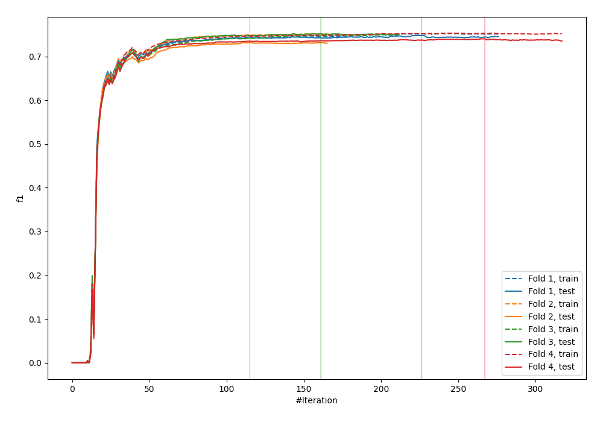
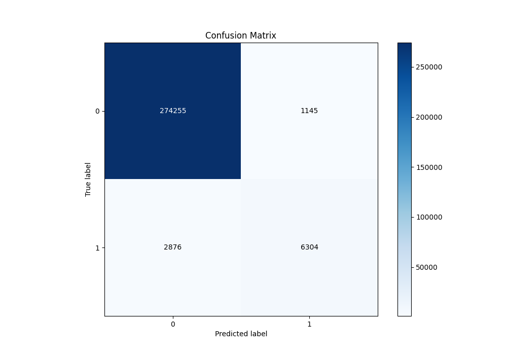
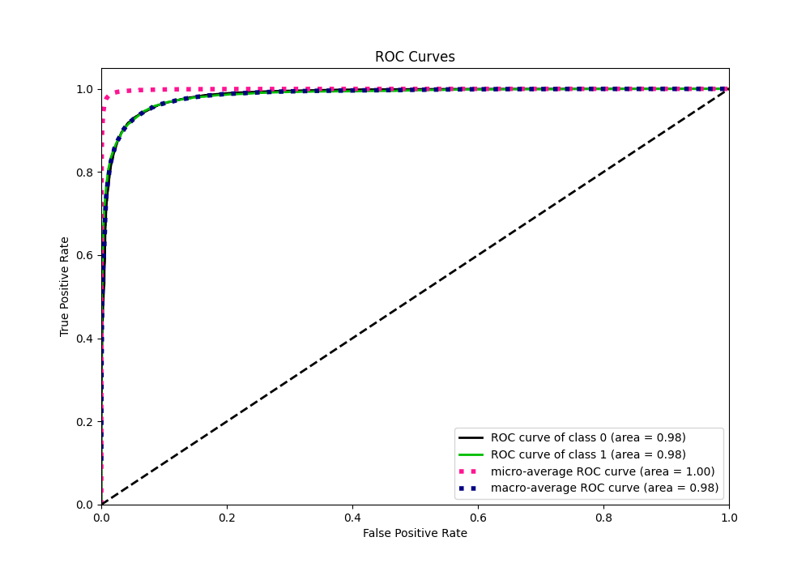
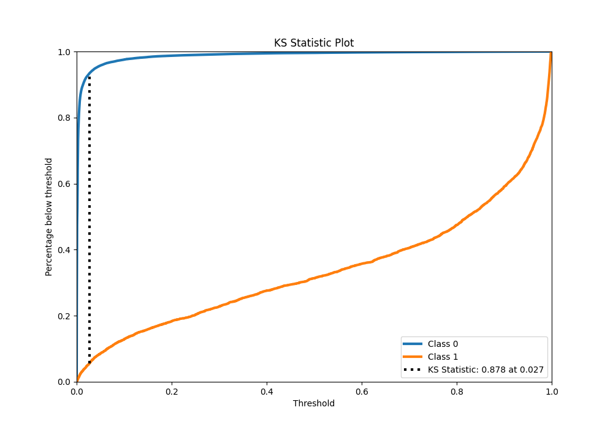
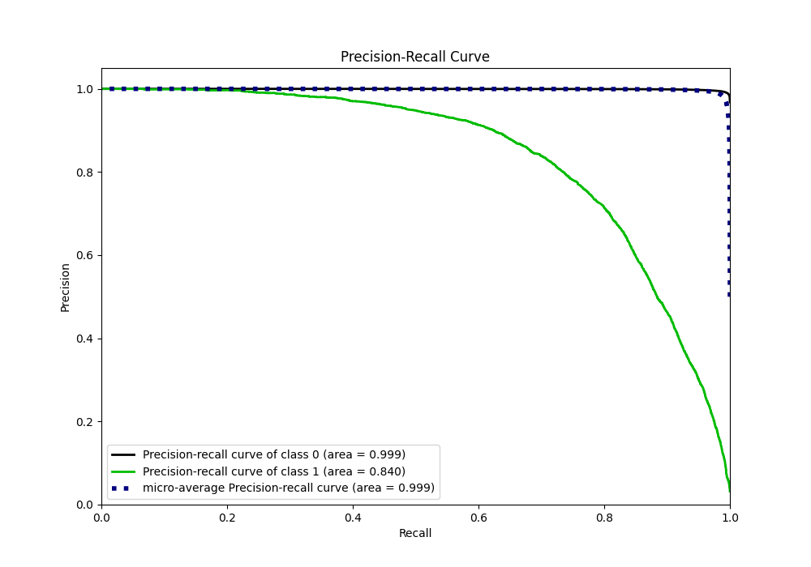
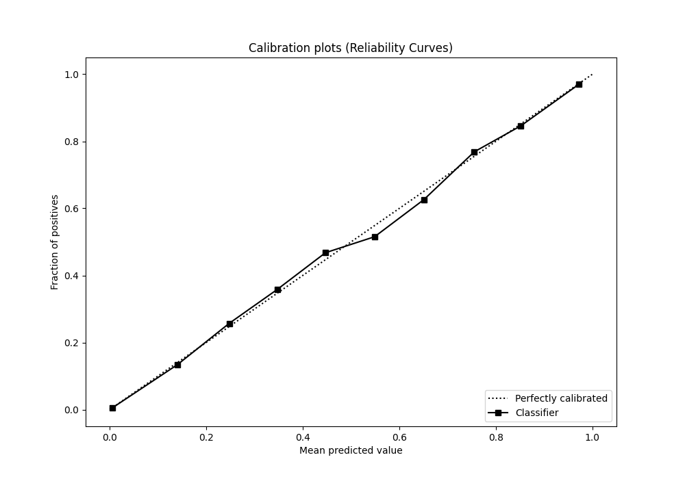
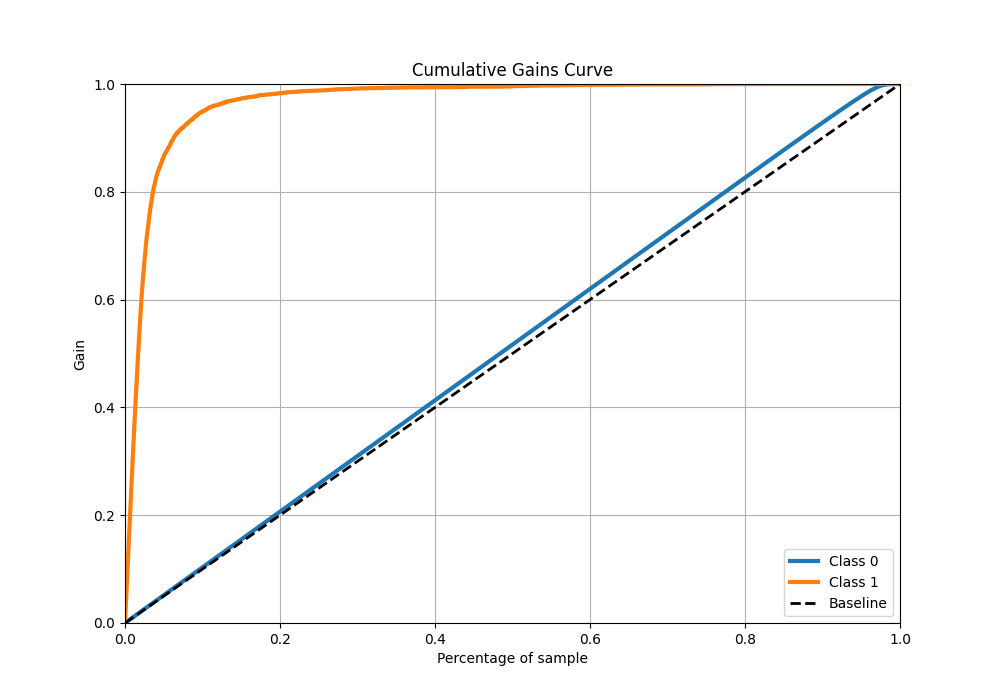
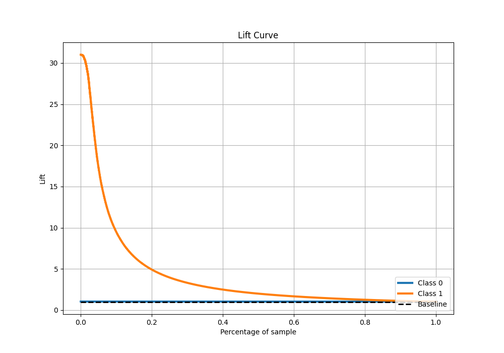

# Summary of 10_Xgboost

[<< Go back](../README.md)

## Extreme Gradient Boosting (Xgboost)
- **n_jobs**: -1
- **objective**: binary:logistic
- **eta**: 0.05
- **max_depth**: 8
- **min_child_weight**: 5
- **subsample**: 0.5
- **colsample_bytree**: 0.8
- **eval_metric**: f1
- **explain_level**: 0

## Validation
 - **validation_type**: kfold
 - **k_folds**: 4
 - **shuffle**: False
 - **stratify**: True

## Optimized metric
f1

## Training time

170.5 seconds

## Metric details
|           |     score |    threshold |
|:----------|----------:|-------------:|
| logloss   | 0.0414532 | nan          |
| auc       | 0.98462   | nan          |
| f1        | 0.765585  |   0.368682   |
| accuracy  | 0.98587   |   0.497389   |
| precision | 0.846288  |   0.497389   |
| recall    | 1         |   2.0445e-05 |
| mcc       | 0.758579  |   0.368682   |

## Metric details with threshold from accuracy metric
|           |     score |   threshold |
|:----------|----------:|------------:|
| logloss   | 0.0414532 |  nan        |
| auc       | 0.98462   |  nan        |
| f1        | 0.758194  |    0.497389 |
| accuracy  | 0.98587   |    0.497389 |
| precision | 0.846288  |    0.497389 |
| recall    | 0.68671   |    0.497389 |
| mcc       | 0.755349  |    0.497389 |

## Confusion matrix (at threshold=0.497389)
|              |   Predicted as 0 |   Predicted as 1 |
|:-------------|-----------------:|-----------------:|
| Labeled as 0 |           274255 |             1145 |
| Labeled as 1 |             2876 |             6304 |

## Learning curves

## Confusion Matrix

## Normalized Confusion Matrix

## ROC Curve

## Kolmogorov-Smirnov Statistic

## Precision-Recall Curve

## Calibration Curve

## Cumulative Gains Curve

## Lift Curve

[<< Go back](../README.md)
