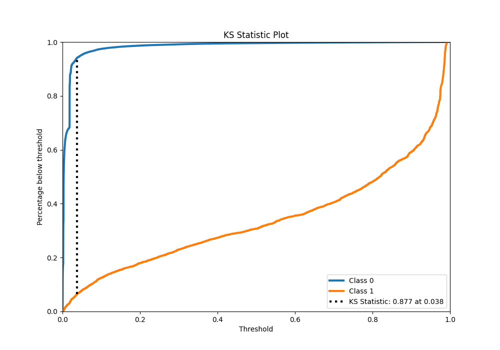
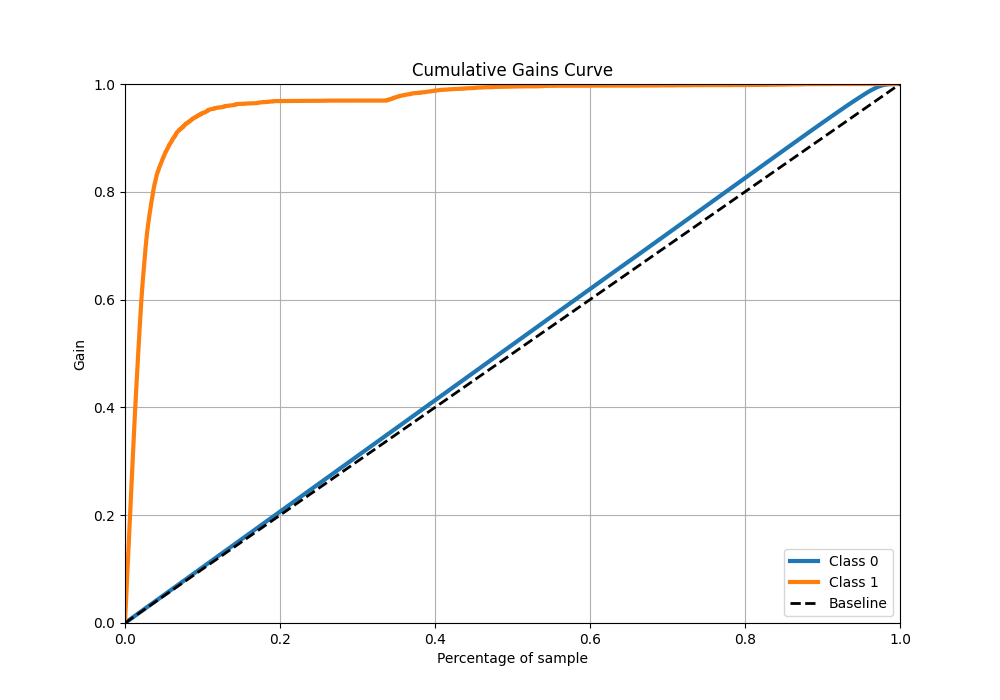

# Summary of 11_Xgboost

[<< Go back](../README.md)

## Extreme Gradient Boosting (Xgboost)
- **n_jobs**: -1
- **objective**: binary:logistic
- **eta**: 0.1
- **max_depth**: 7
- **min_child_weight**: 50
- **subsample**: 1.0
- **colsample_bytree**: 1.0
- **eval_metric**: f1
- **explain_level**: 0

## Validation
 - **validation_type**: kfold
 - **k_folds**: 4
 - **shuffle**: False
 - **stratify**: True

## Optimized metric
f1

## Training time

101.6 seconds

## Metric details
|           |     score |     threshold |
|:----------|----------:|--------------:|
| logloss   | 0.0451933 | nan           |
| auc       | 0.97916   | nan           |
| f1        | 0.766624  |   0.347383    |
| accuracy  | 0.986095  |   0.494996    |
| precision | 0.84732   |   0.494996    |
| recall    | 1         |   0.000120906 |
| mcc       | 0.759948  |   0.494996    |

## Metric details with threshold from accuracy metric
|           |     score |   threshold |
|:----------|----------:|------------:|
| logloss   | 0.0451933 |  nan        |
| auc       | 0.97916   |  nan        |
| f1        | 0.76304   |    0.494996 |
| accuracy  | 0.986095  |    0.494996 |
| precision | 0.84732   |    0.494996 |
| recall    | 0.694009  |    0.494996 |
| mcc       | 0.759948  |    0.494996 |

## Confusion matrix (at threshold=0.494996)
|              |   Predicted as 0 |   Predicted as 1 |
|:-------------|-----------------:|-----------------:|
| Labeled as 0 |           274252 |             1148 |
| Labeled as 1 |             2809 |             6371 |

## Learning curves

## Confusion Matrix

## Normalized Confusion Matrix

## ROC Curve

## Kolmogorov-Smirnov Statistic

## Precision-Recall Curve

## Calibration Curve

## Cumulative Gains Curve

## Lift Curve

[<< Go back](../README.md)
