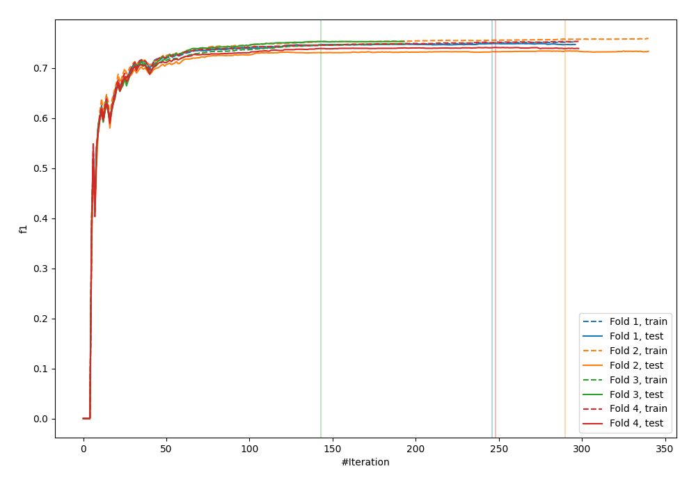
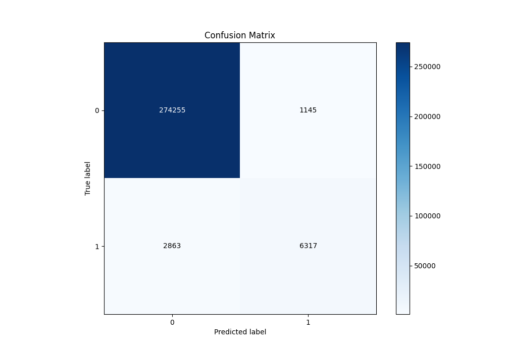
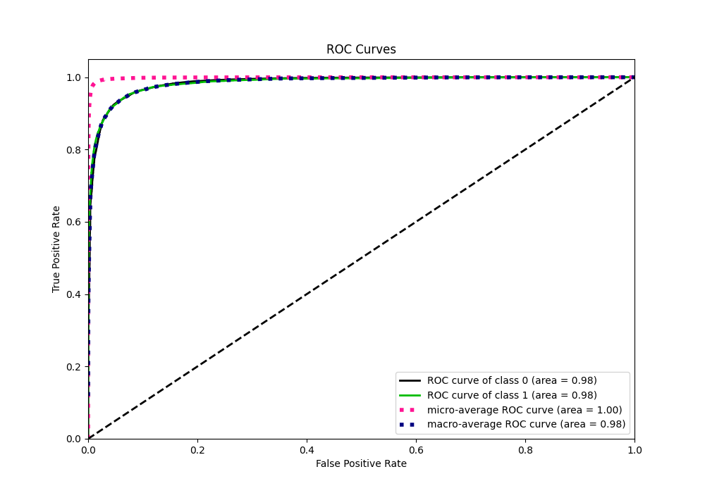
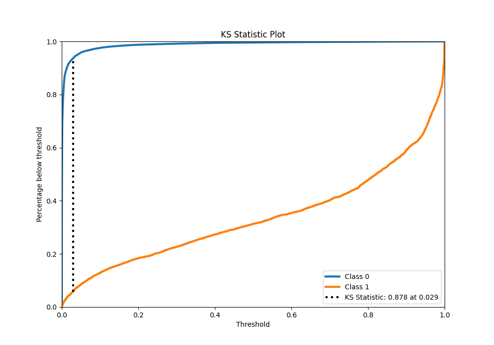
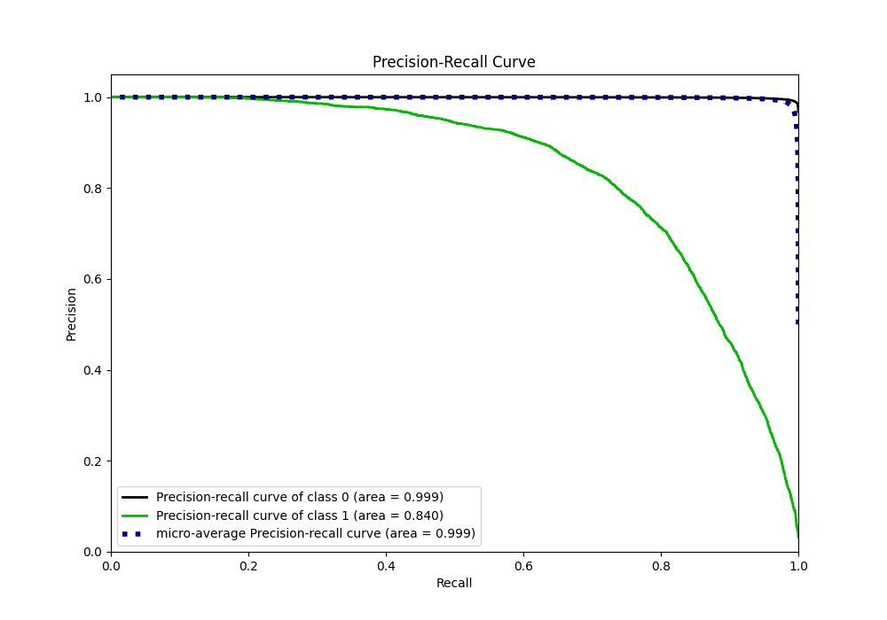
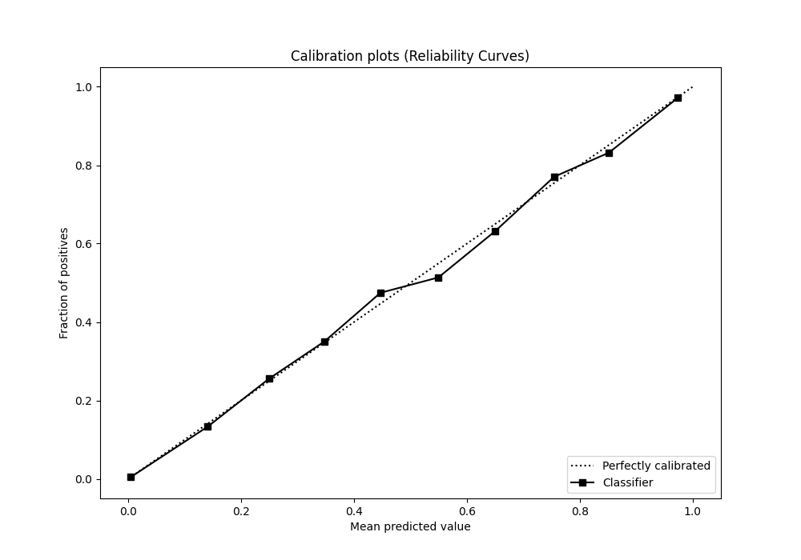
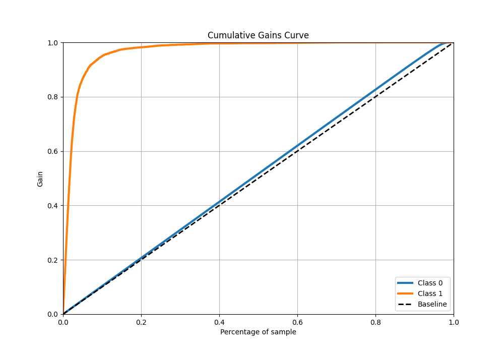
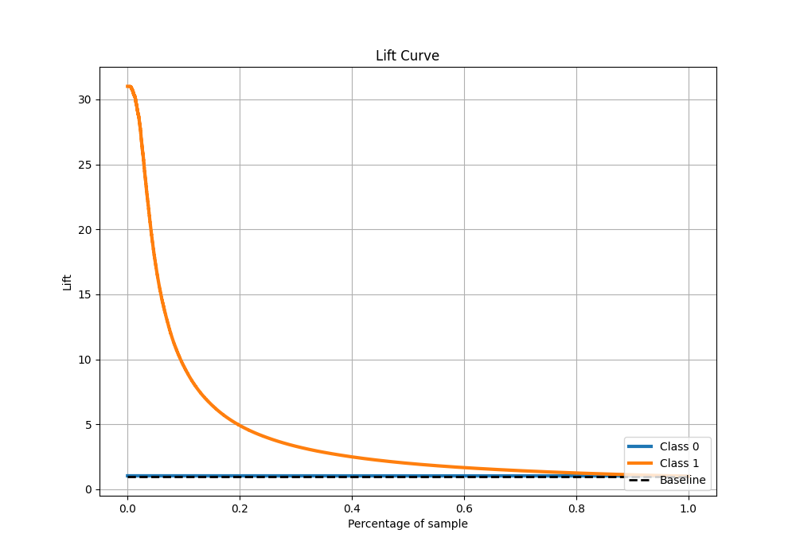

# Summary of 12_Xgboost

[<< Go back](../README.md)

## Extreme Gradient Boosting (Xgboost)
- **n_jobs**: -1
- **objective**: binary:logistic
- **eta**: 0.05
- **max_depth**: 7
- **min_child_weight**: 1
- **subsample**: 0.9
- **colsample_bytree**: 0.9
- **eval_metric**: f1
- **explain_level**: 0

## Validation
 - **validation_type**: kfold
 - **k_folds**: 4
 - **shuffle**: False
 - **stratify**: True

## Optimized metric
f1

## Training time

193.7 seconds

## Metric details
|           |     score |     threshold |
|:----------|----------:|--------------:|
| logloss   | 0.0412417 | nan           |
| auc       | 0.984984  | nan           |
| f1        | 0.766565  |   0.375336    |
| accuracy  | 0.985916  |   0.49779     |
| precision | 0.846556  |   0.49779     |
| recall    | 1         |   4.20713e-06 |
| mcc       | 0.759742  |   0.375336    |

## Metric details with threshold from accuracy metric
|           |     score |   threshold |
|:----------|----------:|------------:|
| logloss   | 0.0412417 |   nan       |
| auc       | 0.984984  |   nan       |
| f1        | 0.759164  |     0.49779 |
| accuracy  | 0.985916  |     0.49779 |
| precision | 0.846556  |     0.49779 |
| recall    | 0.688126  |     0.49779 |
| mcc       | 0.756275  |     0.49779 |

## Confusion matrix (at threshold=0.49779)
|              |   Predicted as 0 |   Predicted as 1 |
|:-------------|-----------------:|-----------------:|
| Labeled as 0 |           274255 |             1145 |
| Labeled as 1 |             2863 |             6317 |

## Learning curves

## Confusion Matrix

## Normalized Confusion Matrix

## ROC Curve

## Kolmogorov-Smirnov Statistic

## Precision-Recall Curve

## Calibration Curve

## Cumulative Gains Curve

## Lift Curve

[<< Go back](../README.md)
