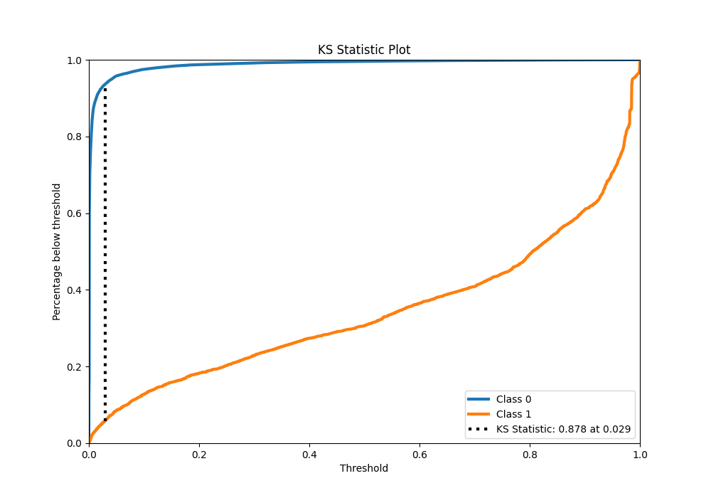

# Summary of 15_LightGBM

[<< Go back](../README.md)

## LightGBM
- **n_jobs**: -1
- **objective**: binary
- **num_leaves**: 63
- **learning_rate**: 0.05
- **feature_fraction**: 0.9
- **bagging_fraction**: 1.0
- **min_data_in_leaf**: 20
- **metric**: custom
- **custom_eval_metric_name**: f1
- **explain_level**: 0

## Validation
 - **validation_type**: kfold
 - **k_folds**: 4
 - **shuffle**: False
 - **stratify**: True

## Optimized metric
f1

## Training time

138.3 seconds

## Metric details
|           |     score |    threshold |
|:----------|----------:|-------------:|
| logloss   | 0.0414413 | nan          |
| auc       | 0.984669  | nan          |
| f1        | 0.766801  |   0.373993   |
| accuracy  | 0.986067  |   0.498231   |
| precision | 0.846052  |   0.498231   |
| recall    | 1         |   3.8106e-06 |
| mcc       | 0.759974  |   0.373993   |

## Metric details with threshold from accuracy metric
|           |     score |   threshold |
|:----------|----------:|------------:|
| logloss   | 0.0414413 |  nan        |
| auc       | 0.984669  |  nan        |
| f1        | 0.762788  |    0.498231 |
| accuracy  | 0.986067  |    0.498231 |
| precision | 0.846052  |    0.498231 |
| recall    | 0.694444  |    0.498231 |
| mcc       | 0.759595  |    0.498231 |

## Confusion matrix (at threshold=0.498231)
|              |   Predicted as 0 |   Predicted as 1 |
|:-------------|-----------------:|-----------------:|
| Labeled as 0 |           274240 |             1160 |
| Labeled as 1 |             2805 |             6375 |

## Learning curves

## Confusion Matrix

## Normalized Confusion Matrix

## ROC Curve

## Kolmogorov-Smirnov Statistic

## Precision-Recall Curve

## Calibration Curve

## Cumulative Gains Curve

## Lift Curve

[<< Go back](../README.md)
