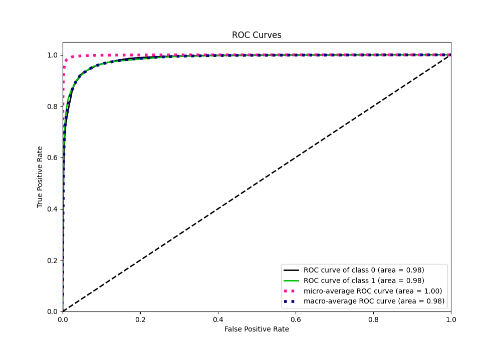

# Summary of 16_LightGBM

[<< Go back](../README.md)

## LightGBM
- **n_jobs**: -1
- **objective**: binary
- **num_leaves**: 95
- **learning_rate**: 0.05
- **feature_fraction**: 1.0
- **bagging_fraction**: 1.0
- **min_data_in_leaf**: 10
- **metric**: custom
- **custom_eval_metric_name**: f1
- **explain_level**: 0

## Validation
 - **validation_type**: kfold
 - **k_folds**: 4
 - **shuffle**: False
 - **stratify**: True

## Optimized metric
f1

## Training time

131.3 seconds

## Metric details
|           |     score |     threshold |
|:----------|----------:|--------------:|
| logloss   | 0.0416464 | nan           |
| auc       | 0.98456   | nan           |
| f1        | 0.765839  |   0.377954    |
| accuracy  | 0.985944  |   0.493693    |
| precision | 0.842411  |   0.493693    |
| recall    | 1         |   0.000146069 |
| mcc       | 0.759022  |   0.377954    |

## Metric details with threshold from accuracy metric
|           |     score |   threshold |
|:----------|----------:|------------:|
| logloss   | 0.0416464 |  nan        |
| auc       | 0.98456   |  nan        |
| f1        | 0.761108  |    0.493693 |
| accuracy  | 0.985944  |    0.493693 |
| precision | 0.842411  |    0.493693 |
| recall    | 0.694118  |    0.493693 |
| mcc       | 0.75769   |    0.493693 |

## Confusion matrix (at threshold=0.493693)
|              |   Predicted as 0 |   Predicted as 1 |
|:-------------|-----------------:|-----------------:|
| Labeled as 0 |           274208 |             1192 |
| Labeled as 1 |             2808 |             6372 |

## Learning curves

## Confusion Matrix

## Normalized Confusion Matrix

## ROC Curve

## Kolmogorov-Smirnov Statistic

## Precision-Recall Curve

## Calibration Curve

## Cumulative Gains Curve

## Lift Curve

[<< Go back](../README.md)
