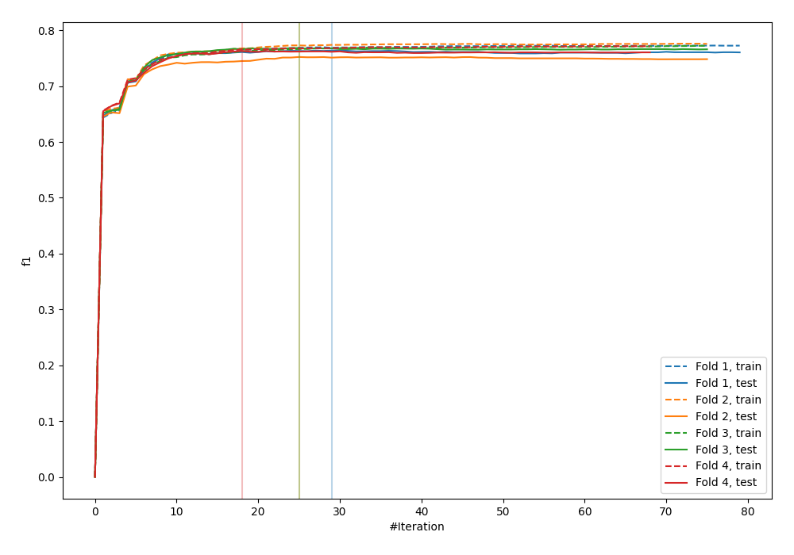
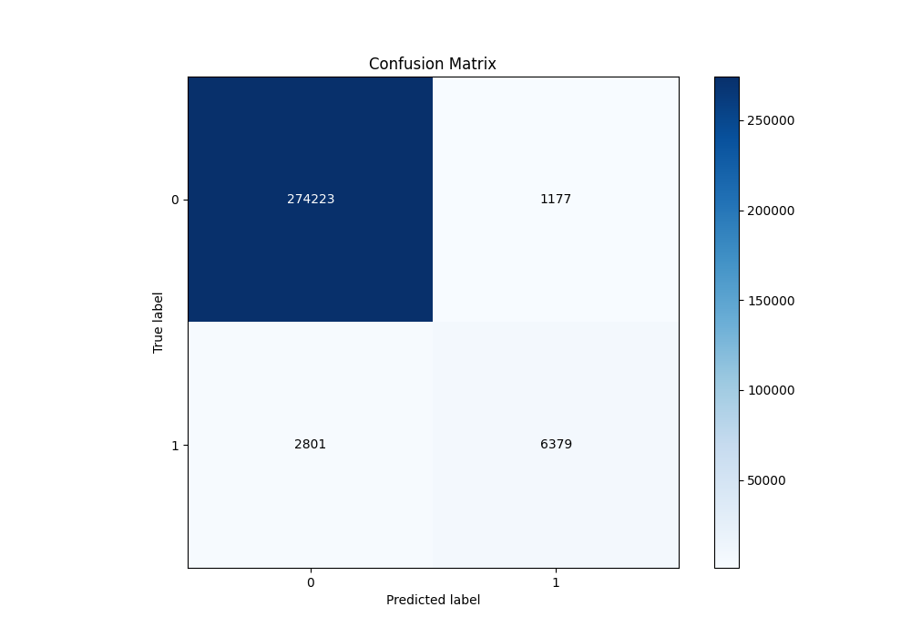
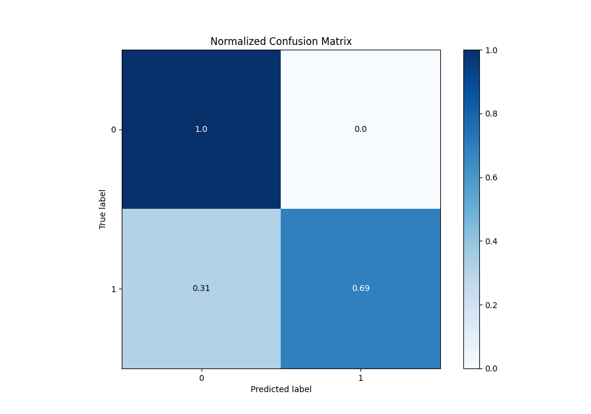
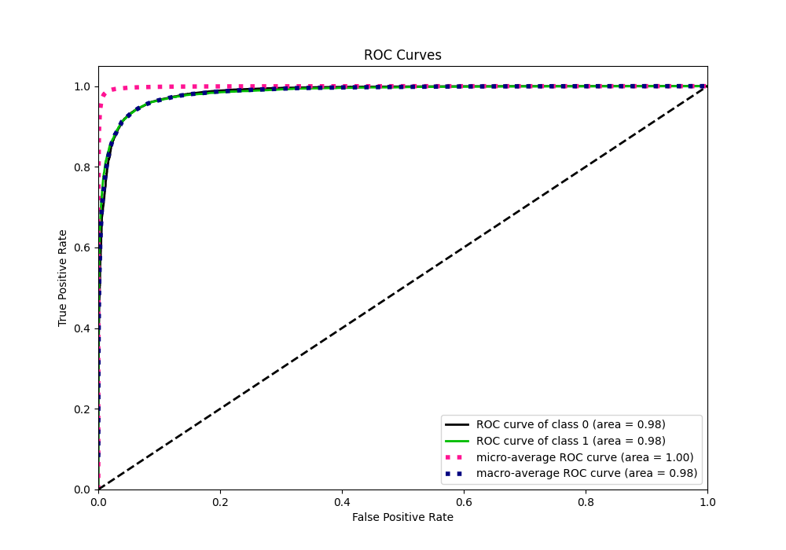
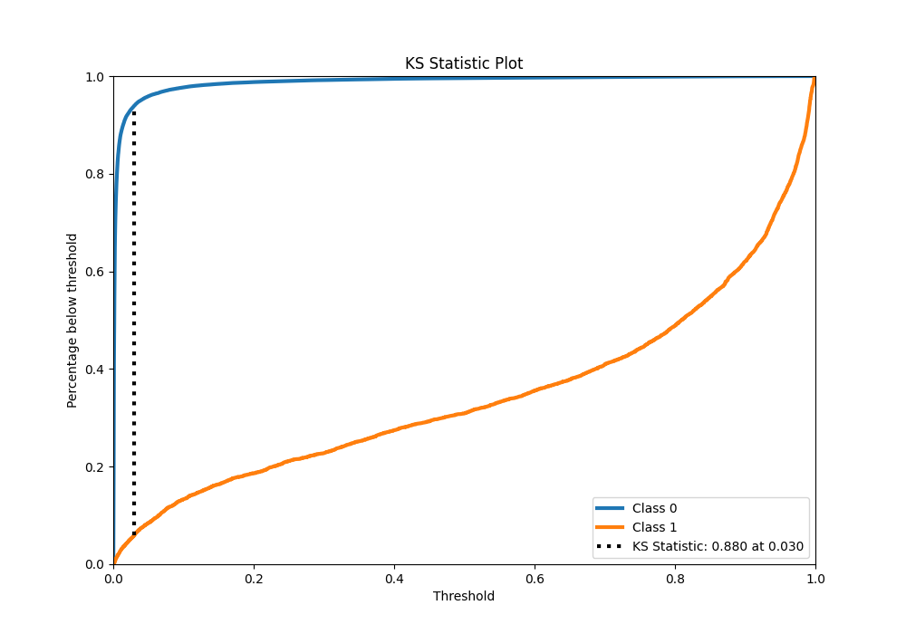
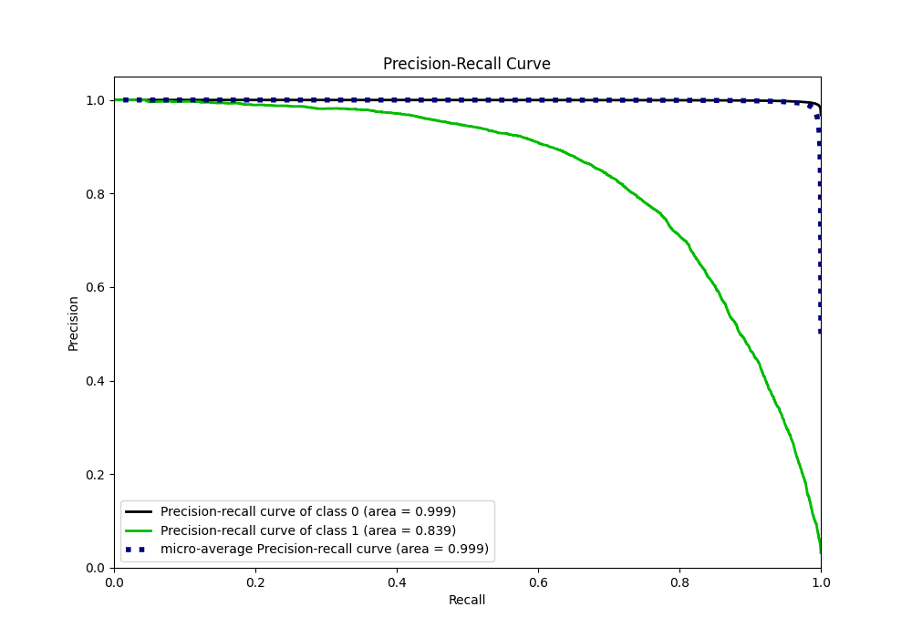
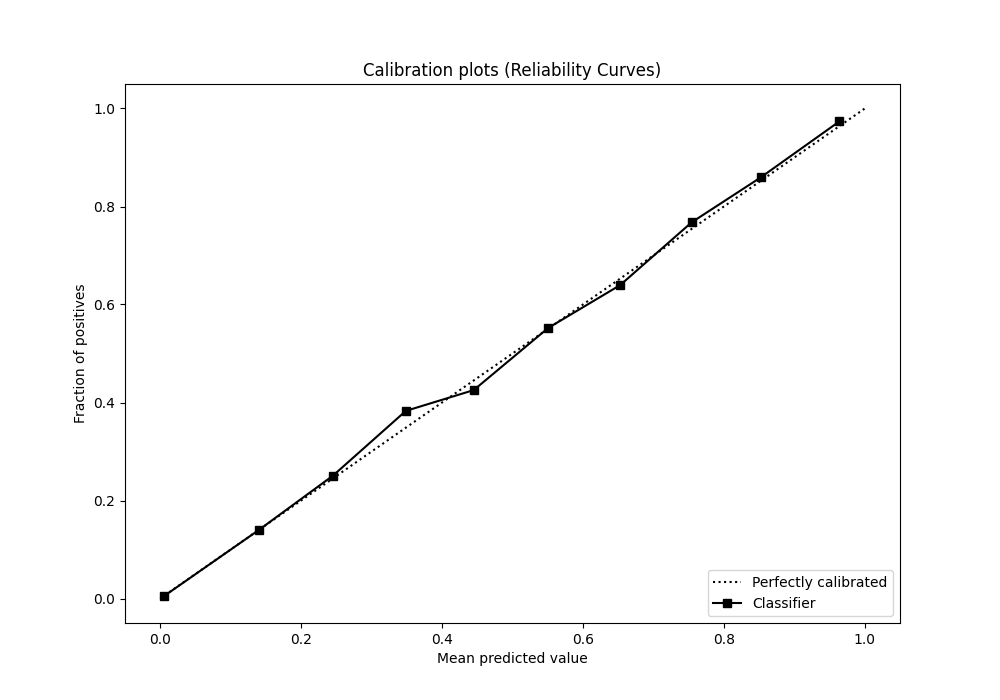
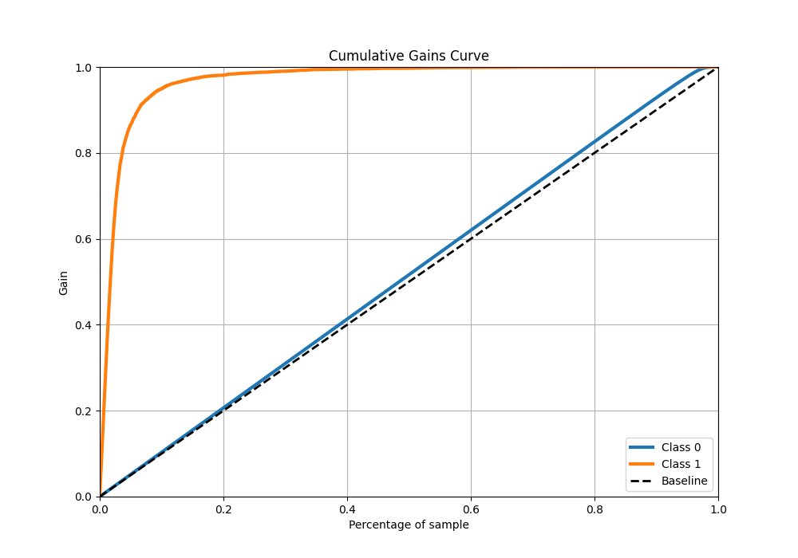
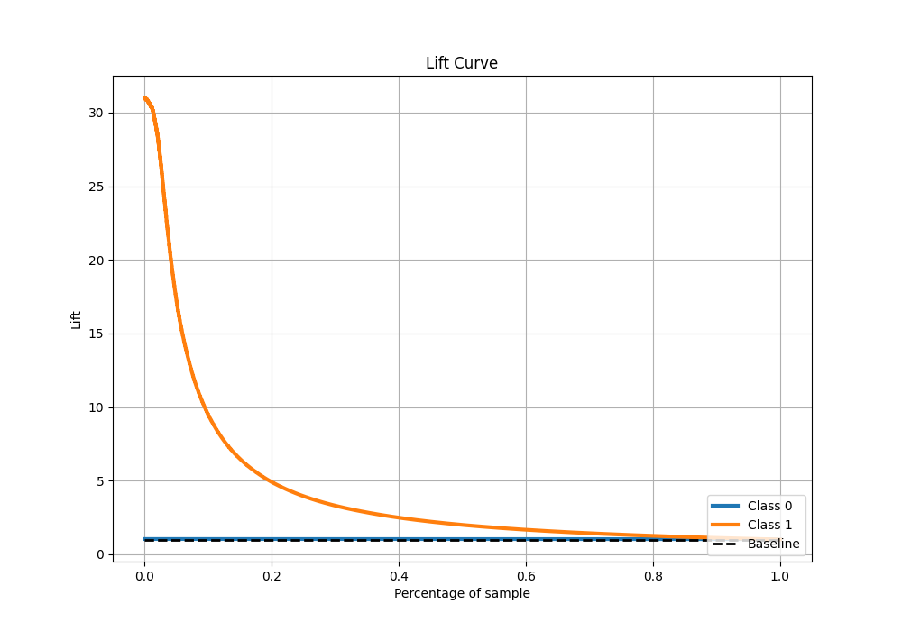

# Summary of 17_LightGBM

[<< Go back](../README.md)

## LightGBM
- **n_jobs**: -1
- **objective**: binary
- **num_leaves**: 63
- **learning_rate**: 0.2
- **feature_fraction**: 0.5
- **bagging_fraction**: 1.0
- **min_data_in_leaf**: 30
- **metric**: custom
- **custom_eval_metric_name**: f1
- **explain_level**: 0

## Validation
 - **validation_type**: kfold
 - **k_folds**: 4
 - **shuffle**: False
 - **stratify**: True

## Optimized metric
f1

## Training time

85.0 seconds

## Metric details
|           |     score |     threshold |
|:----------|----------:|--------------:|
| logloss   | 0.0416888 | nan           |
| auc       | 0.984865  | nan           |
| f1        | 0.766119  |   0.378563    |
| accuracy  | 0.986022  |   0.485945    |
| precision | 0.84423   |   0.485945    |
| recall    | 1         |   3.67293e-05 |
| mcc       | 0.759417  |   0.378563    |

## Metric details with threshold from accuracy metric
|           |     score |   threshold |
|:----------|----------:|------------:|
| logloss   | 0.0416888 |  nan        |
| auc       | 0.984865  |  nan        |
| f1        | 0.762309  |    0.485945 |
| accuracy  | 0.986022  |    0.485945 |
| precision | 0.84423   |    0.485945 |
| recall    | 0.69488   |    0.485945 |
| mcc       | 0.758978  |    0.485945 |

## Confusion matrix (at threshold=0.485945)
|              |   Predicted as 0 |   Predicted as 1 |
|:-------------|-----------------:|-----------------:|
| Labeled as 0 |           274223 |             1177 |
| Labeled as 1 |             2801 |             6379 |

## Learning curves

## Confusion Matrix

## Normalized Confusion Matrix

## ROC Curve

## Kolmogorov-Smirnov Statistic

## Precision-Recall Curve

## Calibration Curve

## Cumulative Gains Curve

## Lift Curve

[<< Go back](../README.md)
