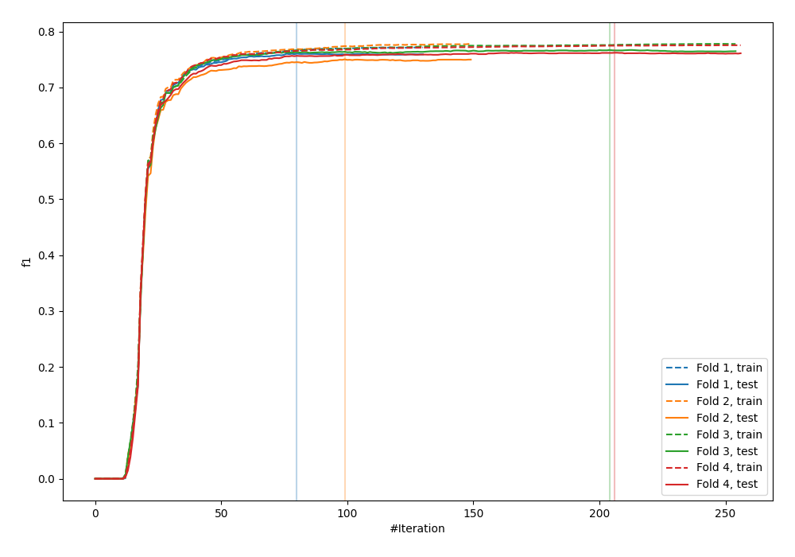
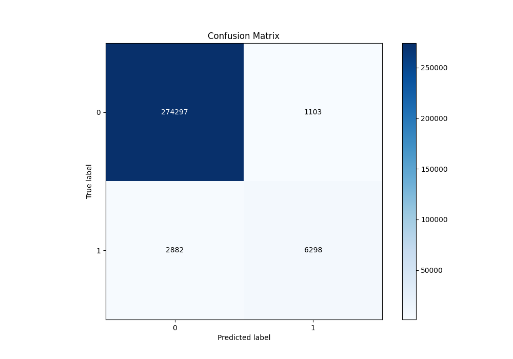
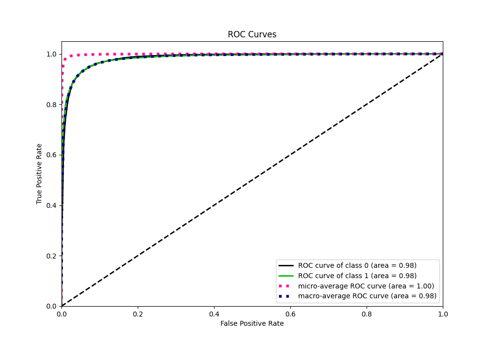
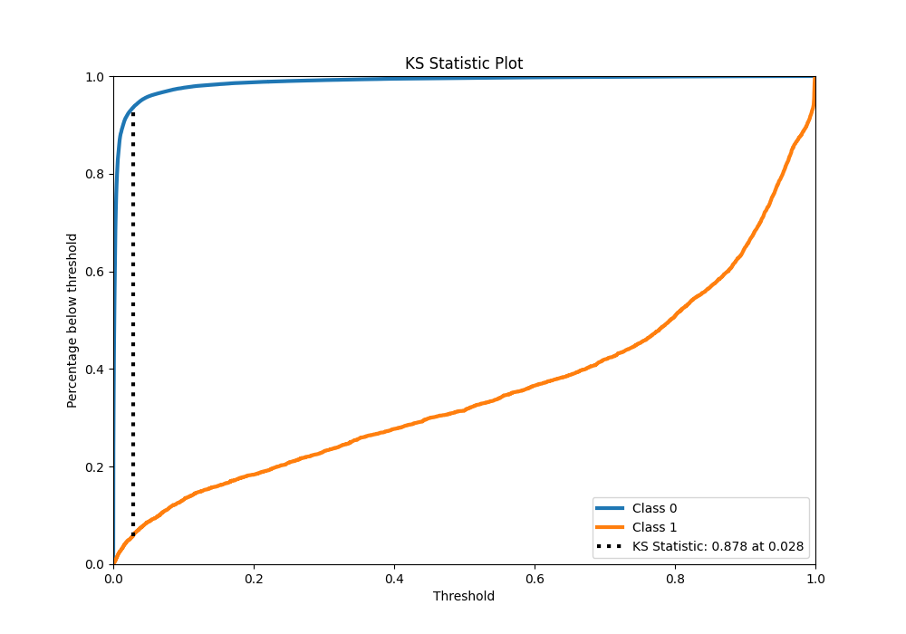
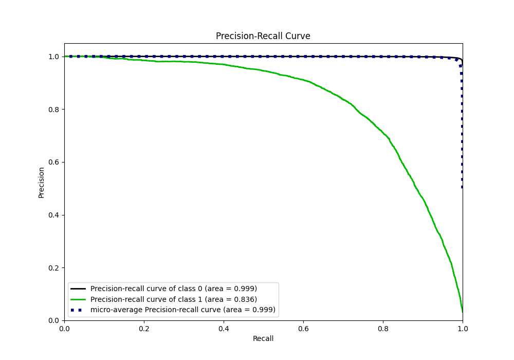
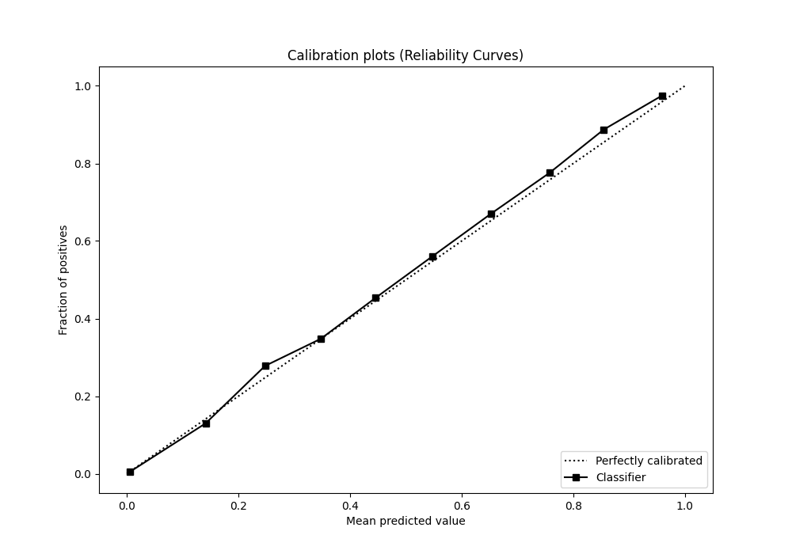
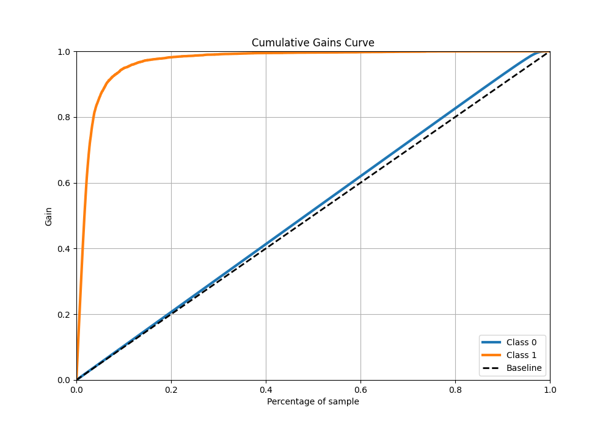
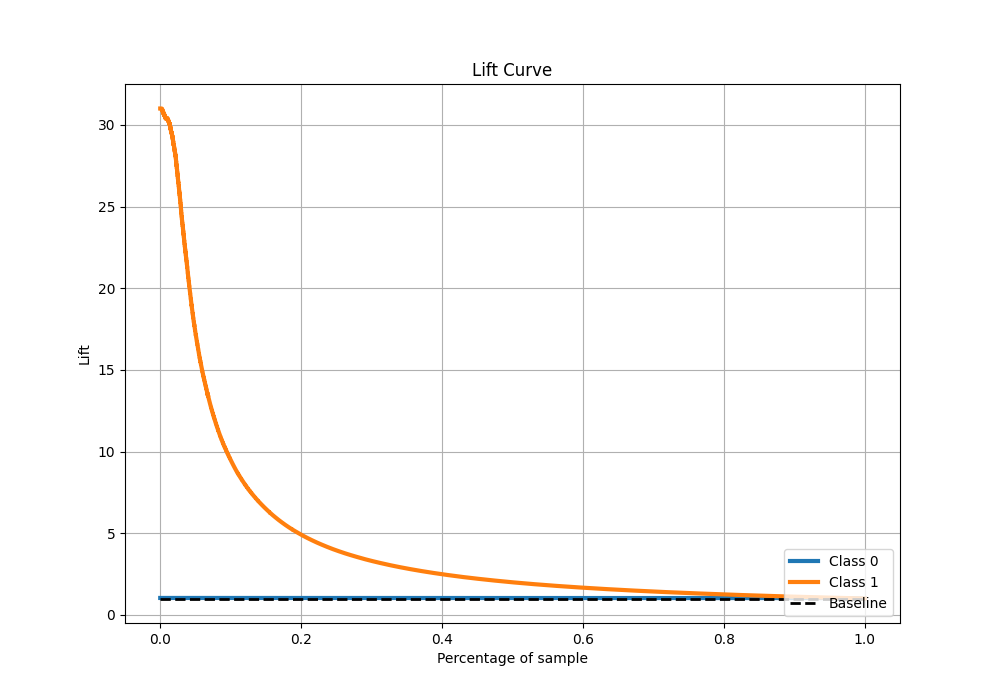

# Summary of 18_LightGBM

[<< Go back](../README.md)

## LightGBM
- **n_jobs**: -1
- **objective**: binary
- **num_leaves**: 127
- **learning_rate**: 0.05
- **feature_fraction**: 0.5
- **bagging_fraction**: 0.5
- **min_data_in_leaf**: 20
- **metric**: custom
- **custom_eval_metric_name**: f1
- **explain_level**: 0

## Validation
 - **validation_type**: kfold
 - **k_folds**: 4
 - **shuffle**: False
 - **stratify**: True

## Optimized metric
f1

## Training time

163.2 seconds

## Metric details
|           |     score |     threshold |
|:----------|----------:|--------------:|
| logloss   | 0.0420446 | nan           |
| auc       | 0.984168  | nan           |
| f1        | 0.764943  |   0.376323    |
| accuracy  | 0.985997  |   0.496515    |
| precision | 0.850966  |   0.496515    |
| recall    | 1         |   7.11027e-07 |
| mcc       | 0.758254  |   0.376323    |

## Metric details with threshold from accuracy metric
|           |     score |   threshold |
|:----------|----------:|------------:|
| logloss   | 0.0420446 |  nan        |
| auc       | 0.984168  |  nan        |
| f1        | 0.759665  |    0.496515 |
| accuracy  | 0.985997  |    0.496515 |
| precision | 0.850966  |    0.496515 |
| recall    | 0.686057  |    0.496515 |
| mcc       | 0.757173  |    0.496515 |

## Confusion matrix (at threshold=0.496515)
|              |   Predicted as 0 |   Predicted as 1 |
|:-------------|-----------------:|-----------------:|
| Labeled as 0 |           274297 |             1103 |
| Labeled as 1 |             2882 |             6298 |

## Learning curves

## Confusion Matrix

## Normalized Confusion Matrix

## ROC Curve

## Kolmogorov-Smirnov Statistic

## Precision-Recall Curve

## Calibration Curve

## Cumulative Gains Curve

## Lift Curve

[<< Go back](../README.md)
