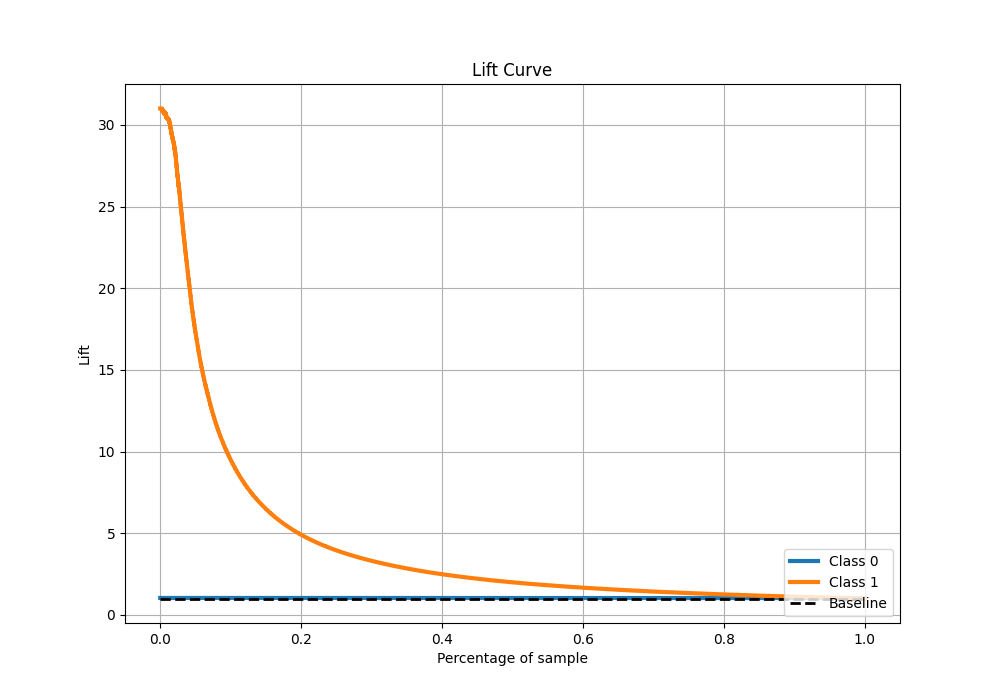

# Summary of 1_Default_LightGBM

[<< Go back](../README.md)

## LightGBM
- **n_jobs**: -1
- **objective**: binary
- **num_leaves**: 63
- **learning_rate**: 0.05
- **feature_fraction**: 0.9
- **bagging_fraction**: 0.9
- **min_data_in_leaf**: 10
- **metric**: custom
- **custom_eval_metric_name**: f1
- **explain_level**: 0

## Validation
 - **validation_type**: kfold
 - **k_folds**: 4
 - **shuffle**: False
 - **stratify**: True

## Optimized metric
f1

## Training time

129.1 seconds

## Metric details
|           |     score |     threshold |
|:----------|----------:|--------------:|
| logloss   | 0.0415782 | nan           |
| auc       | 0.984257  | nan           |
| f1        | 0.767018  |   0.372066    |
| accuracy  | 0.986014  |   0.480172    |
| precision | 0.838101  |   0.480172    |
| recall    | 1         |   5.80829e-05 |
| mcc       | 0.76021   |   0.372066    |

## Metric details with threshold from accuracy metric
|           |     score |   threshold |
|:----------|----------:|------------:|
| logloss   | 0.0415782 |  nan        |
| auc       | 0.984257  |  nan        |
| f1        | 0.764078  |    0.480172 |
| accuracy  | 0.986014  |    0.480172 |
| precision | 0.838101  |    0.480172 |
| recall    | 0.70207   |    0.480172 |
| mcc       | 0.760083  |    0.480172 |

## Confusion matrix (at threshold=0.480172)
|              |   Predicted as 0 |   Predicted as 1 |
|:-------------|-----------------:|-----------------:|
| Labeled as 0 |           274155 |             1245 |
| Labeled as 1 |             2735 |             6445 |

## Learning curves

## Confusion Matrix

## Normalized Confusion Matrix

## ROC Curve

## Kolmogorov-Smirnov Statistic

## Precision-Recall Curve

## Calibration Curve

## Cumulative Gains Curve

## Lift Curve

[<< Go back](../README.md)
