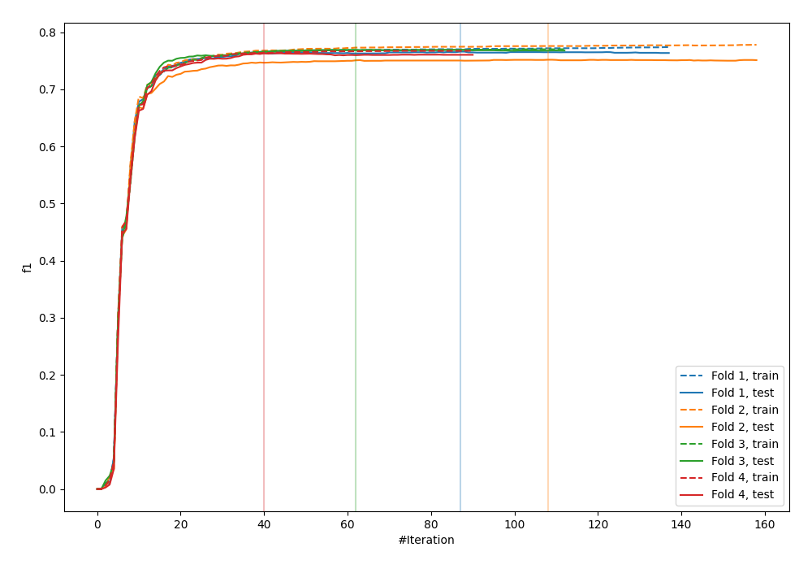
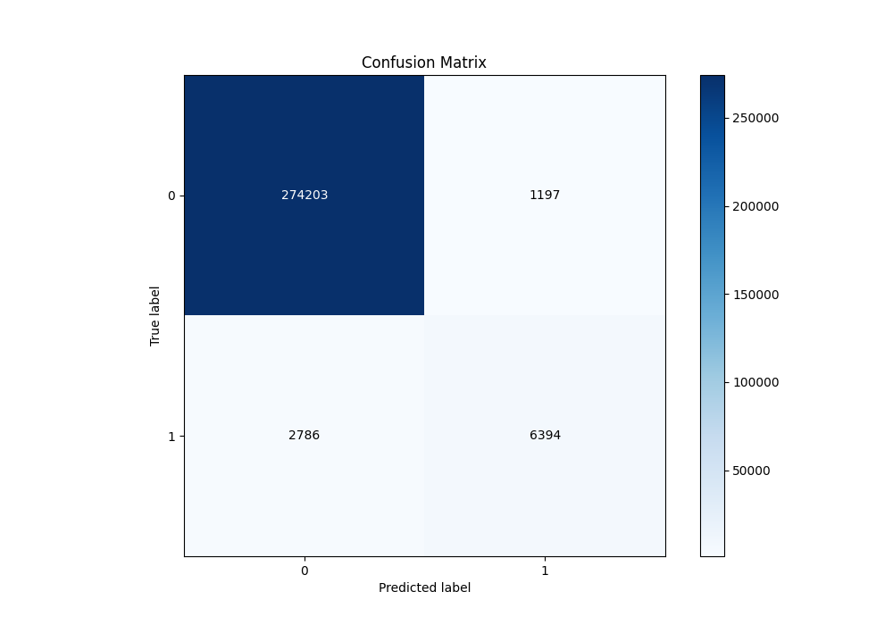
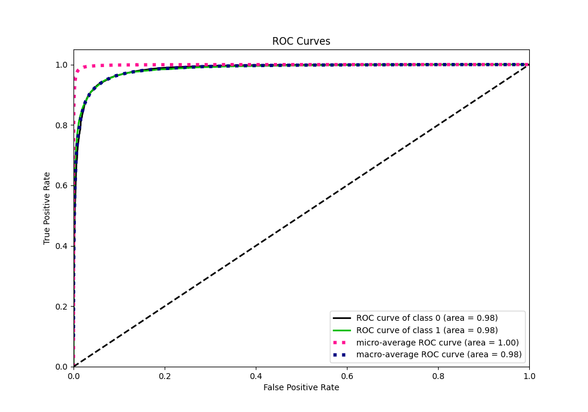
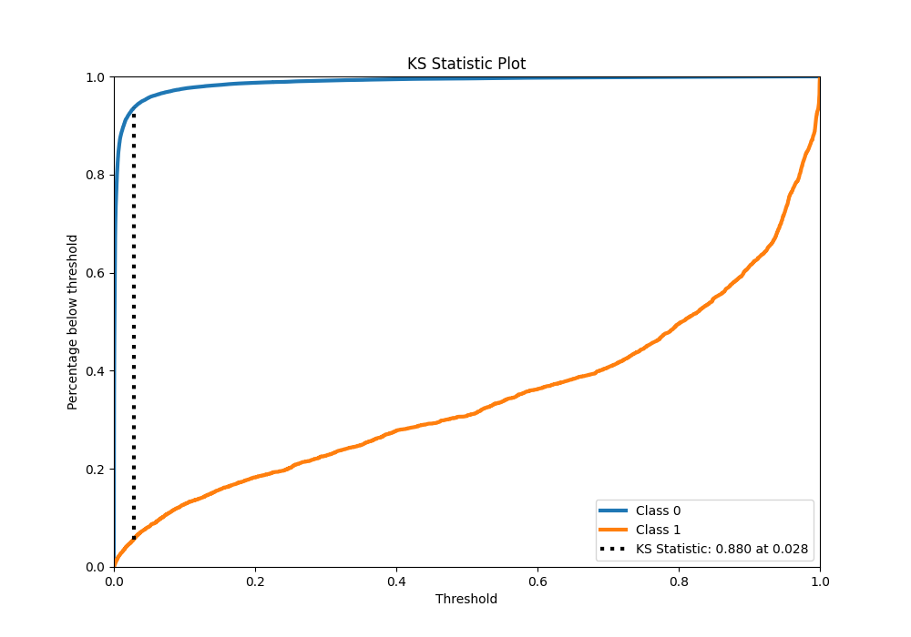
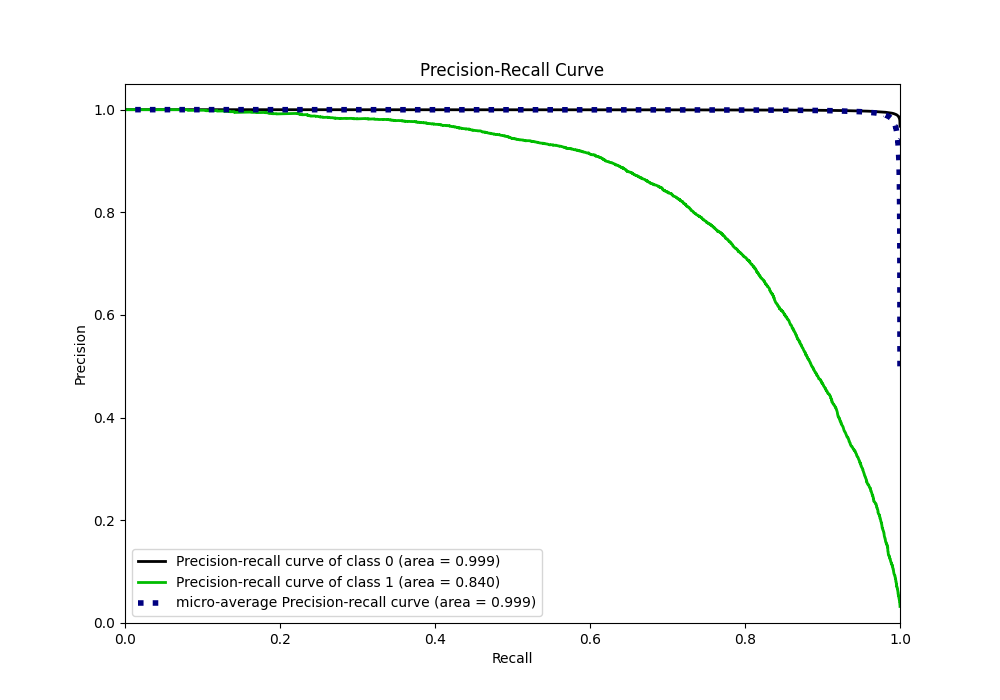
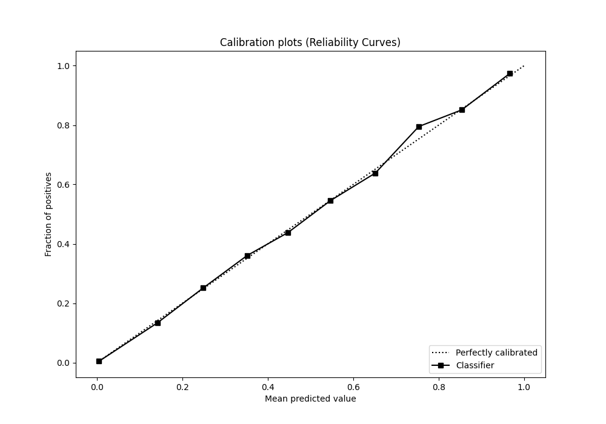
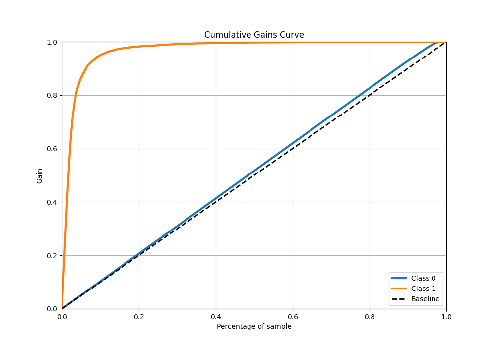
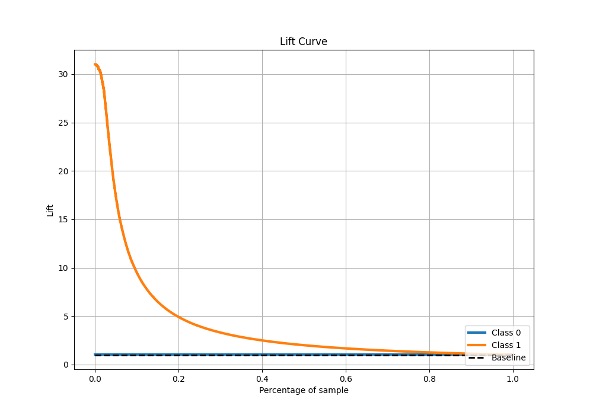

# Summary of 20_LightGBM

[<< Go back](../README.md)

## LightGBM
- **n_jobs**: -1
- **objective**: binary
- **num_leaves**: 31
- **learning_rate**: 0.1
- **feature_fraction**: 0.8
- **bagging_fraction**: 0.8
- **min_data_in_leaf**: 5
- **metric**: custom
- **custom_eval_metric_name**: f1
- **explain_level**: 0

## Validation
 - **validation_type**: kfold
 - **k_folds**: 4
 - **shuffle**: False
 - **stratify**: True

## Optimized metric
f1

## Training time

116.8 seconds

## Metric details
|           |     score |     threshold |
|:----------|----------:|--------------:|
| logloss   | 0.0413481 | nan           |
| auc       | 0.984667  | nan           |
| f1        | 0.766099  |   0.386912    |
| accuracy  | 0.986004  |   0.481569    |
| precision | 0.842313  |   0.481569    |
| recall    | 1         |   8.03933e-07 |
| mcc       | 0.759715  |   0.386912    |

## Metric details with threshold from accuracy metric
|           |     score |   threshold |
|:----------|----------:|------------:|
| logloss   | 0.0413481 |  nan        |
| auc       | 0.984667  |  nan        |
| f1        | 0.762507  |    0.481569 |
| accuracy  | 0.986004  |    0.481569 |
| precision | 0.842313  |    0.481569 |
| recall    | 0.696514  |    0.481569 |
| mcc       | 0.758986  |    0.481569 |

## Confusion matrix (at threshold=0.481569)
|              |   Predicted as 0 |   Predicted as 1 |
|:-------------|-----------------:|-----------------:|
| Labeled as 0 |           274203 |             1197 |
| Labeled as 1 |             2786 |             6394 |

## Learning curves

## Confusion Matrix

## Normalized Confusion Matrix

## ROC Curve

## Kolmogorov-Smirnov Statistic

## Precision-Recall Curve

## Calibration Curve

## Cumulative Gains Curve

## Lift Curve

[<< Go back](../README.md)
