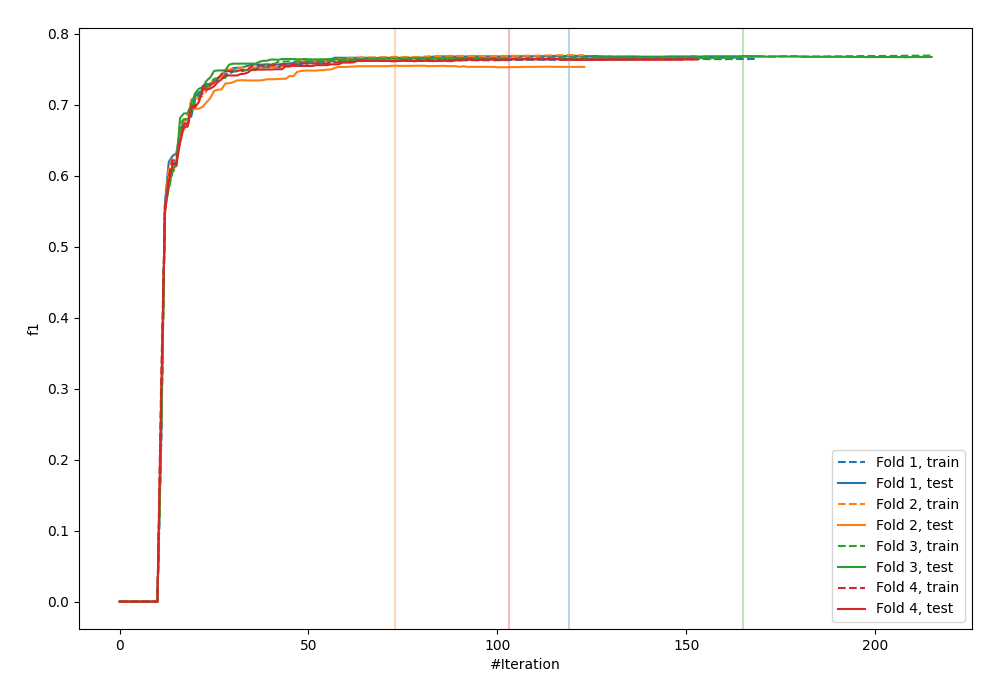
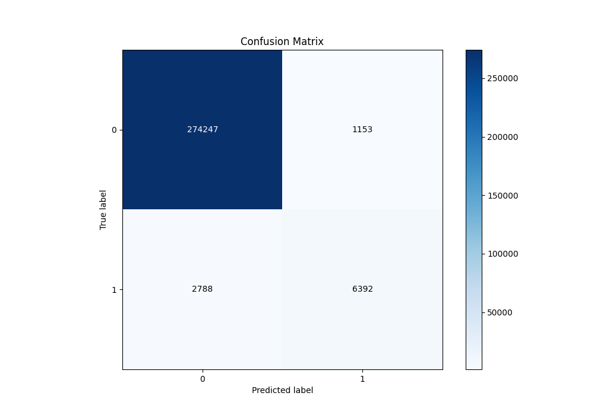
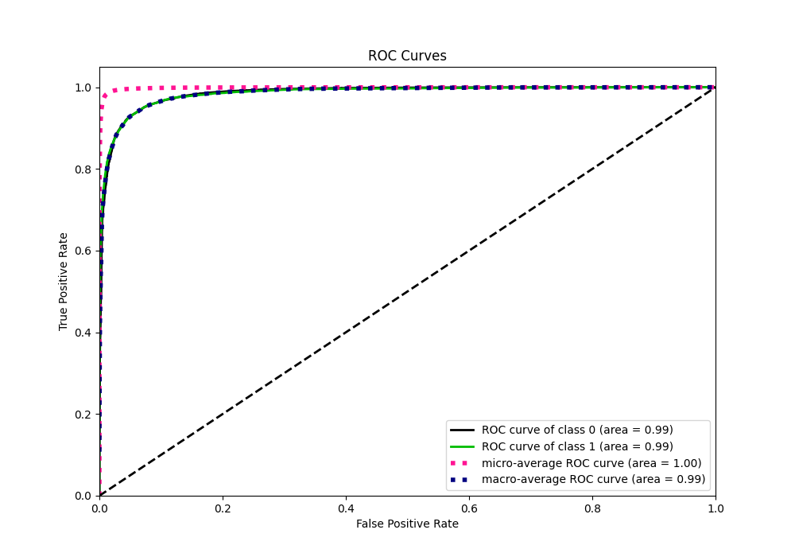
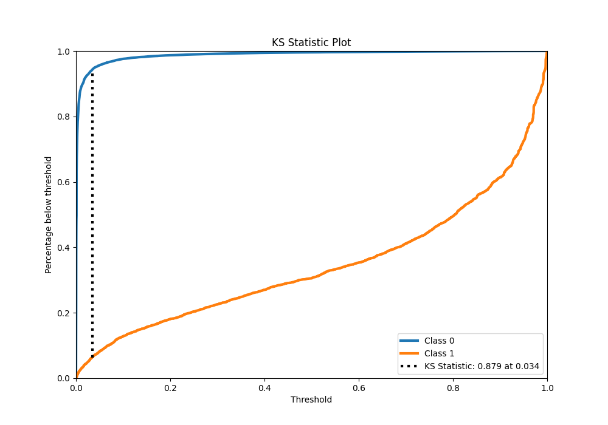
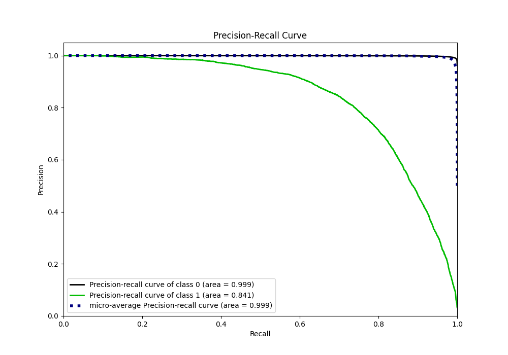
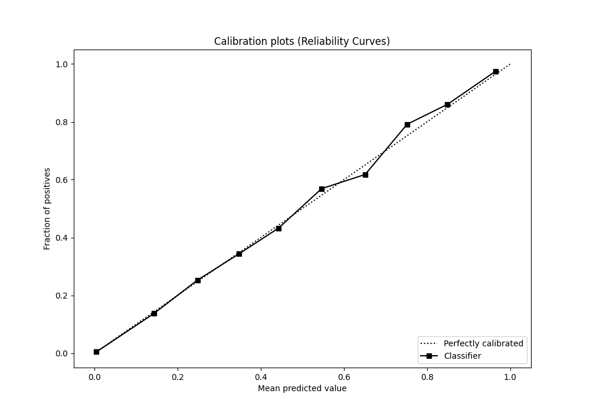
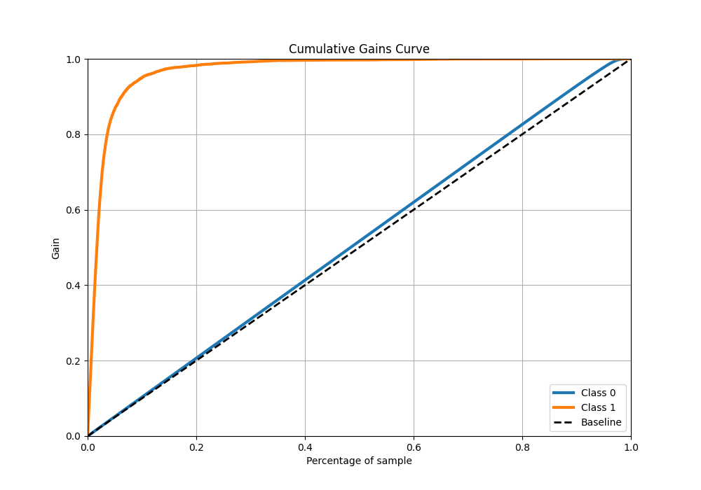
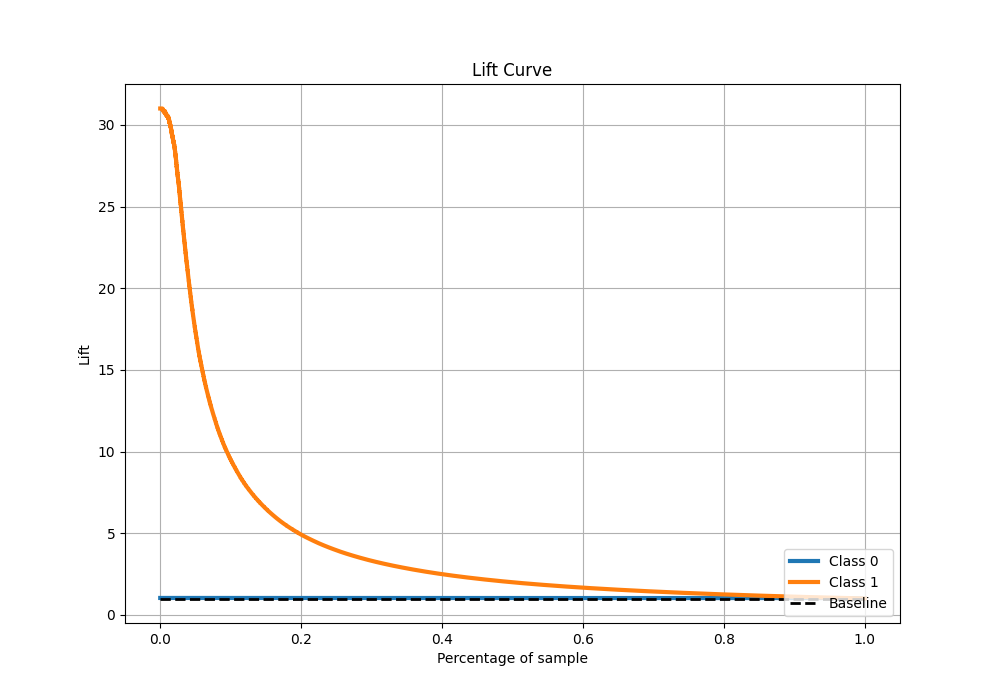

# Summary of 21_LightGBM

[<< Go back](../README.md)

## LightGBM
- **n_jobs**: -1
- **objective**: binary
- **num_leaves**: 15
- **learning_rate**: 0.05
- **feature_fraction**: 1.0
- **bagging_fraction**: 0.5
- **min_data_in_leaf**: 30
- **metric**: custom
- **custom_eval_metric_name**: f1
- **explain_level**: 0

## Validation
 - **validation_type**: kfold
 - **k_folds**: 4
 - **shuffle**: False
 - **stratify**: True

## Optimized metric
f1

## Training time

140.5 seconds

## Metric details
|           |     score |     threshold |
|:----------|----------:|--------------:|
| logloss   | 0.0410883 | nan           |
| auc       | 0.985271  | nan           |
| f1        | 0.7686    |   0.36432     |
| accuracy  | 0.986152  |   0.489494    |
| precision | 0.847184  |   0.489494    |
| recall    | 1         |   1.63519e-05 |
| mcc       | 0.761546  |   0.36432     |

## Metric details with threshold from accuracy metric
|           |     score |   threshold |
|:----------|----------:|------------:|
| logloss   | 0.0410883 |  nan        |
| auc       | 0.985271  |  nan        |
| f1        | 0.764365  |    0.489494 |
| accuracy  | 0.986152  |    0.489494 |
| precision | 0.847184  |    0.489494 |
| recall    | 0.696296  |    0.489494 |
| mcc       | 0.761169  |    0.489494 |

## Confusion matrix (at threshold=0.489494)
|              |   Predicted as 0 |   Predicted as 1 |
|:-------------|-----------------:|-----------------:|
| Labeled as 0 |           274247 |             1153 |
| Labeled as 1 |             2788 |             6392 |

## Learning curves

## Confusion Matrix

## Normalized Confusion Matrix

## ROC Curve

## Kolmogorov-Smirnov Statistic

## Precision-Recall Curve

## Calibration Curve

## Cumulative Gains Curve

## Lift Curve

[<< Go back](../README.md)
