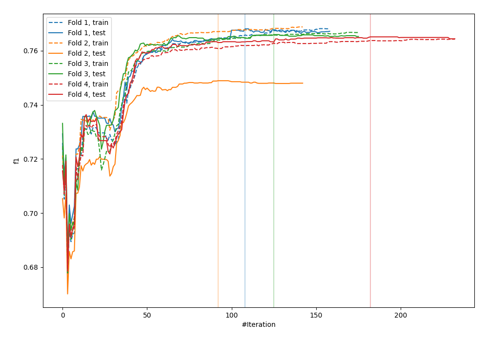
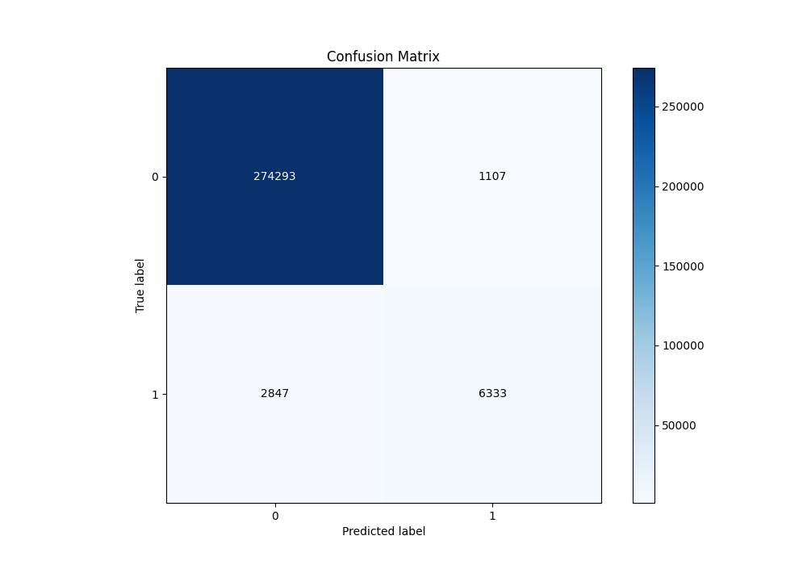
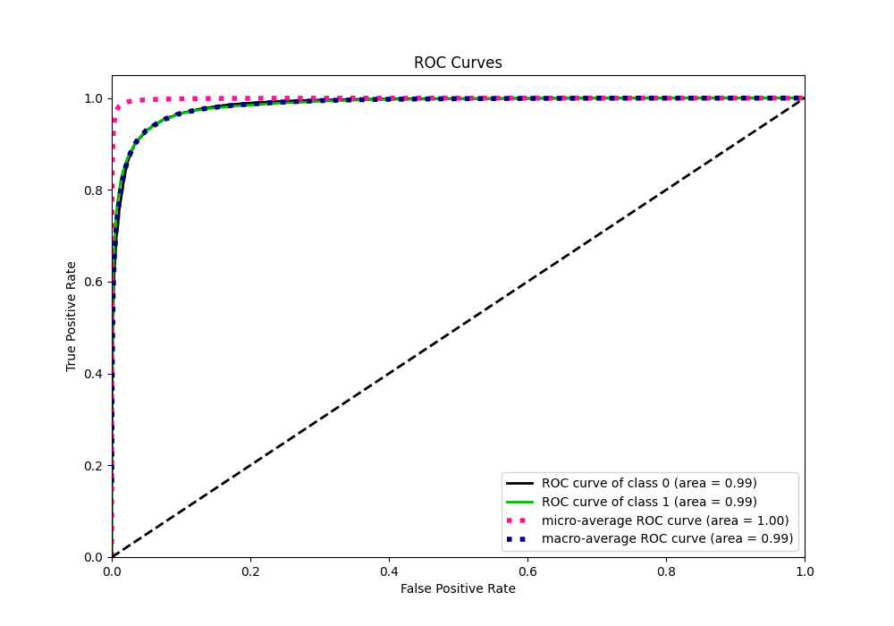
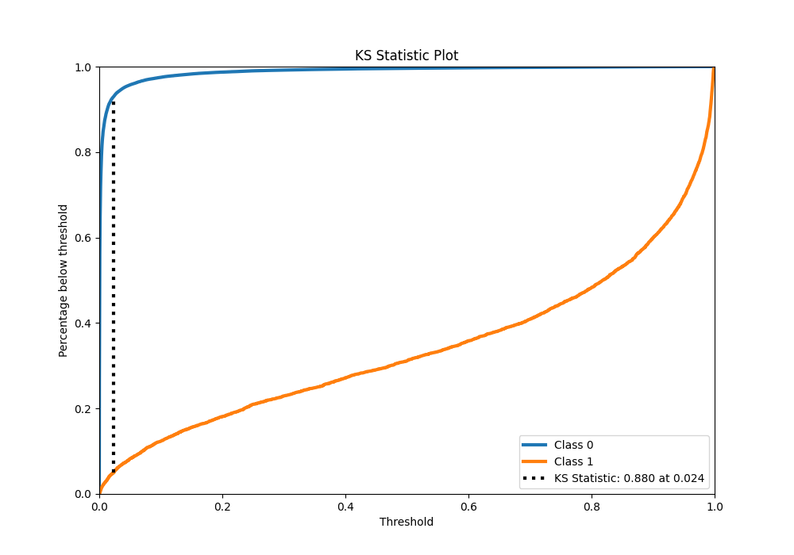
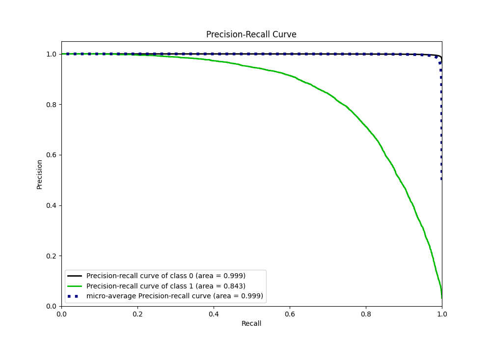
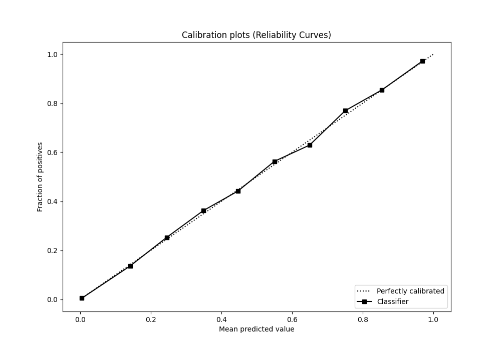
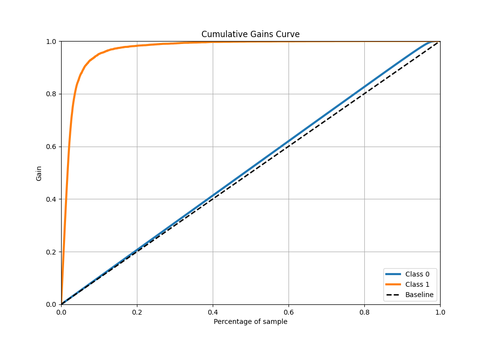
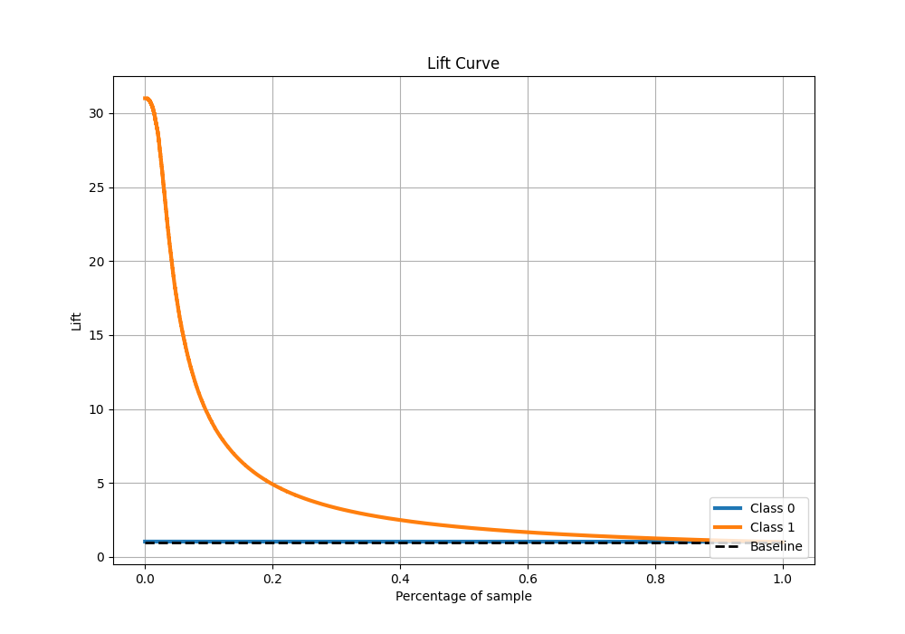

# Summary of 22_CatBoost

[<< Go back](../README.md)

## CatBoost
- **n_jobs**: -1
- **learning_rate**: 0.05
- **depth**: 8
- **rsm**: 0.8
- **loss_function**: Logloss
- **eval_metric**: F1
- **explain_level**: 0

## Validation
 - **validation_type**: kfold
 - **k_folds**: 4
 - **shuffle**: False
 - **stratify**: True

## Optimized metric
f1

## Training time

96.0 seconds

## Metric details
|           |     score |     threshold |
|:----------|----------:|--------------:|
| logloss   | 0.0409197 | nan           |
| auc       | 0.985355  | nan           |
| f1        | 0.769378  |   0.365224    |
| accuracy  | 0.986106  |   0.497222    |
| precision | 0.85121   |   0.497222    |
| recall    | 1         |   5.70138e-06 |
| mcc       | 0.762412  |   0.365224    |

## Metric details with threshold from accuracy metric
|           |     score |   threshold |
|:----------|----------:|------------:|
| logloss   | 0.0409197 |  nan        |
| auc       | 0.985355  |  nan        |
| f1        | 0.762094  |    0.497222 |
| accuracy  | 0.986106  |    0.497222 |
| precision | 0.85121   |    0.497222 |
| recall    | 0.689869  |    0.497222 |
| mcc       | 0.759445  |    0.497222 |

## Confusion matrix (at threshold=0.497222)
|              |   Predicted as 0 |   Predicted as 1 |
|:-------------|-----------------:|-----------------:|
| Labeled as 0 |           274293 |             1107 |
| Labeled as 1 |             2847 |             6333 |

## Learning curves

## Confusion Matrix

## Normalized Confusion Matrix

## ROC Curve

## Kolmogorov-Smirnov Statistic

## Precision-Recall Curve

## Calibration Curve

## Cumulative Gains Curve

## Lift Curve

[<< Go back](../README.md)
