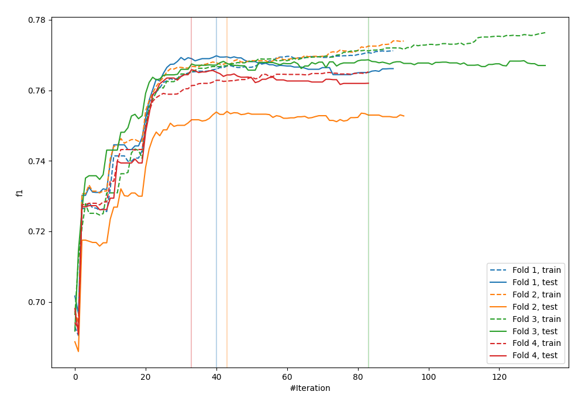
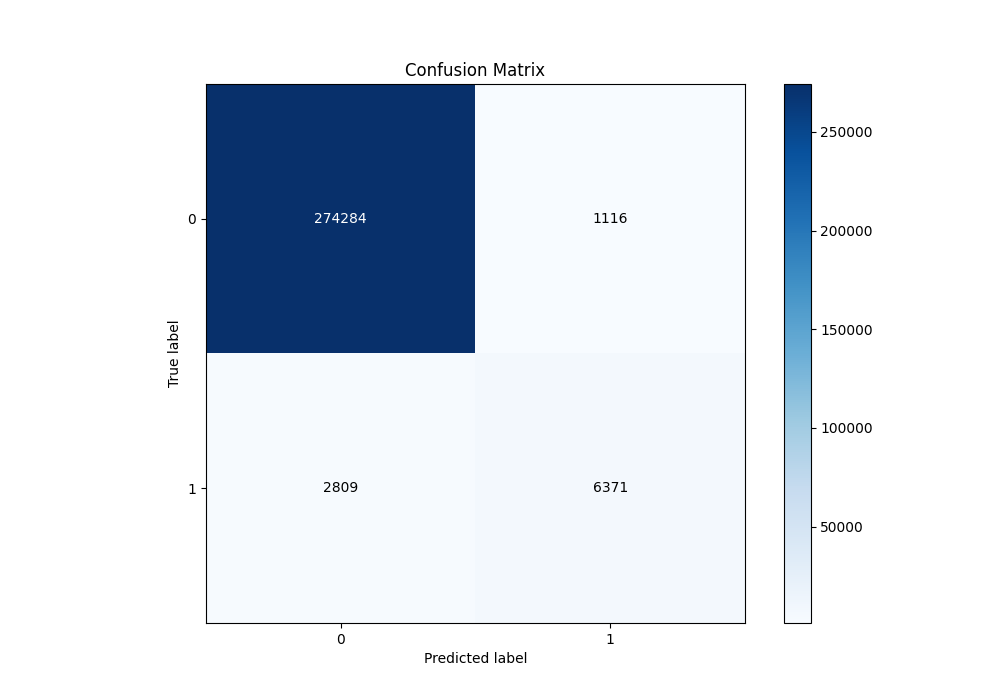
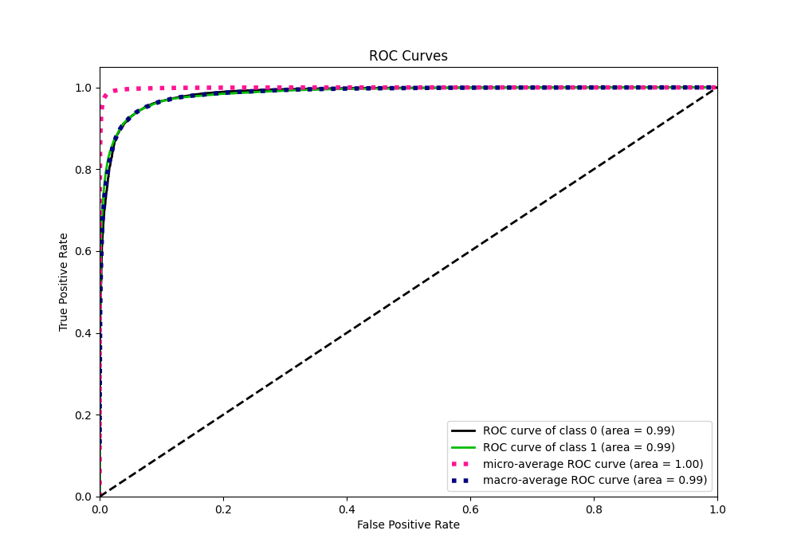
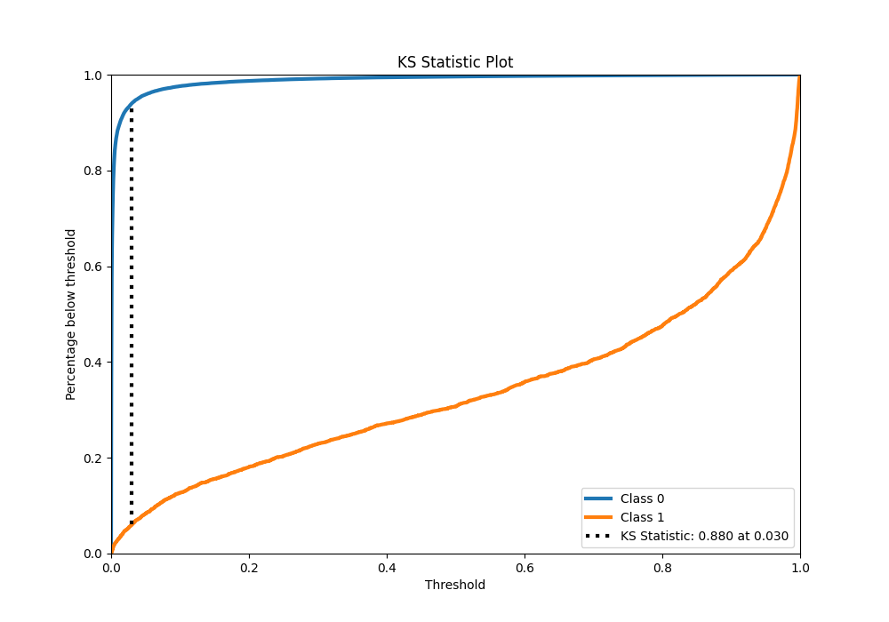
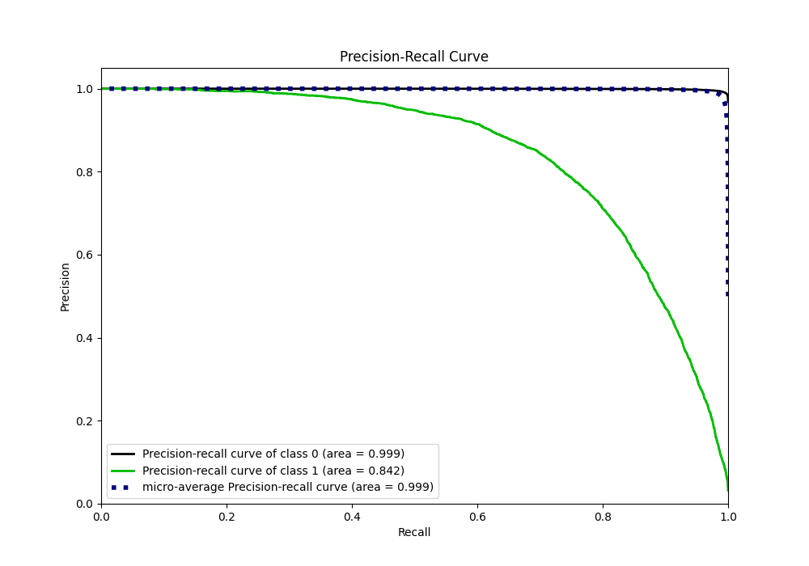
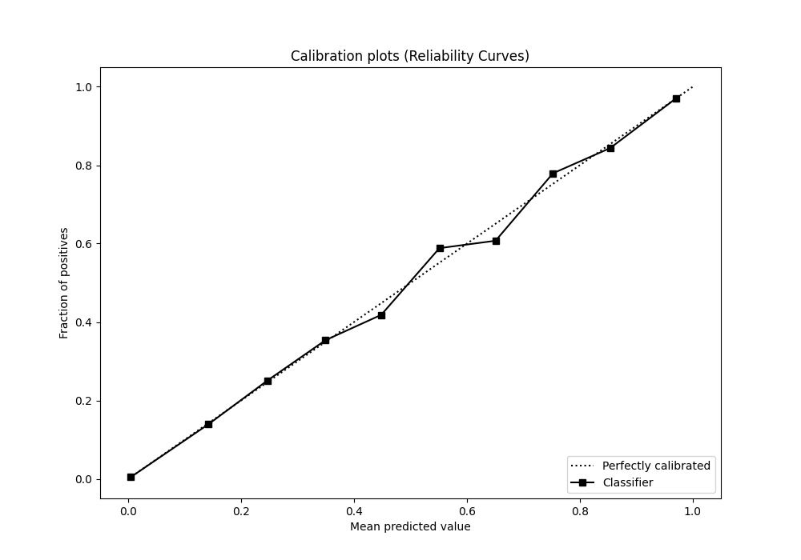
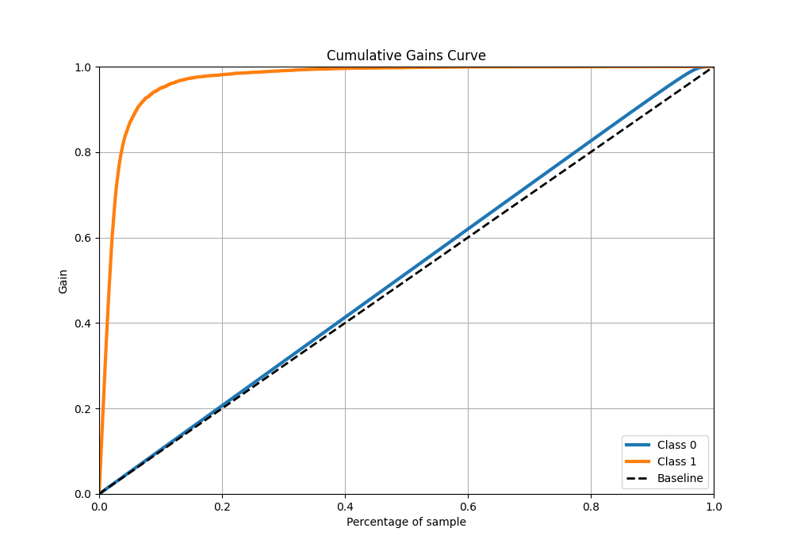
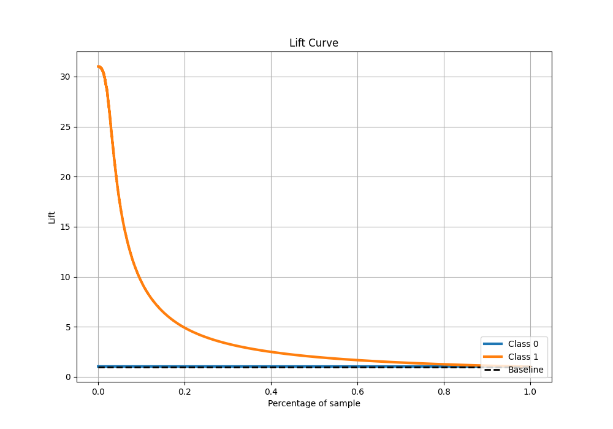

# Summary of 25_CatBoost

[<< Go back](../README.md)

## CatBoost
- **n_jobs**: -1
- **learning_rate**: 0.2
- **depth**: 8
- **rsm**: 1.0
- **loss_function**: Logloss
- **eval_metric**: F1
- **explain_level**: 0

## Validation
 - **validation_type**: kfold
 - **k_folds**: 4
 - **shuffle**: False
 - **stratify**: True

## Optimized metric
f1

## Training time

68.4 seconds

## Metric details
|           |     score |     threshold |
|:----------|----------:|--------------:|
| logloss   | 0.0410269 | nan           |
| auc       | 0.985057  | nan           |
| f1        | 0.76762   |   0.391647    |
| accuracy  | 0.986208  |   0.494958    |
| precision | 0.850942  |   0.494958    |
| recall    | 1         |   1.95211e-06 |
| mcc       | 0.761655  |   0.494958    |

## Metric details with threshold from accuracy metric
|           |     score |   threshold |
|:----------|----------:|------------:|
| logloss   | 0.0410269 |  nan        |
| auc       | 0.985057  |  nan        |
| f1        | 0.764505  |    0.494958 |
| accuracy  | 0.986208  |    0.494958 |
| precision | 0.850942  |    0.494958 |
| recall    | 0.694009  |    0.494958 |
| mcc       | 0.761655  |    0.494958 |

## Confusion matrix (at threshold=0.494958)
|              |   Predicted as 0 |   Predicted as 1 |
|:-------------|-----------------:|-----------------:|
| Labeled as 0 |           274284 |             1116 |
| Labeled as 1 |             2809 |             6371 |

## Learning curves

## Confusion Matrix

## Normalized Confusion Matrix

## ROC Curve

## Kolmogorov-Smirnov Statistic

## Precision-Recall Curve

## Calibration Curve

## Cumulative Gains Curve

## Lift Curve

[<< Go back](../README.md)
