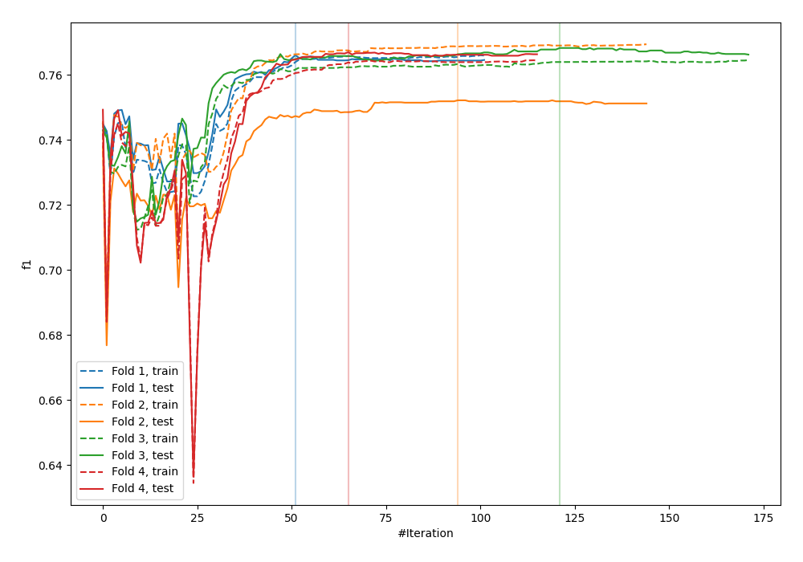
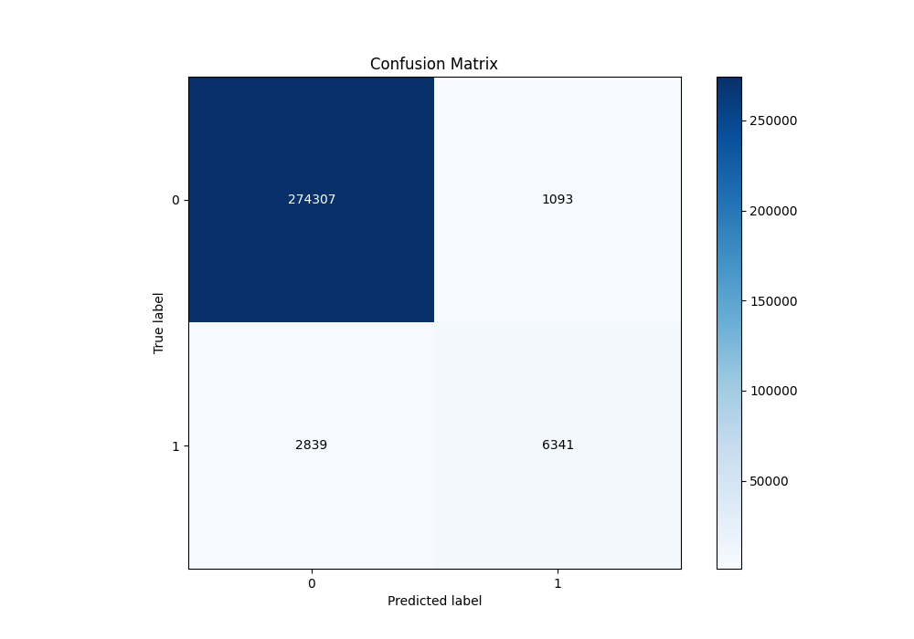
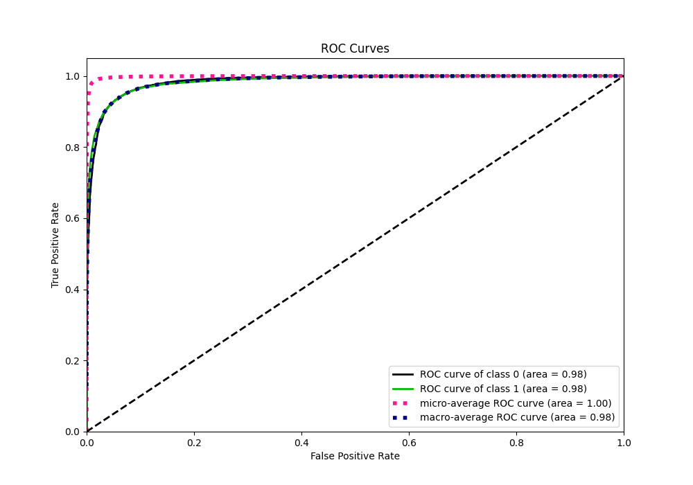
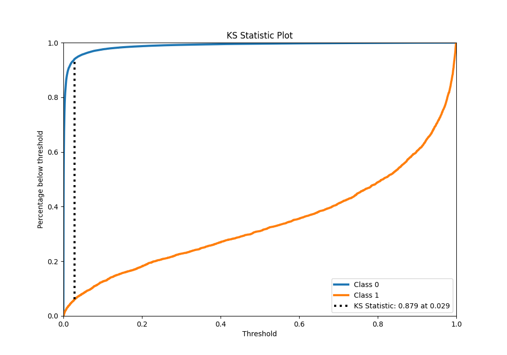
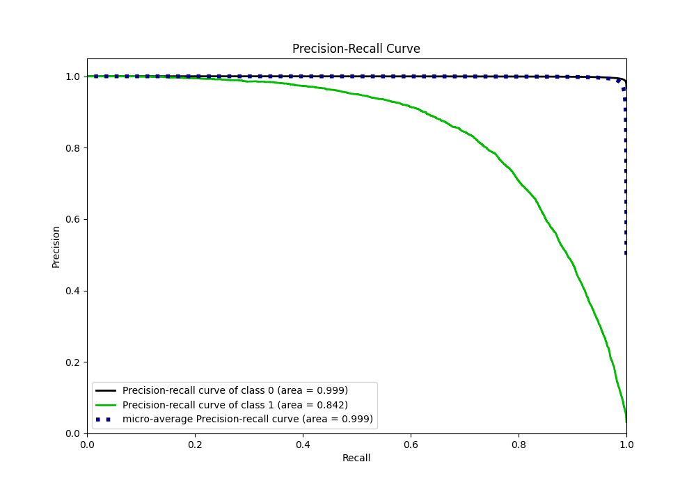
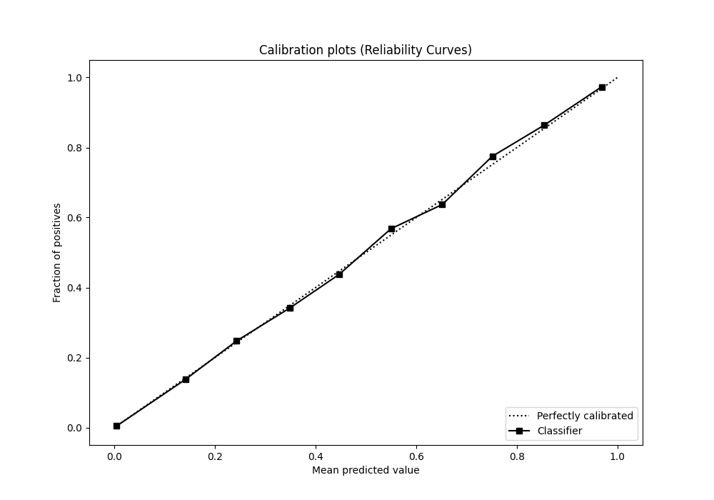
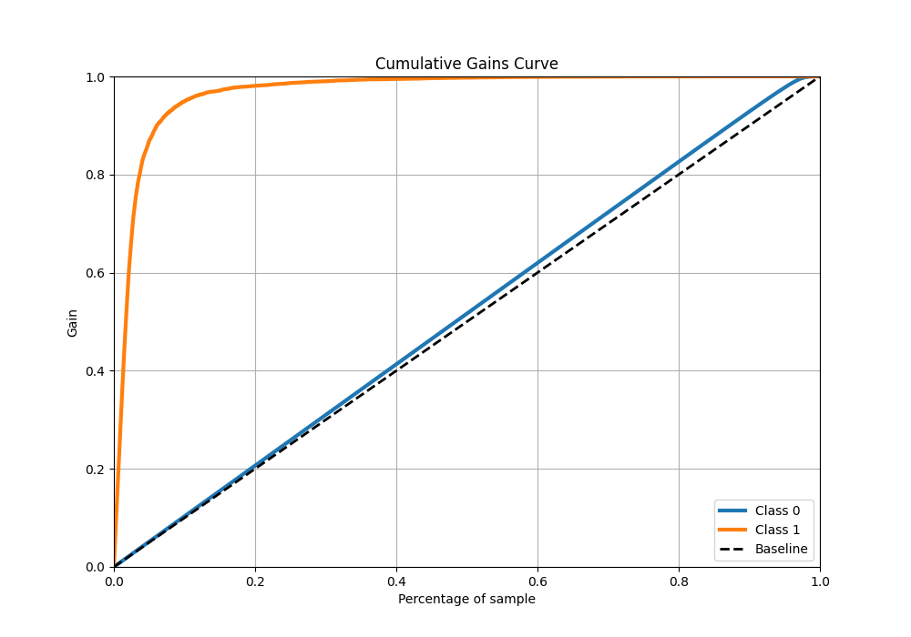
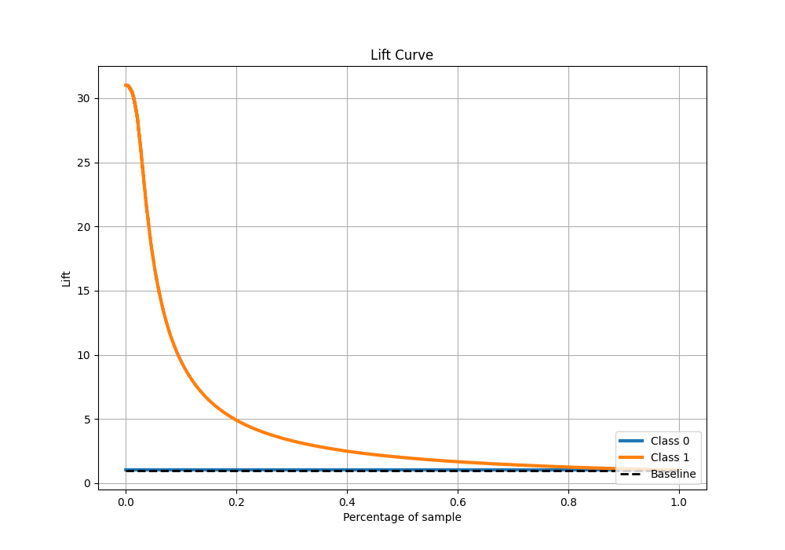

# Summary of 26_CatBoost

[<< Go back](../README.md)

## CatBoost
- **n_jobs**: -1
- **learning_rate**: 0.1
- **depth**: 6
- **rsm**: 0.7
- **loss_function**: Logloss
- **eval_metric**: F1
- **explain_level**: 0

## Validation
 - **validation_type**: kfold
 - **k_folds**: 4
 - **shuffle**: False
 - **stratify**: True

## Optimized metric
f1

## Training time

70.2 seconds

## Metric details
|           |     score |     threshold |
|:----------|----------:|--------------:|
| logloss   | 0.0410815 | nan           |
| auc       | 0.984889  | nan           |
| f1        | 0.768213  |   0.362335    |
| accuracy  | 0.986183  |   0.496153    |
| precision | 0.852973  |   0.496153    |
| recall    | 1         |   8.03932e-06 |
| mcc       | 0.761057  |   0.362335    |

## Metric details with threshold from accuracy metric
|           |     score |   threshold |
|:----------|----------:|------------:|
| logloss   | 0.0410815 |  nan        |
| auc       | 0.984889  |  nan        |
| f1        | 0.763332  |    0.496153 |
| accuracy  | 0.986183  |    0.496153 |
| precision | 0.852973  |    0.496153 |
| recall    | 0.690741  |    0.496153 |
| mcc       | 0.760765  |    0.496153 |

## Confusion matrix (at threshold=0.496153)
|              |   Predicted as 0 |   Predicted as 1 |
|:-------------|-----------------:|-----------------:|
| Labeled as 0 |           274307 |             1093 |
| Labeled as 1 |             2839 |             6341 |

## Learning curves

## Confusion Matrix

## Normalized Confusion Matrix

## ROC Curve

## Kolmogorov-Smirnov Statistic

## Precision-Recall Curve

## Calibration Curve

## Cumulative Gains Curve

## Lift Curve

[<< Go back](../README.md)
