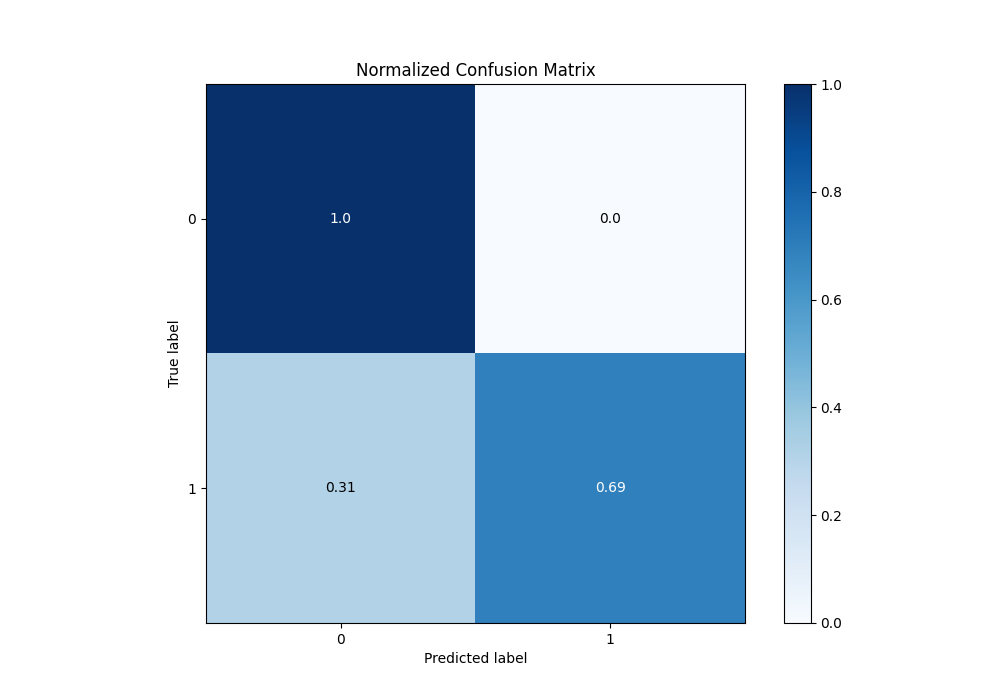

# Summary of 27_CatBoost

[<< Go back](../README.md)

## CatBoost
- **n_jobs**: -1
- **learning_rate**: 0.1
- **depth**: 4
- **rsm**: 0.7
- **loss_function**: Logloss
- **eval_metric**: F1
- **explain_level**: 0

## Validation
 - **validation_type**: kfold
 - **k_folds**: 4
 - **shuffle**: False
 - **stratify**: True

## Optimized metric
f1

## Training time

70.4 seconds

## Metric details
|           |     score |     threshold |
|:----------|----------:|--------------:|
| logloss   | 0.0411119 | nan           |
| auc       | 0.984838  | nan           |
| f1        | 0.769196  |   0.356723    |
| accuracy  | 0.986236  |   0.496125    |
| precision | 0.852323  |   0.496125    |
| recall    | 1         |   6.66387e-06 |
| mcc       | 0.761998  |   0.496125    |

## Metric details with threshold from accuracy metric
|           |     score |   threshold |
|:----------|----------:|------------:|
| logloss   | 0.0411119 |  nan        |
| auc       | 0.984838  |  nan        |
| f1        | 0.764731  |    0.496125 |
| accuracy  | 0.986236  |    0.496125 |
| precision | 0.852323  |    0.496125 |
| recall    | 0.693464  |    0.496125 |
| mcc       | 0.761998  |    0.496125 |

## Confusion matrix (at threshold=0.496125)
|              |   Predicted as 0 |   Predicted as 1 |
|:-------------|-----------------:|-----------------:|
| Labeled as 0 |           274297 |             1103 |
| Labeled as 1 |             2814 |             6366 |

## Learning curves

## Confusion Matrix

## Normalized Confusion Matrix

## ROC Curve

## Kolmogorov-Smirnov Statistic

## Precision-Recall Curve

## Calibration Curve

## Cumulative Gains Curve

## Lift Curve

[<< Go back](../README.md)
