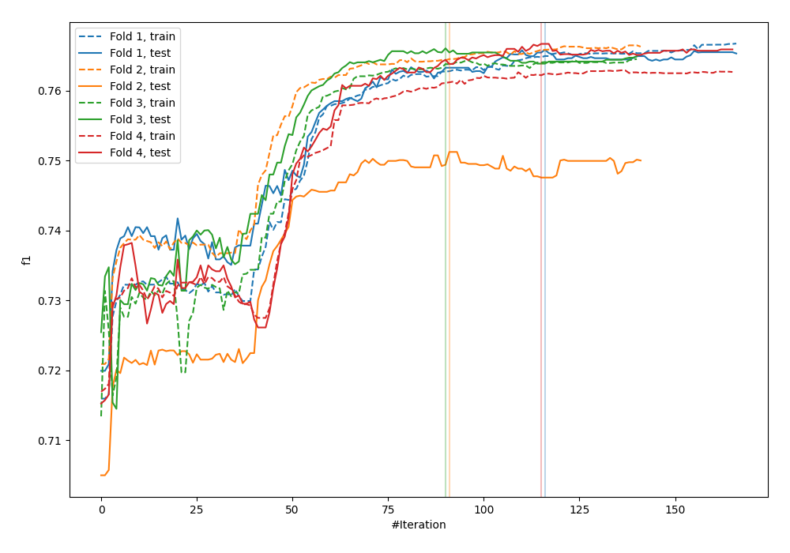
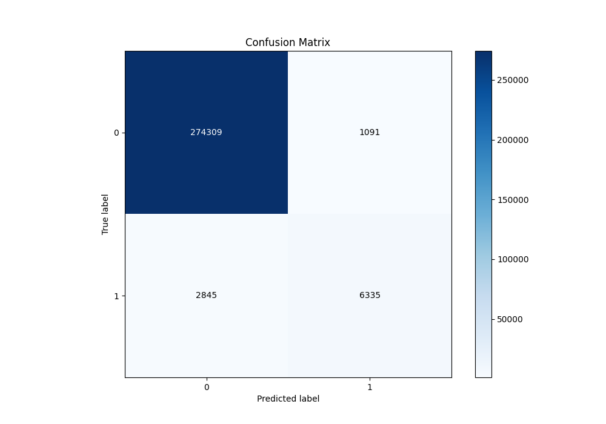
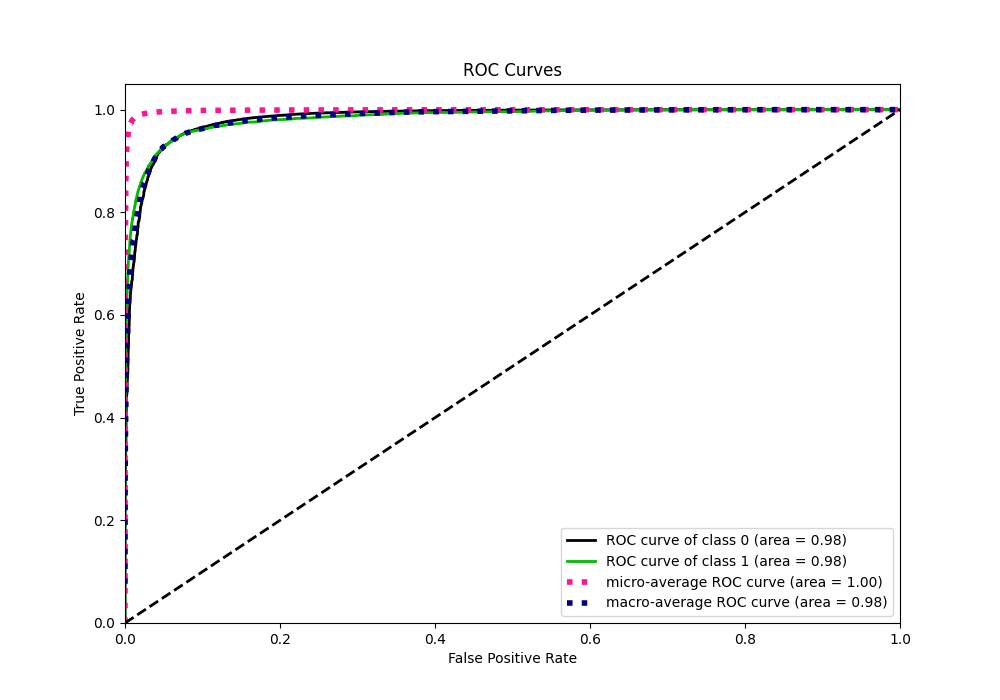
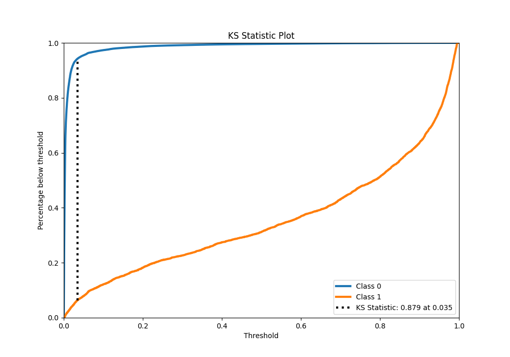
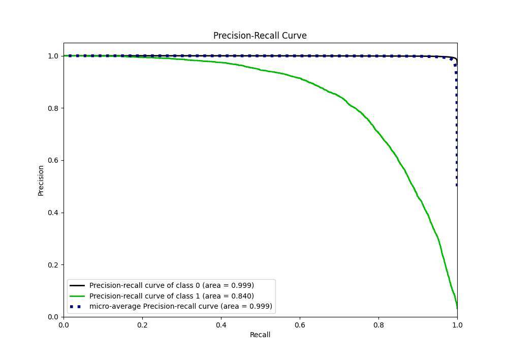
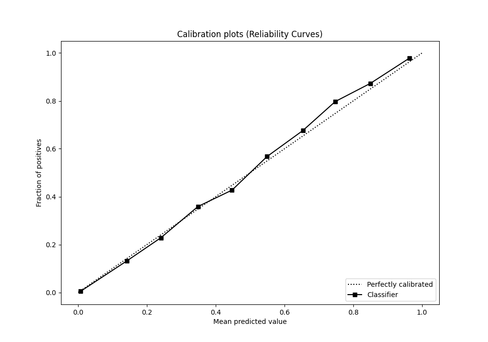
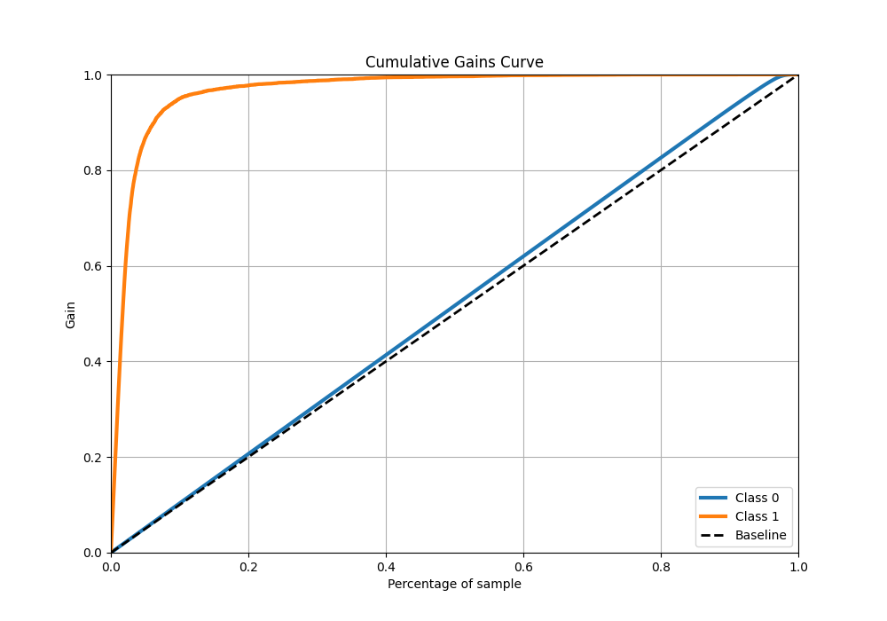
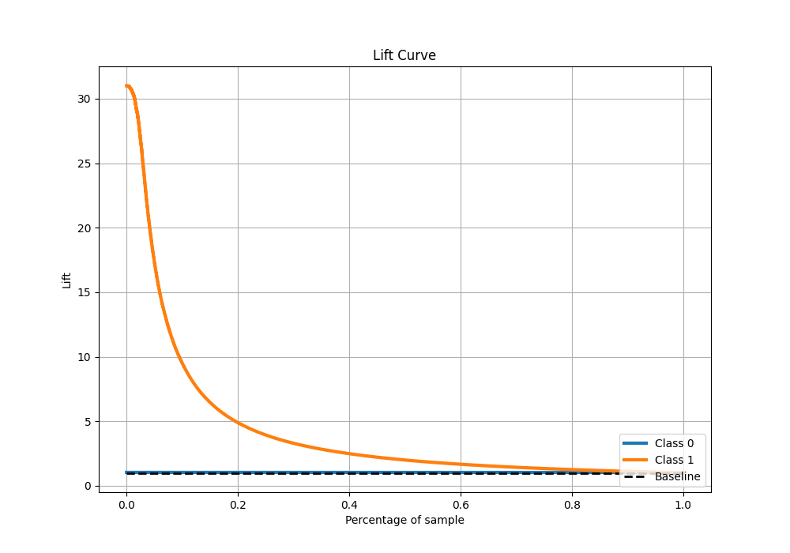

# Summary of 28_CatBoost

[<< Go back](../README.md)

## CatBoost
- **n_jobs**: -1
- **learning_rate**: 0.025
- **depth**: 8
- **rsm**: 1.0
- **loss_function**: Logloss
- **eval_metric**: F1
- **explain_level**: 0

## Validation
 - **validation_type**: kfold
 - **k_folds**: 4
 - **shuffle**: False
 - **stratify**: True

## Optimized metric
f1

## Training time

93.7 seconds

## Metric details
|           |    score |     threshold |
|:----------|---------:|--------------:|
| logloss   | 0.042608 | nan           |
| auc       | 0.983566 | nan           |
| f1        | 0.76883  |   0.3439      |
| accuracy  | 0.986169 |   0.495347    |
| precision | 0.853084 |   0.495347    |
| recall    | 1        |   7.96338e-05 |
| mcc       | 0.76139  |   0.3439      |

## Metric details with threshold from accuracy metric
|           |    score |   threshold |
|:----------|---------:|------------:|
| logloss   | 0.042608 |  nan        |
| auc       | 0.983566 |  nan        |
| f1        | 0.762977 |    0.495347 |
| accuracy  | 0.986169 |    0.495347 |
| precision | 0.853084 |    0.495347 |
| recall    | 0.690087 |    0.495347 |
| mcc       | 0.760447 |    0.495347 |

## Confusion matrix (at threshold=0.495347)
|              |   Predicted as 0 |   Predicted as 1 |
|:-------------|-----------------:|-----------------:|
| Labeled as 0 |           274309 |             1091 |
| Labeled as 1 |             2845 |             6335 |

## Learning curves

## Confusion Matrix

## Normalized Confusion Matrix

## ROC Curve

## Kolmogorov-Smirnov Statistic

## Precision-Recall Curve

## Calibration Curve

## Cumulative Gains Curve

## Lift Curve

[<< Go back](../README.md)
