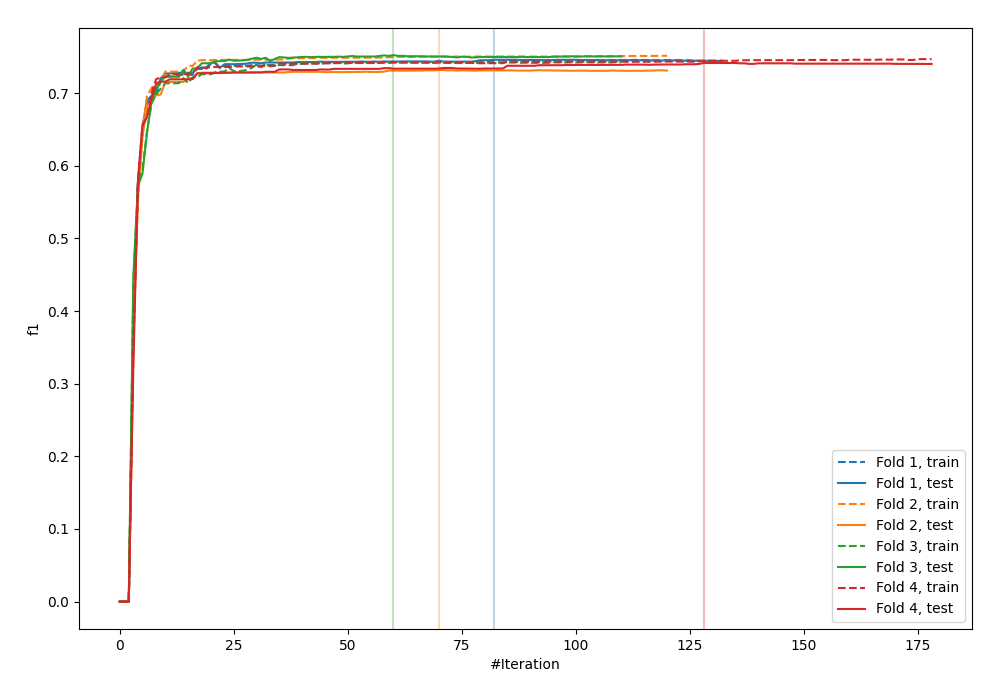
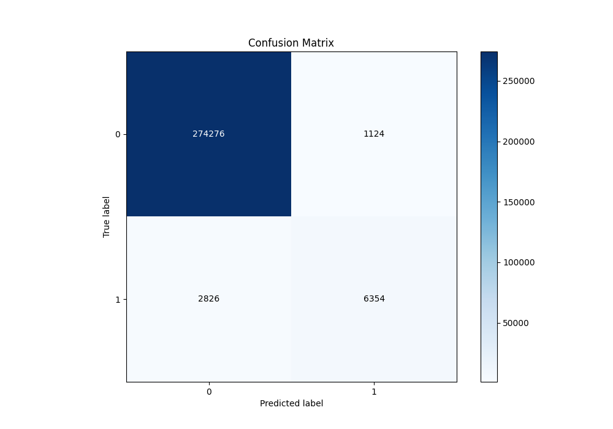
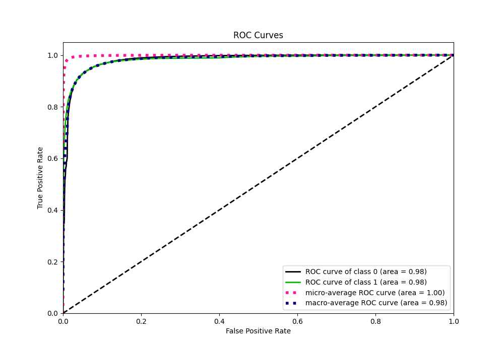
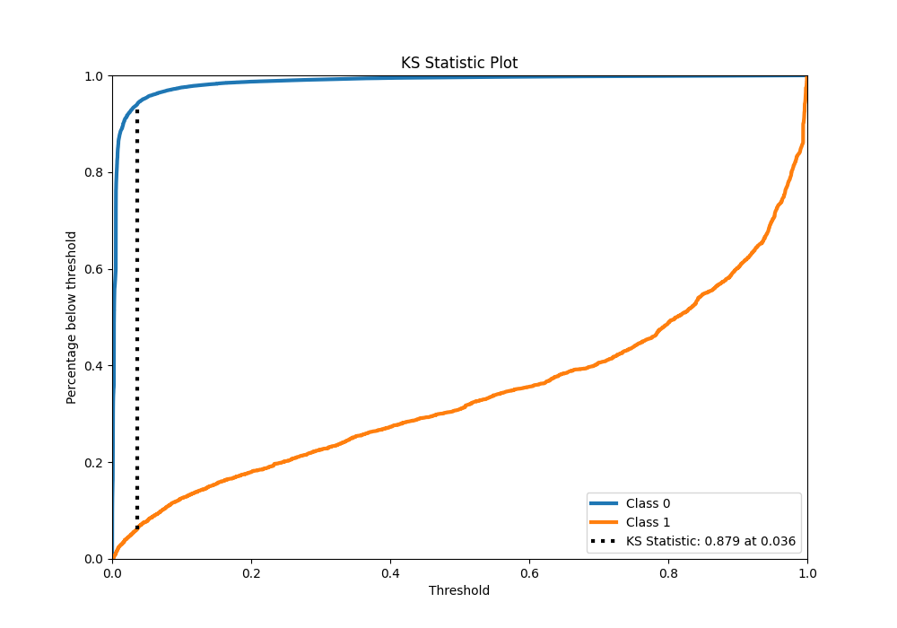
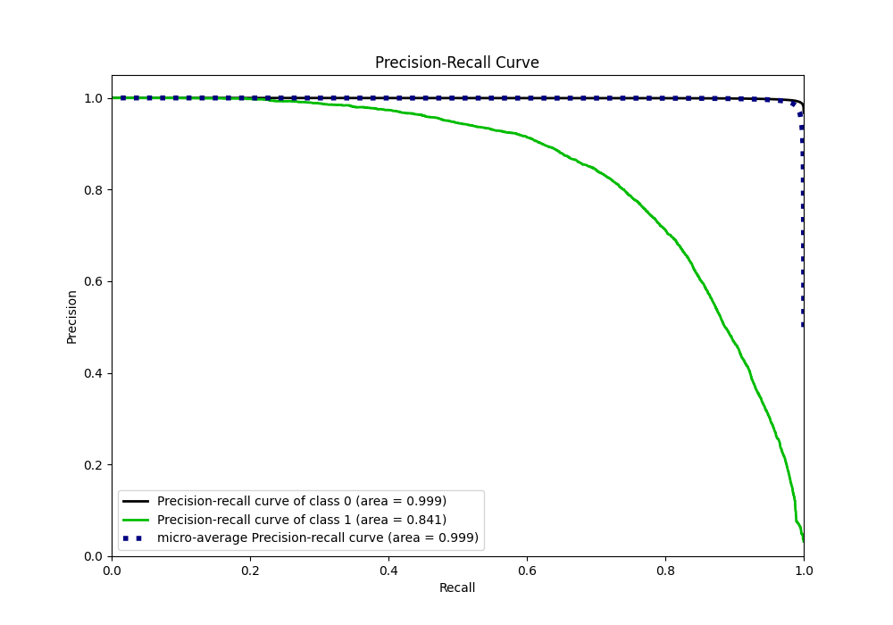
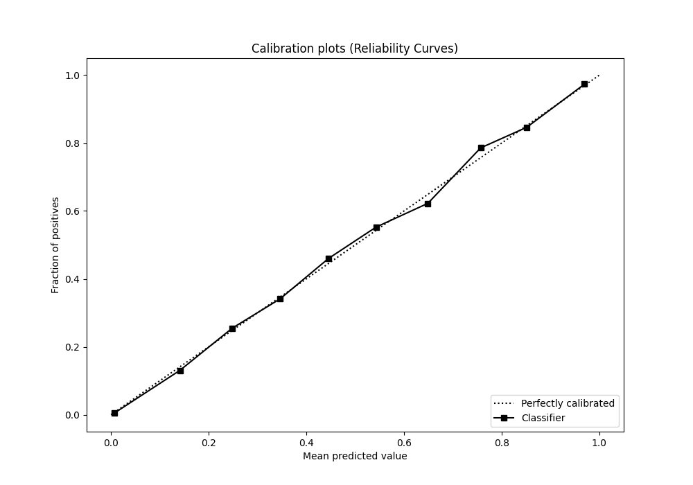
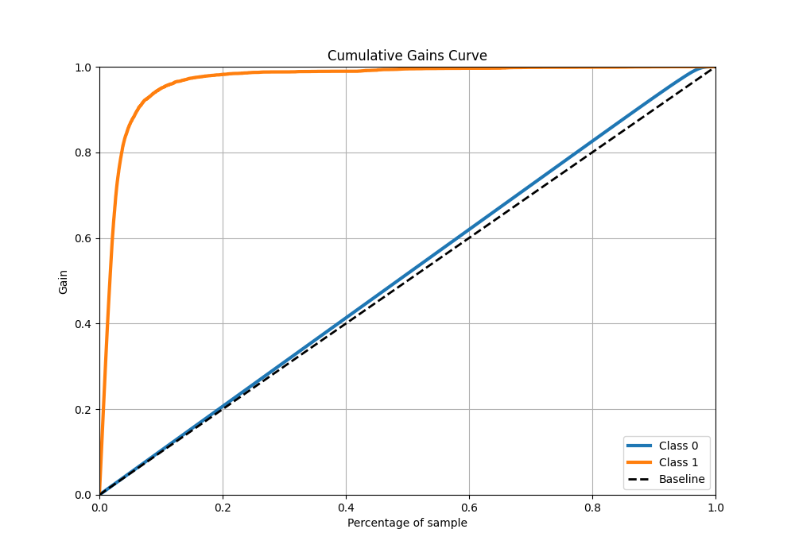
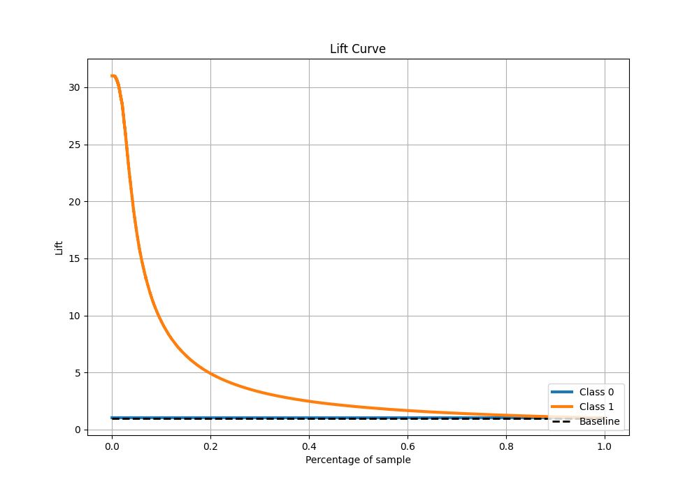

# Summary of 2_Default_Xgboost

[<< Go back](../README.md)

## Extreme Gradient Boosting (Xgboost)
- **n_jobs**: -1
- **objective**: binary:logistic
- **eta**: 0.075
- **max_depth**: 6
- **min_child_weight**: 1
- **subsample**: 1.0
- **colsample_bytree**: 1.0
- **eval_metric**: f1
- **explain_level**: 0

## Validation
 - **validation_type**: kfold
 - **k_folds**: 4
 - **shuffle**: False
 - **stratify**: True

## Optimized metric
f1

## Training time

110.1 seconds

## Metric details
|           |     score |     threshold |
|:----------|----------:|--------------:|
| logloss   | 0.0422291 | nan           |
| auc       | 0.983352  | nan           |
| f1        | 0.767591  |   0.355212    |
| accuracy  | 0.98612   |   0.496905    |
| precision | 0.849692  |   0.496905    |
| recall    | 1         |   5.59913e-05 |
| mcc       | 0.760454  |   0.355212    |

## Metric details with threshold from accuracy metric
|           |     score |   threshold |
|:----------|----------:|------------:|
| logloss   | 0.0422291 |  nan        |
| auc       | 0.983352  |  nan        |
| f1        | 0.762877  |    0.496905 |
| accuracy  | 0.98612   |    0.496905 |
| precision | 0.849692  |    0.496905 |
| recall    | 0.692157  |    0.496905 |
| mcc       | 0.760023  |    0.496905 |

## Confusion matrix (at threshold=0.496905)
|              |   Predicted as 0 |   Predicted as 1 |
|:-------------|-----------------:|-----------------:|
| Labeled as 0 |           274276 |             1124 |
| Labeled as 1 |             2826 |             6354 |

## Learning curves

## Confusion Matrix

## Normalized Confusion Matrix

## ROC Curve

## Kolmogorov-Smirnov Statistic

## Precision-Recall Curve

## Calibration Curve

## Cumulative Gains Curve

## Lift Curve

[<< Go back](../README.md)
