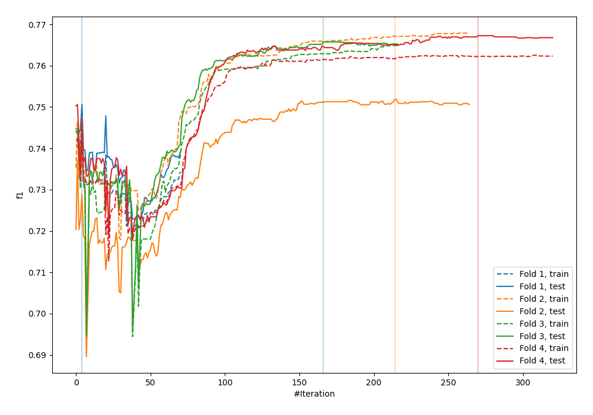
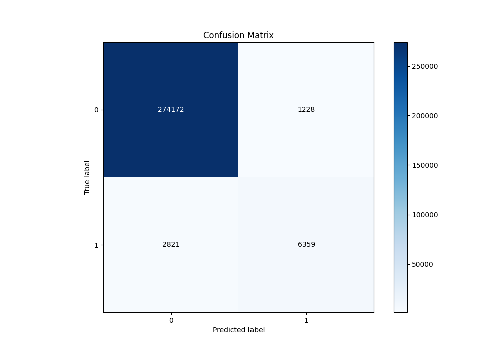
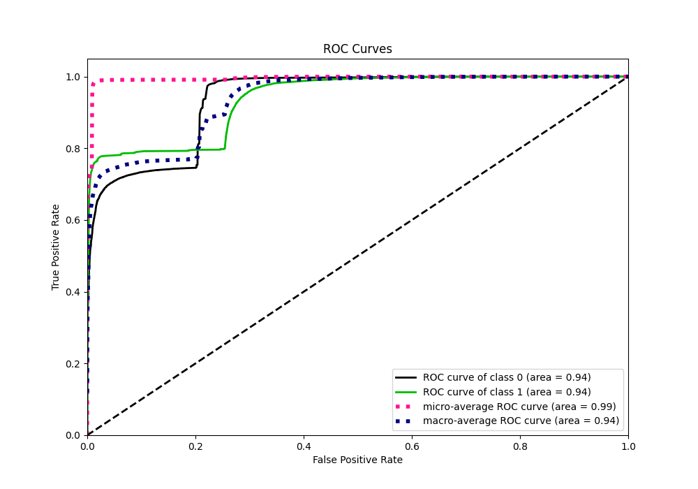
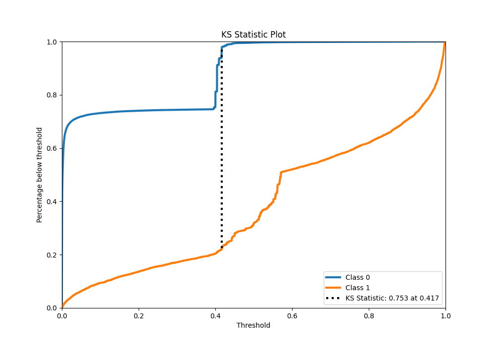
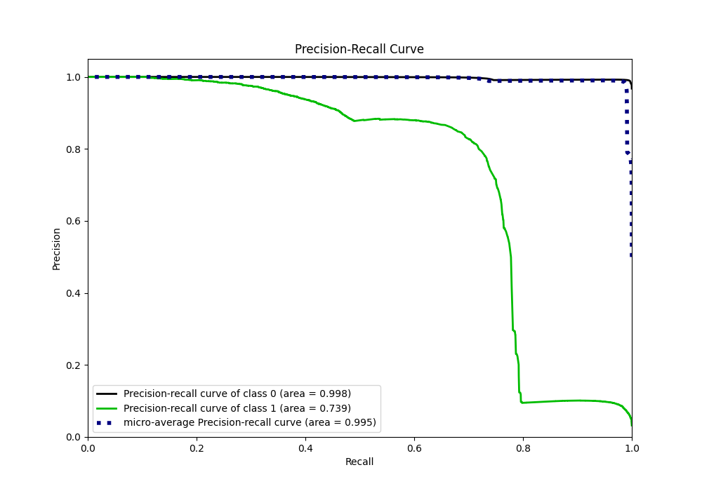
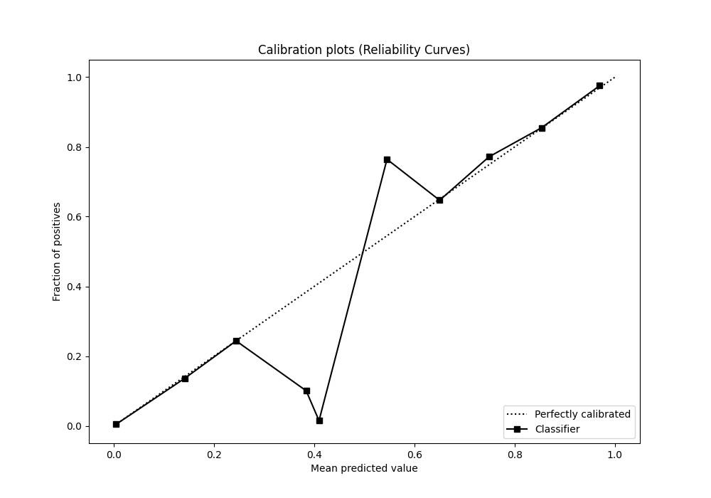
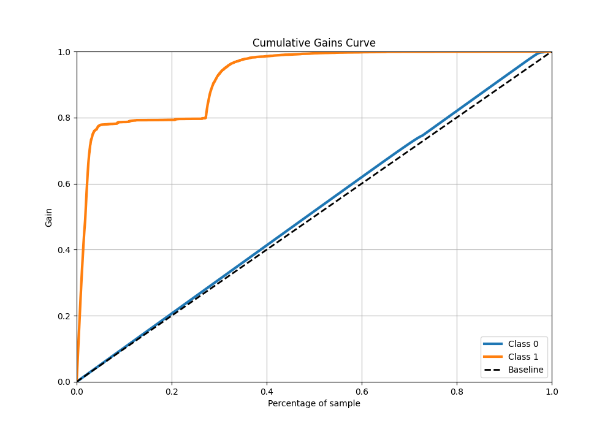
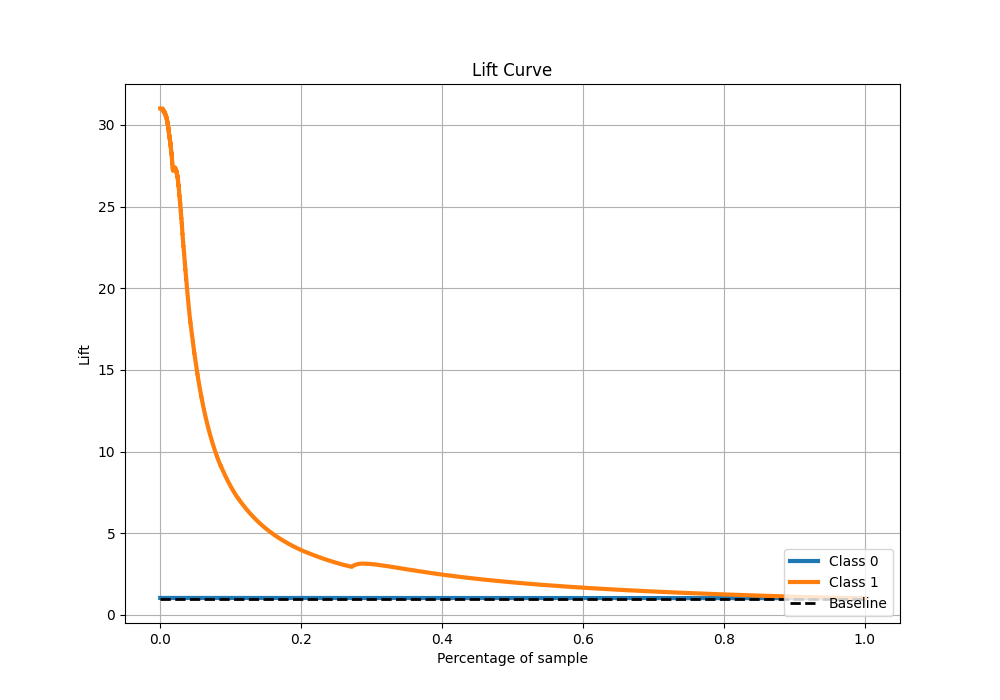

# Summary of 30_CatBoost

[<< Go back](../README.md)

## CatBoost
- **n_jobs**: -1
- **learning_rate**: 0.025
- **depth**: 7
- **rsm**: 0.7
- **loss_function**: Logloss
- **eval_metric**: F1
- **explain_level**: 0

## Validation
 - **validation_type**: kfold
 - **k_folds**: 4
 - **shuffle**: False
 - **stratify**: True

## Optimized metric
f1

## Training time

102.2 seconds

## Metric details
|           |    score |     threshold |
|:----------|---------:|--------------:|
| logloss   | 0.163273 | nan           |
| auc       | 0.937636 | nan           |
| f1        | 0.758514 |   0.496582    |
| accuracy  | 0.985772 |   0.496582    |
| precision | 0.838144 |   0.496582    |
| recall    | 1        |   1.62245e-05 |
| mcc       | 0.754876 |   0.496582    |

## Metric details with threshold from accuracy metric
|           |    score |   threshold |
|:----------|---------:|------------:|
| logloss   | 0.163273 |  nan        |
| auc       | 0.937636 |  nan        |
| f1        | 0.758514 |    0.496582 |
| accuracy  | 0.985772 |    0.496582 |
| precision | 0.838144 |    0.496582 |
| recall    | 0.692702 |    0.496582 |
| mcc       | 0.754876 |    0.496582 |

## Confusion matrix (at threshold=0.496582)
|              |   Predicted as 0 |   Predicted as 1 |
|:-------------|-----------------:|-----------------:|
| Labeled as 0 |           274172 |             1228 |
| Labeled as 1 |             2821 |             6359 |

## Learning curves

## Confusion Matrix

## Normalized Confusion Matrix

## ROC Curve

## Kolmogorov-Smirnov Statistic

## Precision-Recall Curve

## Calibration Curve

## Cumulative Gains Curve

## Lift Curve

[<< Go back](../README.md)
