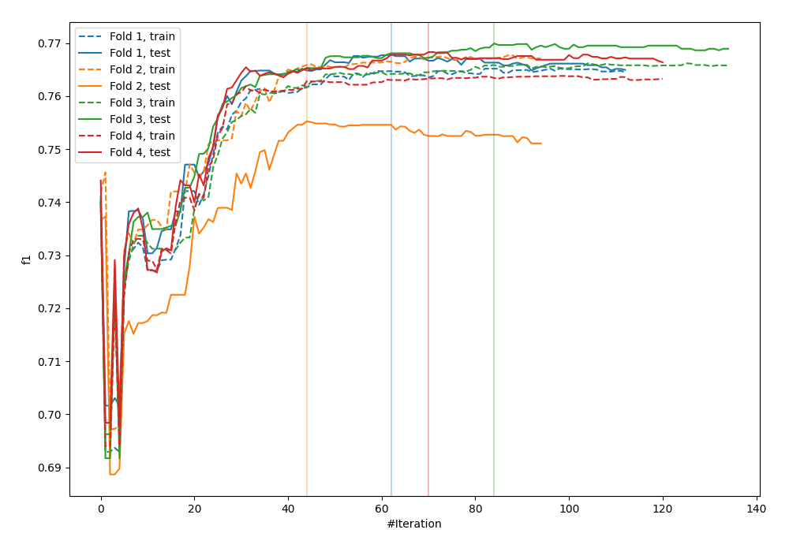
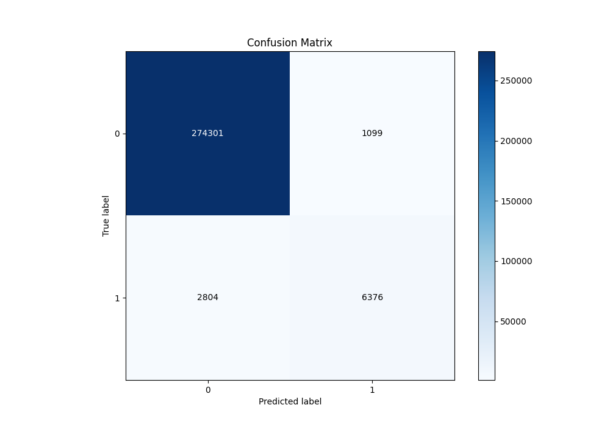
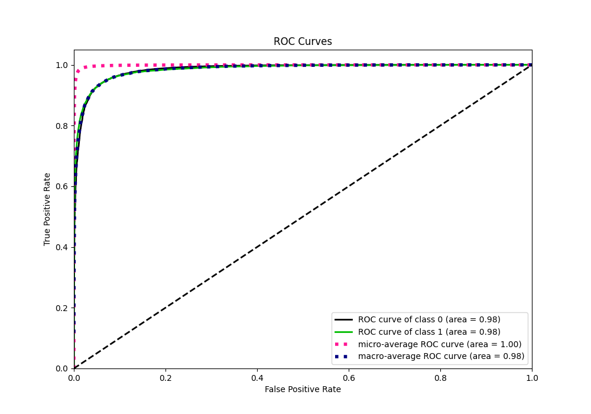
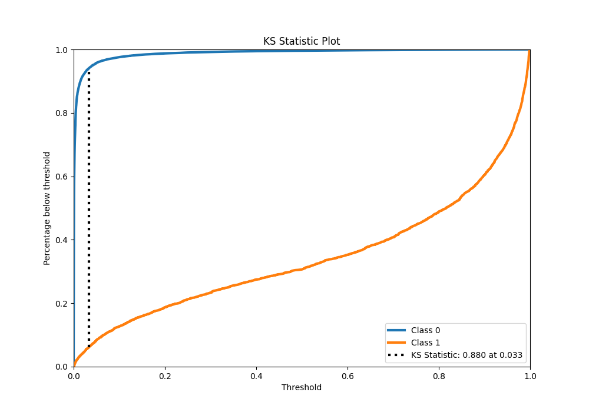
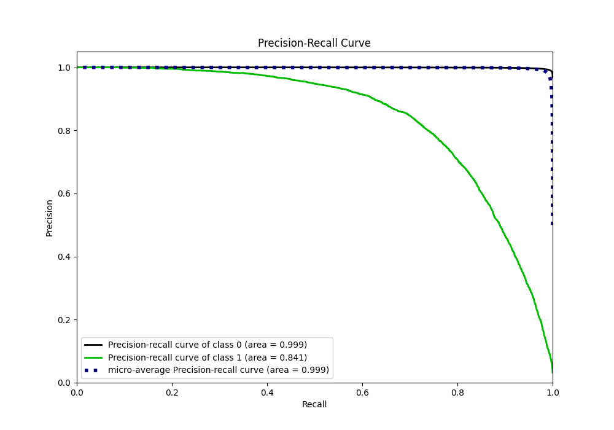
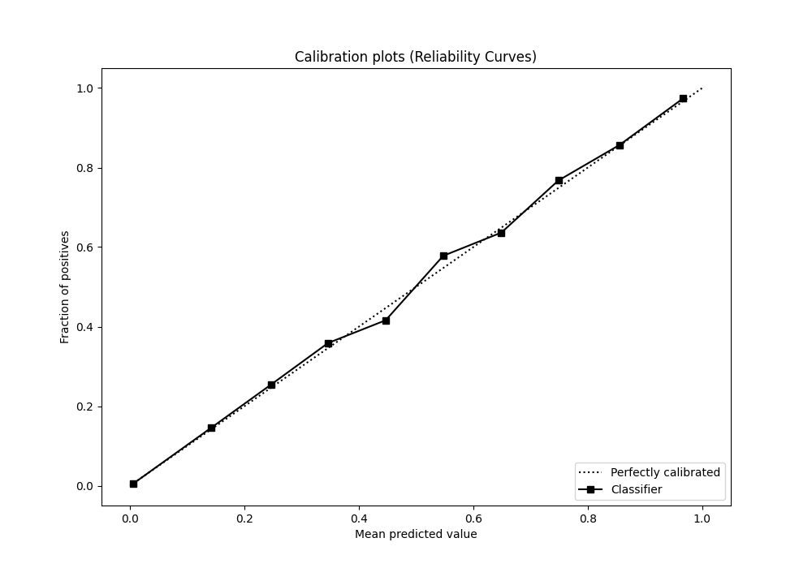
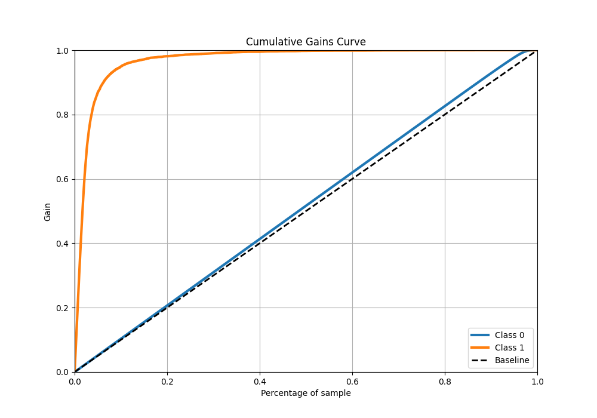
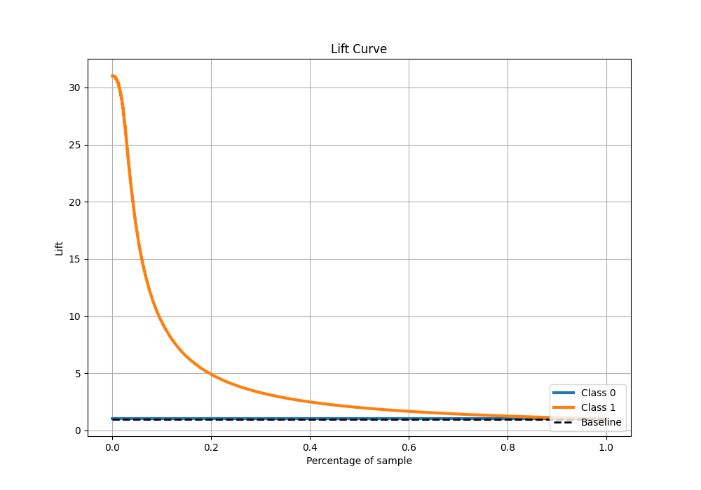

# Summary of 3_Default_CatBoost

[<< Go back](../README.md)

## CatBoost
- **n_jobs**: -1
- **learning_rate**: 0.1
- **depth**: 6
- **rsm**: 1
- **loss_function**: Logloss
- **eval_metric**: F1
- **explain_level**: 0

## Validation
 - **validation_type**: kfold
 - **k_folds**: 4
 - **shuffle**: False
 - **stratify**: True

## Optimized metric
f1

## Training time

71.8 seconds

## Metric details
|           |     score |     threshold |
|:----------|----------:|--------------:|
| logloss   | 0.0411952 | nan           |
| auc       | 0.984932  | nan           |
| f1        | 0.767758  |   0.356259    |
| accuracy  | 0.986285  |   0.494079    |
| precision | 0.852977  |   0.494079    |
| recall    | 1         |   1.22524e-05 |
| mcc       | 0.76292   |   0.494079    |

## Metric details with threshold from accuracy metric
|           |     score |   threshold |
|:----------|----------:|------------:|
| logloss   | 0.0411952 |  nan        |
| auc       | 0.984932  |  nan        |
| f1        | 0.765656  |    0.494079 |
| accuracy  | 0.986285  |    0.494079 |
| precision | 0.852977  |    0.494079 |
| recall    | 0.694553  |    0.494079 |
| mcc       | 0.76292   |    0.494079 |

## Confusion matrix (at threshold=0.494079)
|              |   Predicted as 0 |   Predicted as 1 |
|:-------------|-----------------:|-----------------:|
| Labeled as 0 |           274301 |             1099 |
| Labeled as 1 |             2804 |             6376 |

## Learning curves

## Confusion Matrix

## Normalized Confusion Matrix

## ROC Curve

## Kolmogorov-Smirnov Statistic

## Precision-Recall Curve

## Calibration Curve

## Cumulative Gains Curve

## Lift Curve

[<< Go back](../README.md)
