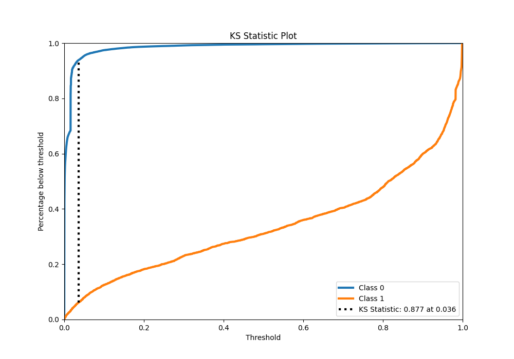

# Summary of 4_Xgboost

[<< Go back](../README.md)

## Extreme Gradient Boosting (Xgboost)
- **n_jobs**: -1
- **objective**: binary:logistic
- **eta**: 0.075
- **max_depth**: 8
- **min_child_weight**: 5
- **subsample**: 1.0
- **colsample_bytree**: 1.0
- **eval_metric**: f1
- **explain_level**: 0

## Validation
 - **validation_type**: kfold
 - **k_folds**: 4
 - **shuffle**: False
 - **stratify**: True

## Optimized metric
f1

## Training time

121.8 seconds

## Metric details
|           |     score |     threshold |
|:----------|----------:|--------------:|
| logloss   | 0.0442102 | nan           |
| auc       | 0.979724  | nan           |
| f1        | 0.766779  |   0.394851    |
| accuracy  | 0.985934  |   0.498284    |
| precision | 0.844995  |   0.498284    |
| recall    | 1         |   6.03387e-05 |
| mcc       | 0.760534  |   0.394851    |

## Metric details with threshold from accuracy metric
|           |     score |   threshold |
|:----------|----------:|------------:|
| logloss   | 0.0442102 |  nan        |
| auc       | 0.979724  |  nan        |
| f1        | 0.760055  |    0.498284 |
| accuracy  | 0.985934  |    0.498284 |
| precision | 0.844995  |    0.498284 |
| recall    | 0.690632  |    0.498284 |
| mcc       | 0.756952  |    0.498284 |

## Confusion matrix (at threshold=0.498284)
|              |   Predicted as 0 |   Predicted as 1 |
|:-------------|-----------------:|-----------------:|
| Labeled as 0 |           274237 |             1163 |
| Labeled as 1 |             2840 |             6340 |

## Learning curves

## Confusion Matrix

## Normalized Confusion Matrix

## ROC Curve

## Kolmogorov-Smirnov Statistic

## Precision-Recall Curve

## Calibration Curve

## Cumulative Gains Curve

## Lift Curve

[<< Go back](../README.md)
