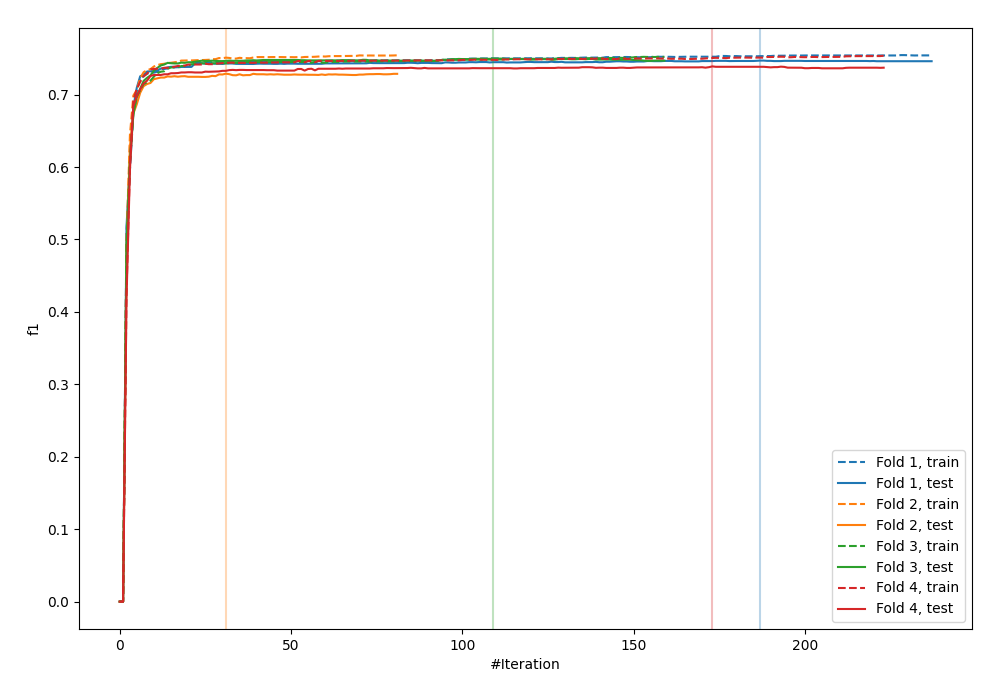
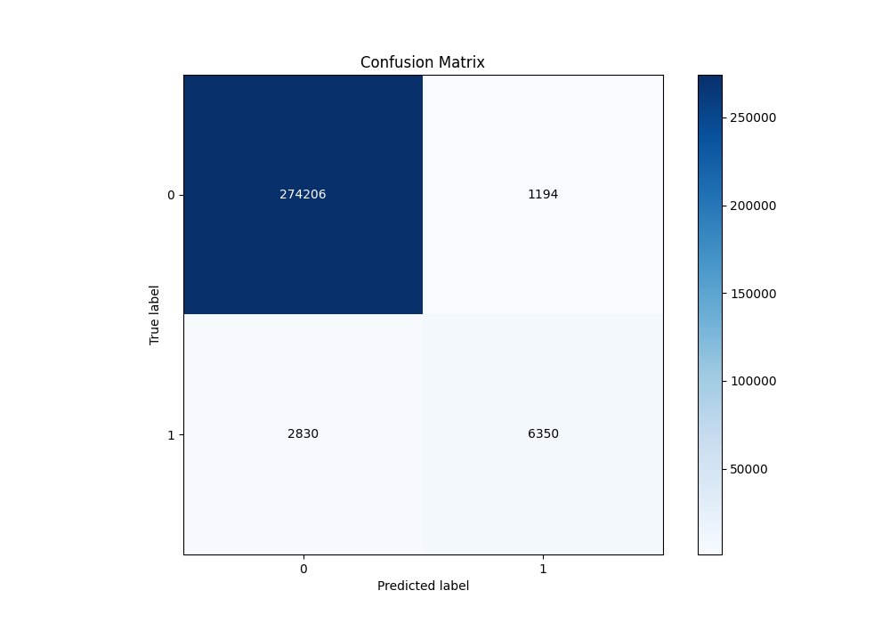
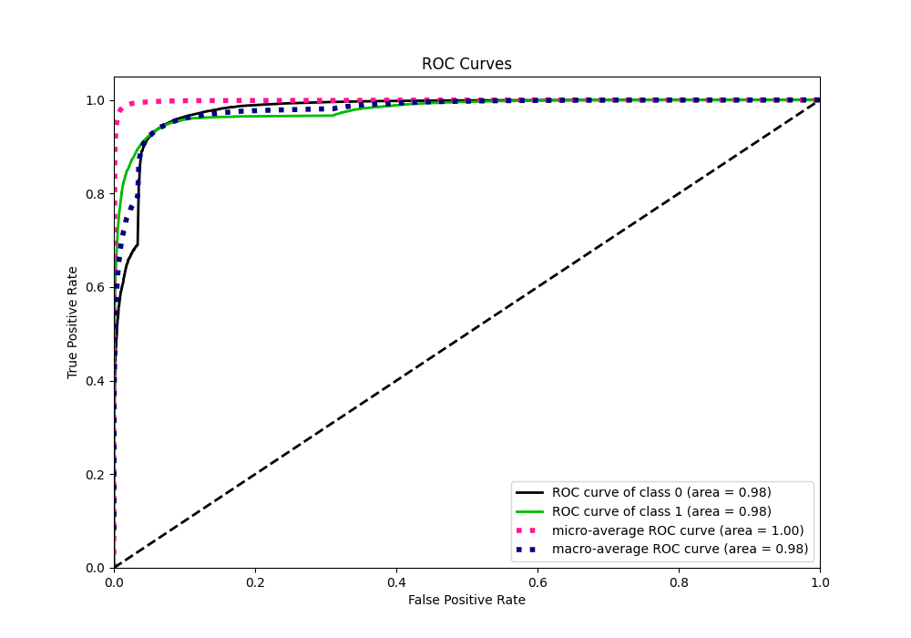
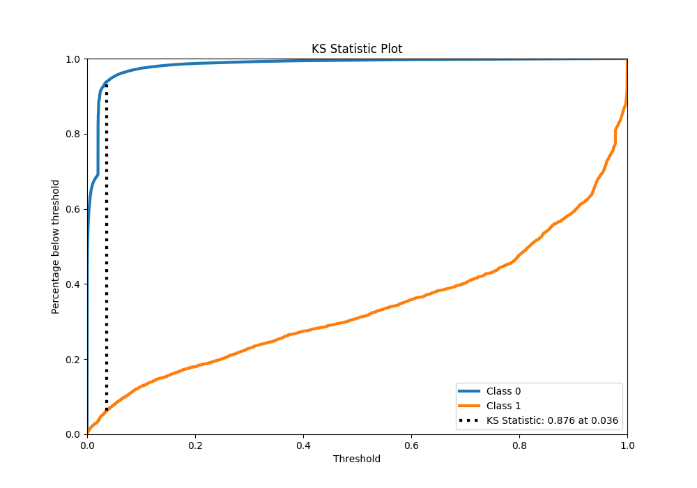
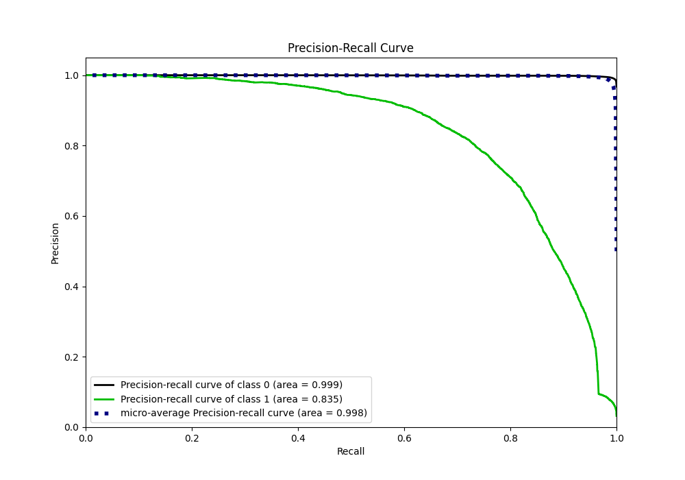
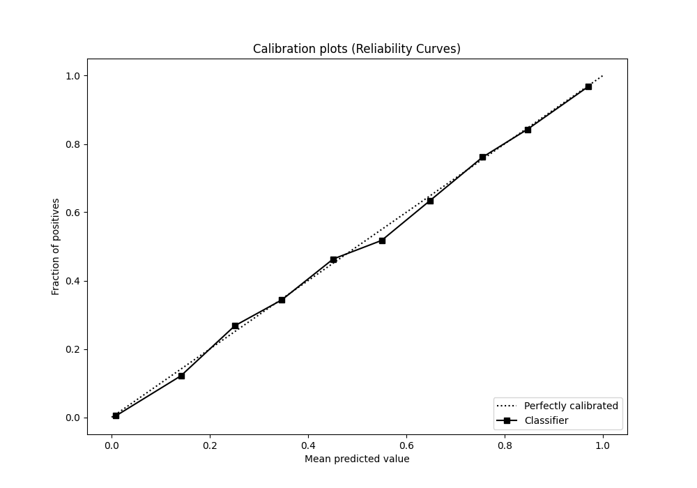
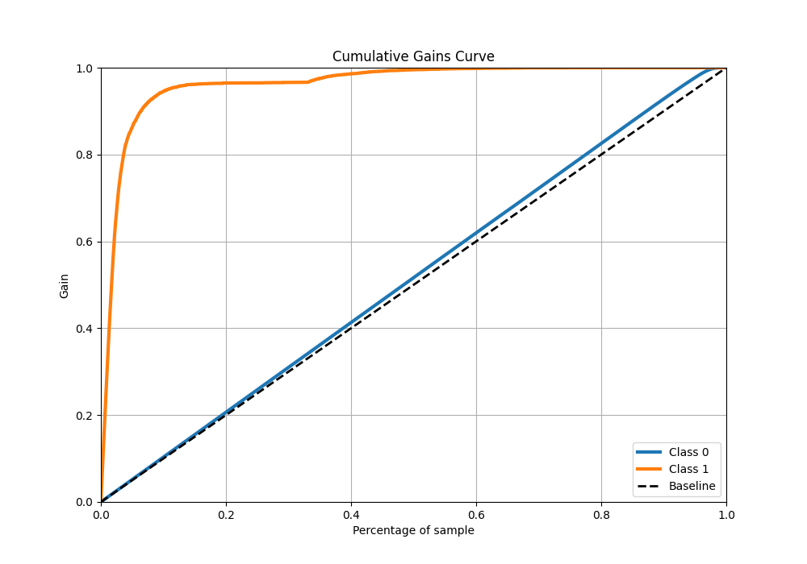
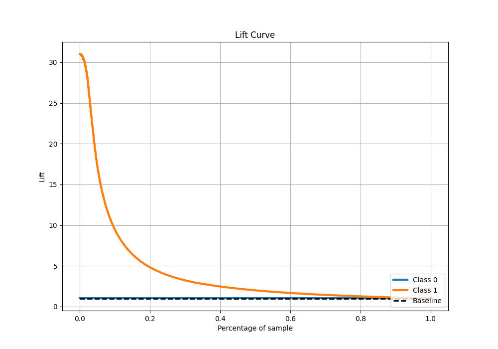

# Summary of 5_Xgboost

[<< Go back](../README.md)

## Extreme Gradient Boosting (Xgboost)
- **n_jobs**: -1
- **objective**: binary:logistic
- **eta**: 0.1
- **max_depth**: 8
- **min_child_weight**: 1
- **subsample**: 1.0
- **colsample_bytree**: 1.0
- **eval_metric**: f1
- **explain_level**: 0

## Validation
 - **validation_type**: kfold
 - **k_folds**: 4
 - **shuffle**: False
 - **stratify**: True

## Optimized metric
f1

## Training time

130.6 seconds

## Metric details
|           |     score |     threshold |
|:----------|----------:|--------------:|
| logloss   | 0.0453313 | nan           |
| auc       | 0.978816  | nan           |
| f1        | 0.766092  |   0.408036    |
| accuracy  | 0.98586   |   0.499228    |
| precision | 0.841729  |   0.499228    |
| recall    | 1         |   2.76566e-06 |
| mcc       | 0.760125  |   0.408036    |

## Metric details with threshold from accuracy metric
|           |     score |   threshold |
|:----------|----------:|------------:|
| logloss   | 0.0453313 |  nan        |
| auc       | 0.978816  |  nan        |
| f1        | 0.759388  |    0.499228 |
| accuracy  | 0.98586   |    0.499228 |
| precision | 0.841729  |    0.499228 |
| recall    | 0.691721  |    0.499228 |
| mcc       | 0.756023  |    0.499228 |

## Confusion matrix (at threshold=0.499228)
|              |   Predicted as 0 |   Predicted as 1 |
|:-------------|-----------------:|-----------------:|
| Labeled as 0 |           274206 |             1194 |
| Labeled as 1 |             2830 |             6350 |

## Learning curves

## Confusion Matrix

## Normalized Confusion Matrix

## ROC Curve

## Kolmogorov-Smirnov Statistic

## Precision-Recall Curve

## Calibration Curve

## Cumulative Gains Curve

## Lift Curve

[<< Go back](../README.md)
