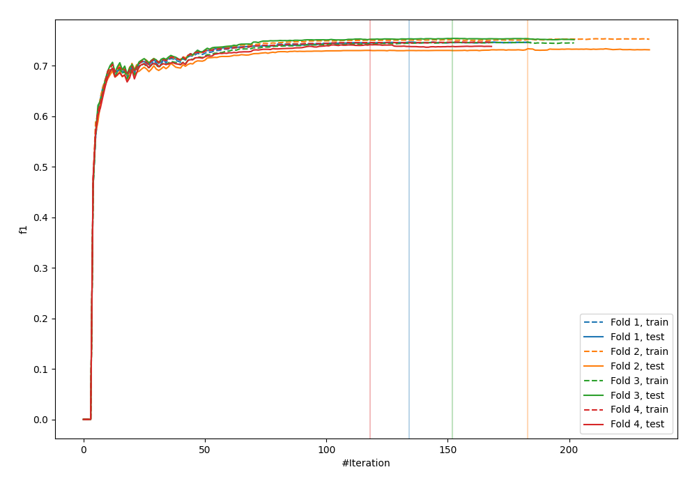
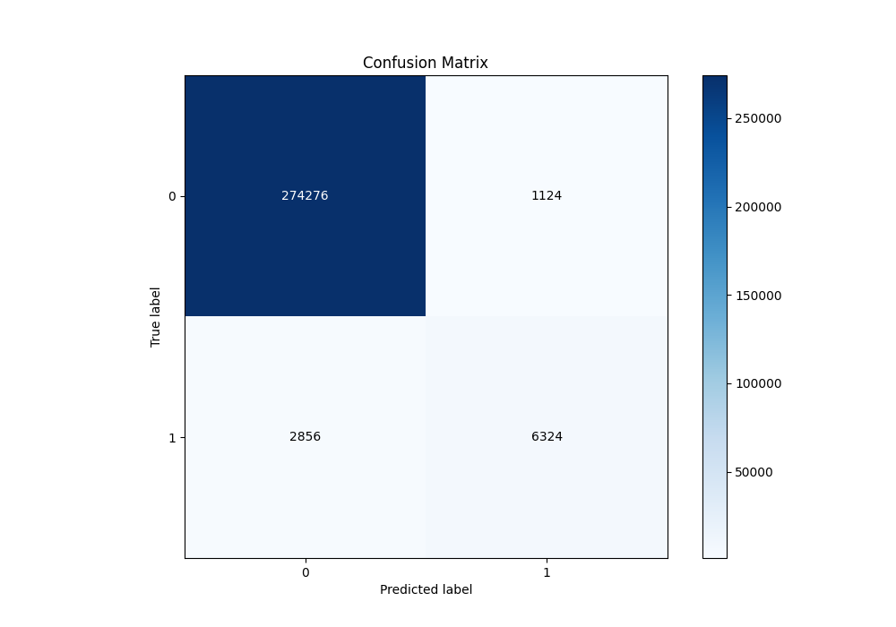
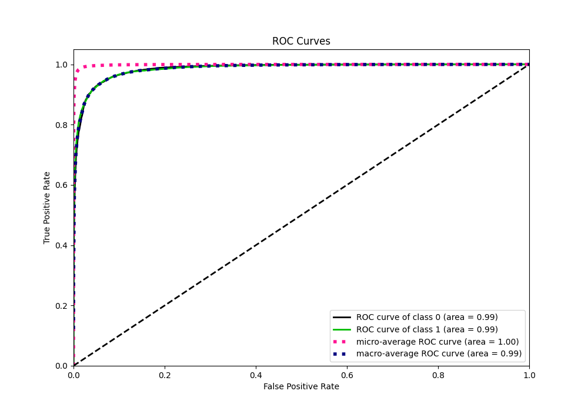
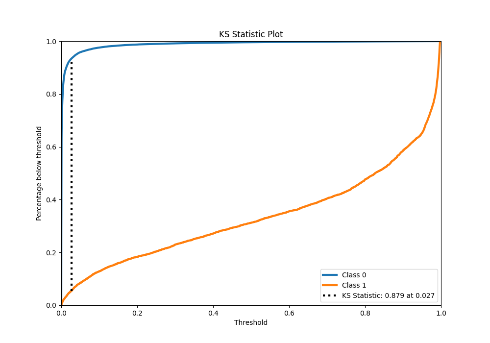
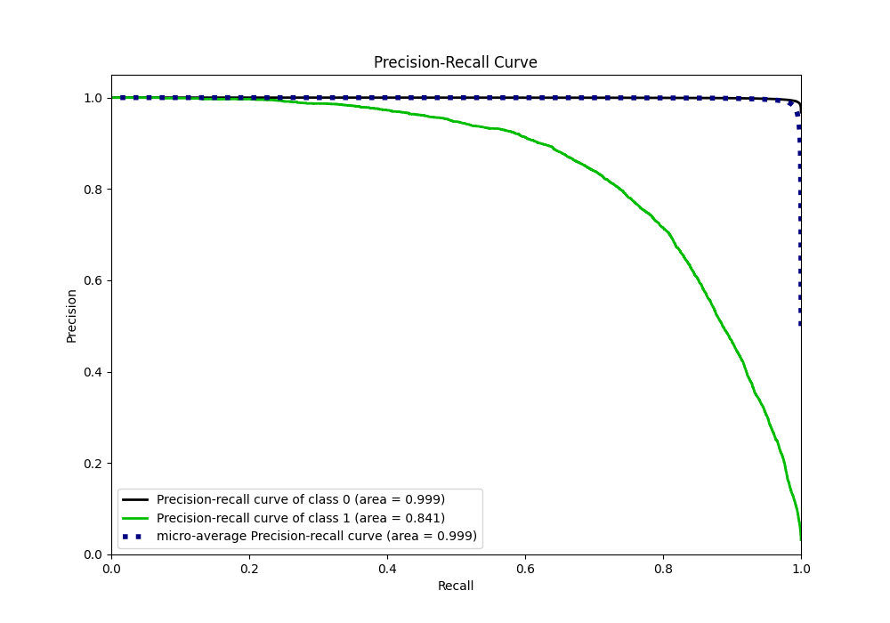
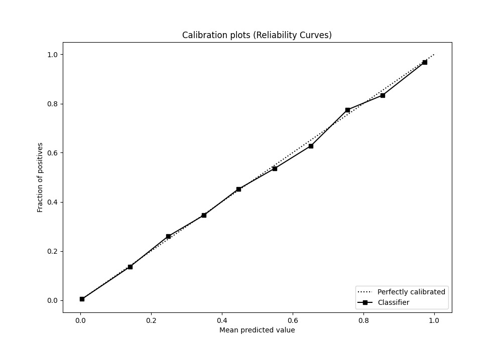
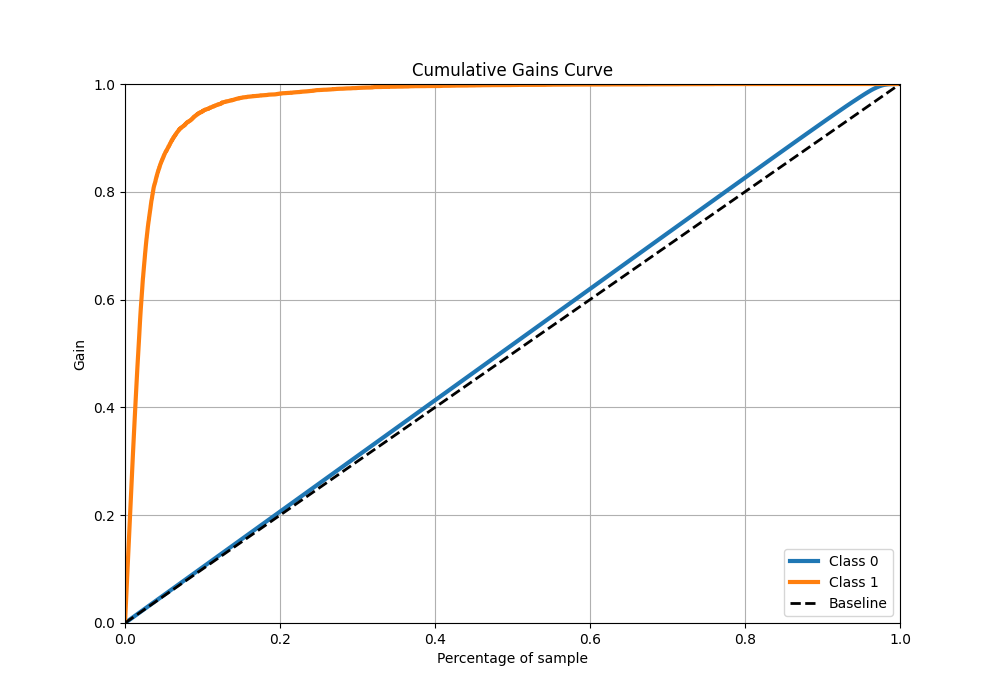
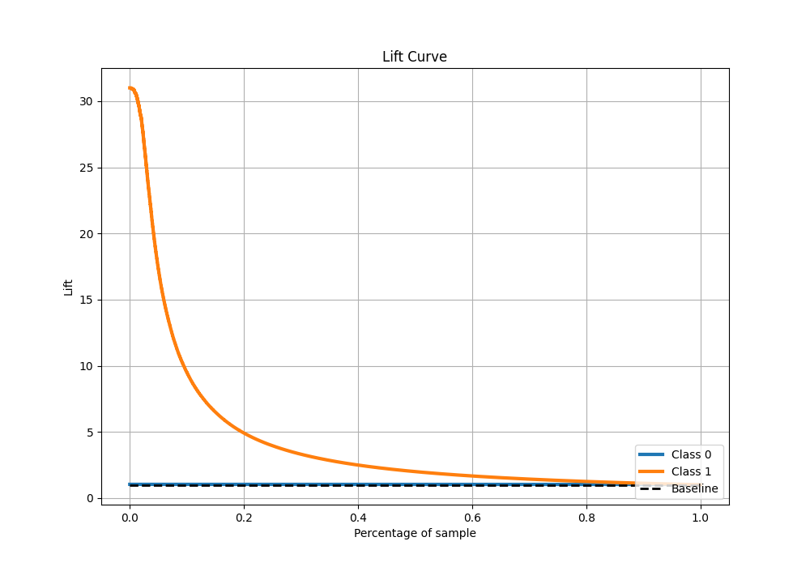

# Summary of 6_Xgboost

[<< Go back](../README.md)

## Extreme Gradient Boosting (Xgboost)
- **n_jobs**: -1
- **objective**: binary:logistic
- **eta**: 0.1
- **max_depth**: 7
- **min_child_weight**: 25
- **subsample**: 0.9
- **colsample_bytree**: 0.6
- **eval_metric**: f1
- **explain_level**: 0

## Validation
 - **validation_type**: kfold
 - **k_folds**: 4
 - **shuffle**: False
 - **stratify**: True

## Optimized metric
f1

## Training time

147.1 seconds

## Metric details
|           |     score |     threshold |
|:----------|----------:|--------------:|
| logloss   | 0.0410388 | nan           |
| auc       | 0.985447  | nan           |
| f1        | 0.767596  |   0.381409    |
| accuracy  | 0.986014  |   0.496886    |
| precision | 0.849087  |   0.496886    |
| recall    | 1         |   1.01778e-05 |
| mcc       | 0.760943  |   0.381409    |

## Metric details with threshold from accuracy metric
|           |     score |   threshold |
|:----------|----------:|------------:|
| logloss   | 0.0410388 |  nan        |
| auc       | 0.985447  |  nan        |
| f1        | 0.760645  |    0.496886 |
| accuracy  | 0.986014  |    0.496886 |
| precision | 0.849087  |    0.496886 |
| recall    | 0.688889  |    0.496886 |
| mcc       | 0.757894  |    0.496886 |

## Confusion matrix (at threshold=0.496886)
|              |   Predicted as 0 |   Predicted as 1 |
|:-------------|-----------------:|-----------------:|
| Labeled as 0 |           274276 |             1124 |
| Labeled as 1 |             2856 |             6324 |

## Learning curves

## Confusion Matrix

## Normalized Confusion Matrix

## ROC Curve

## Kolmogorov-Smirnov Statistic

## Precision-Recall Curve

## Calibration Curve

## Cumulative Gains Curve

## Lift Curve

[<< Go back](../README.md)
