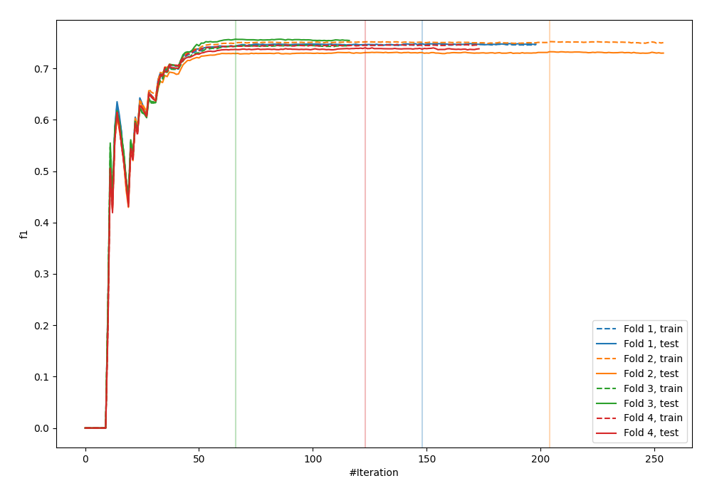
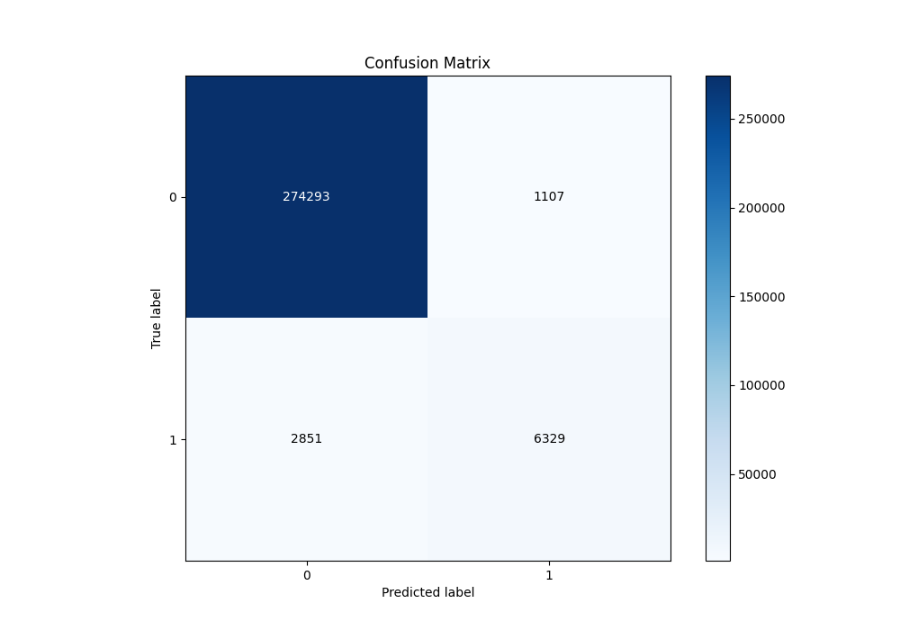
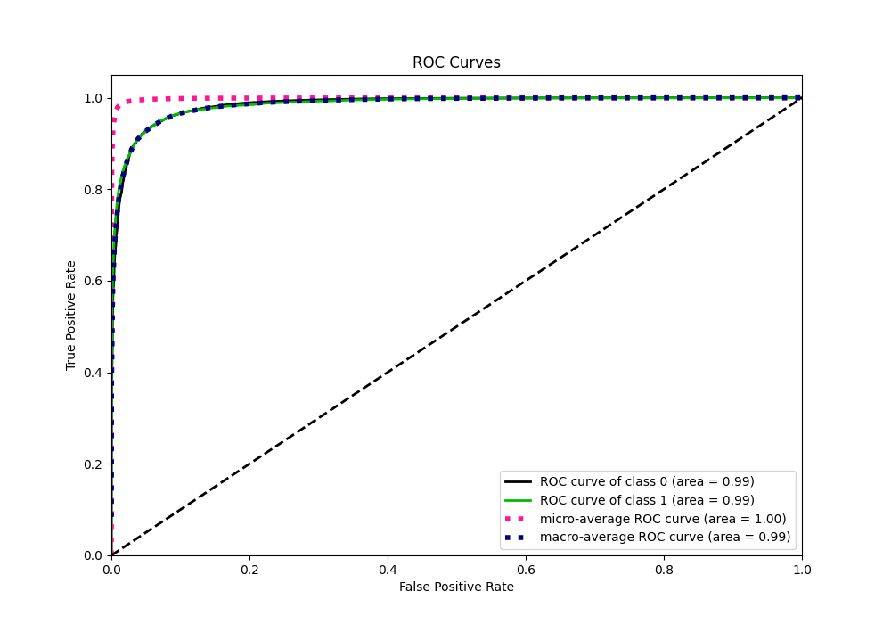
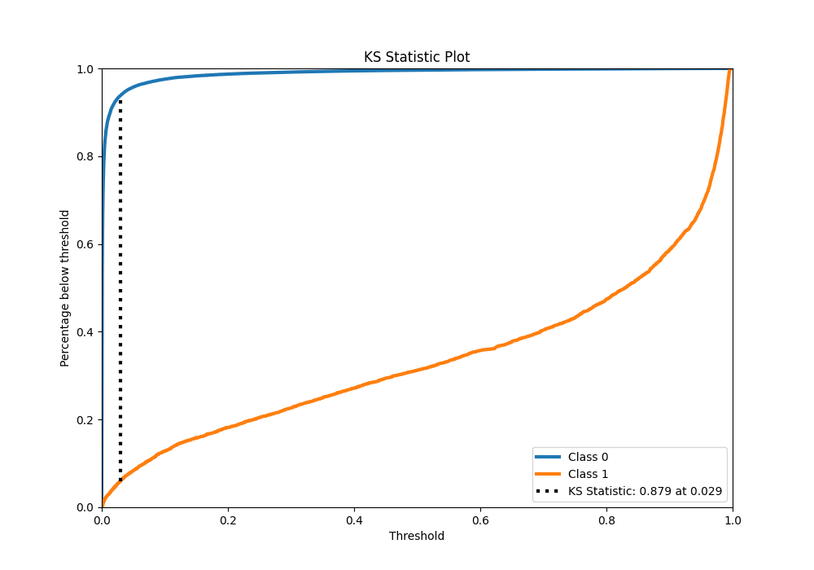
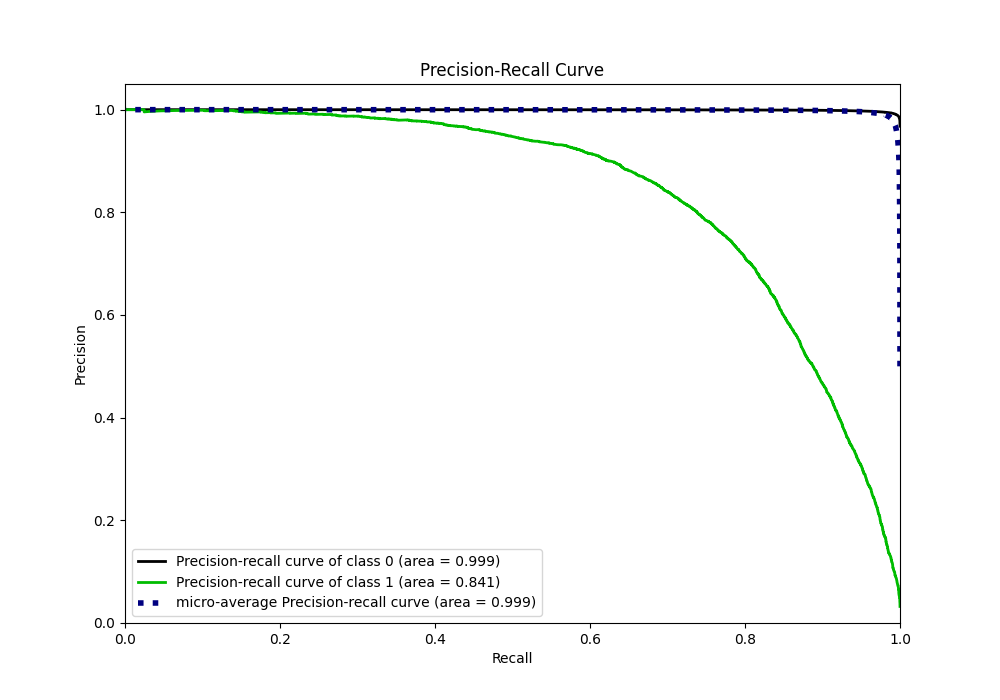
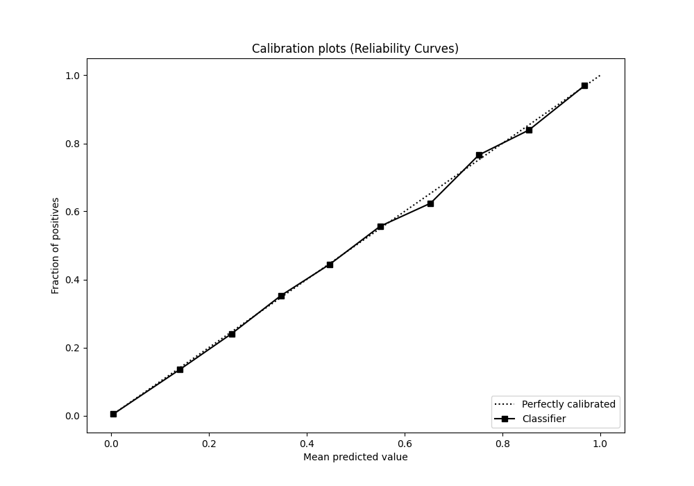
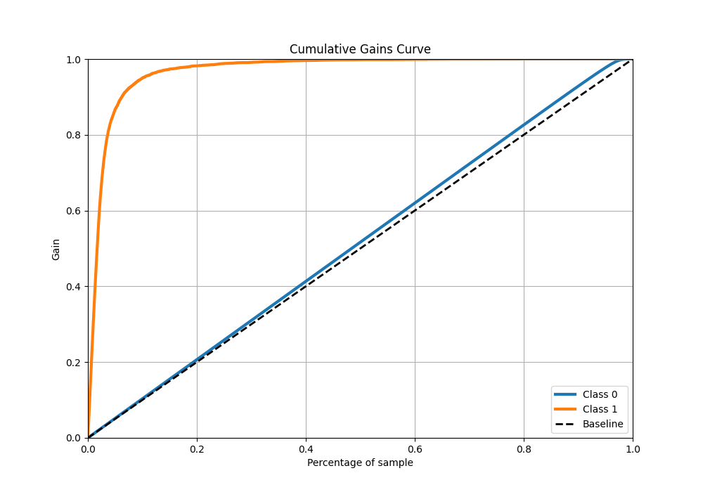
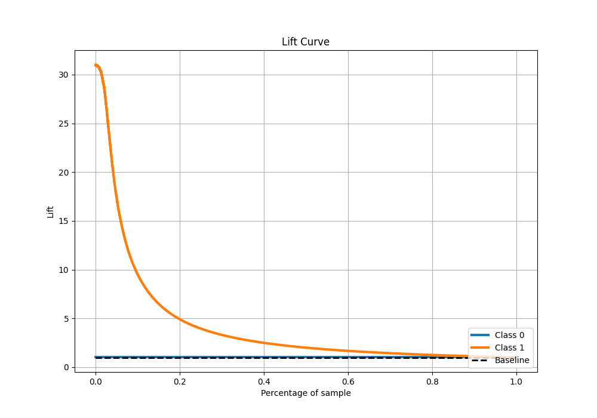

# Summary of 7_Xgboost

[<< Go back](../README.md)

## Extreme Gradient Boosting (Xgboost)
- **n_jobs**: -1
- **objective**: binary:logistic
- **eta**: 0.15
- **max_depth**: 8
- **min_child_weight**: 50
- **subsample**: 0.6
- **colsample_bytree**: 0.6
- **eval_metric**: f1
- **explain_level**: 0

## Validation
 - **validation_type**: kfold
 - **k_folds**: 4
 - **shuffle**: False
 - **stratify**: True

## Optimized metric
f1

## Training time

139.8 seconds

## Metric details
|           |     score |     threshold |
|:----------|----------:|--------------:|
| logloss   | 0.0411095 | nan           |
| auc       | 0.985269  | nan           |
| f1        | 0.767863  |   0.375575    |
| accuracy  | 0.986092  |   0.495669    |
| precision | 0.85113   |   0.495669    |
| recall    | 1         |   1.89782e-05 |
| mcc       | 0.761074  |   0.375575    |

## Metric details with threshold from accuracy metric
|           |     score |   threshold |
|:----------|----------:|------------:|
| logloss   | 0.0411095 |  nan        |
| auc       | 0.985269  |  nan        |
| f1        | 0.761796  |    0.495669 |
| accuracy  | 0.986092  |    0.495669 |
| precision | 0.85113   |    0.495669 |
| recall    | 0.689434  |    0.495669 |
| mcc       | 0.759161  |    0.495669 |

## Confusion matrix (at threshold=0.495669)
|              |   Predicted as 0 |   Predicted as 1 |
|:-------------|-----------------:|-----------------:|
| Labeled as 0 |           274293 |             1107 |
| Labeled as 1 |             2851 |             6329 |

## Learning curves

## Confusion Matrix

## Normalized Confusion Matrix

## ROC Curve

## Kolmogorov-Smirnov Statistic

## Precision-Recall Curve

## Calibration Curve

## Cumulative Gains Curve

## Lift Curve

[<< Go back](../README.md)
