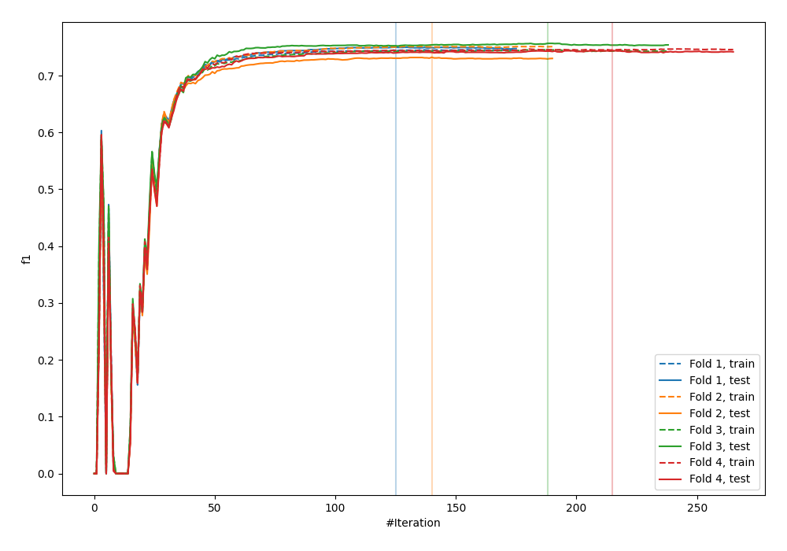
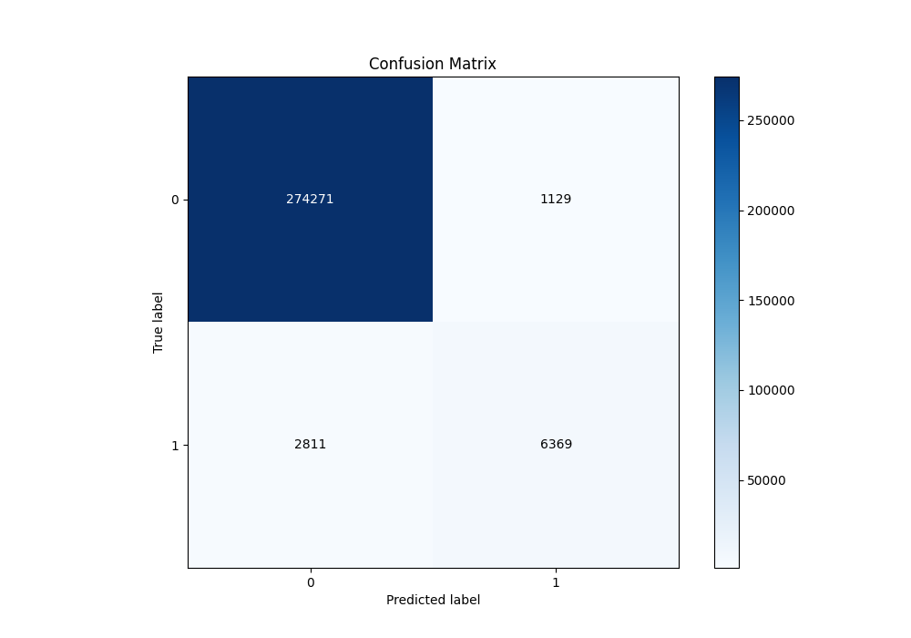
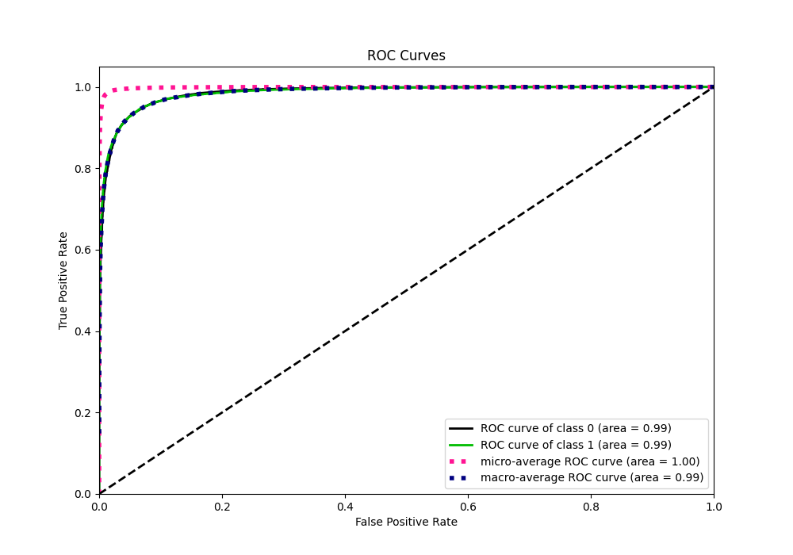
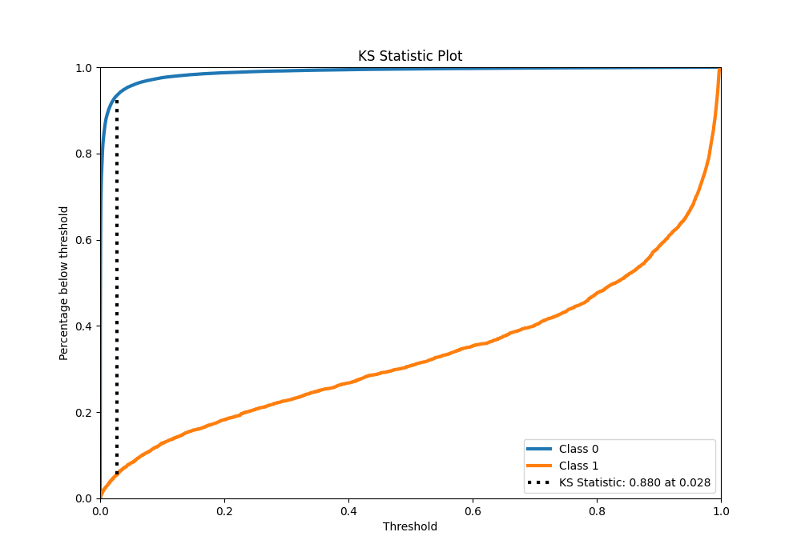
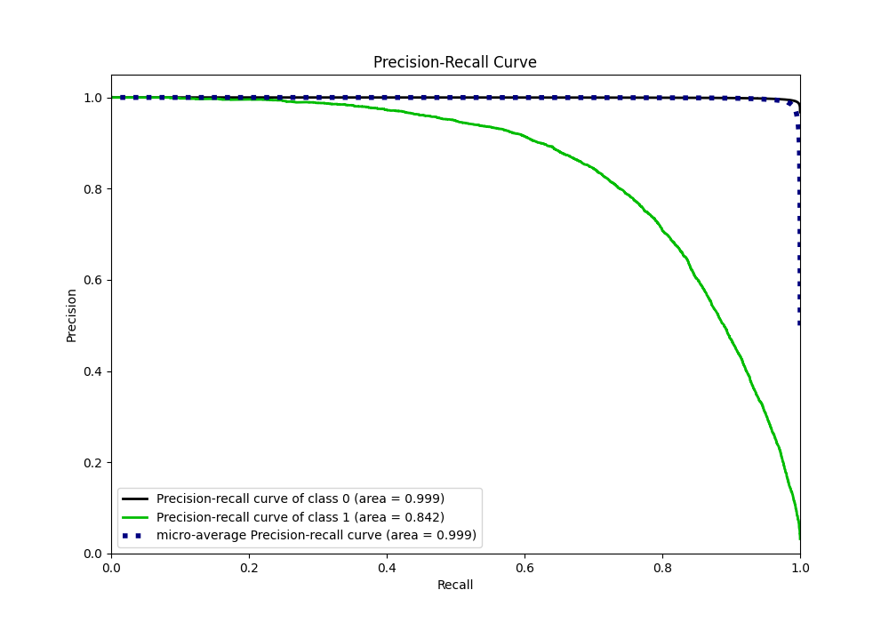
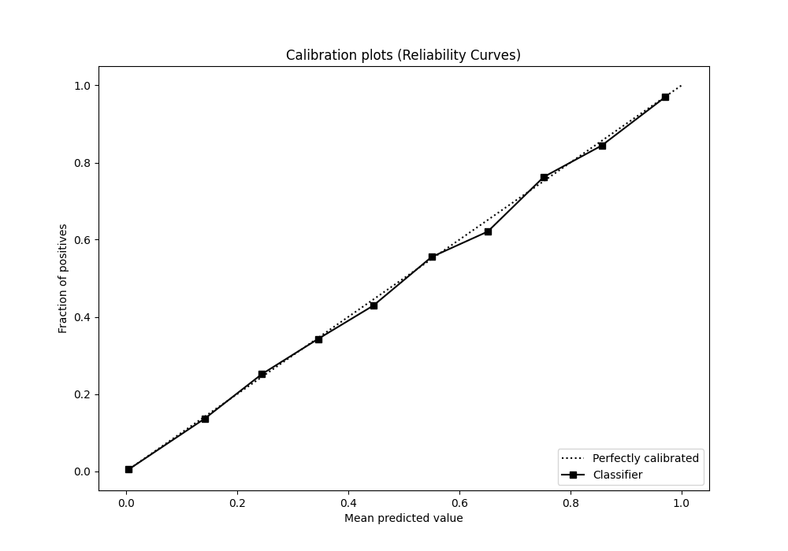
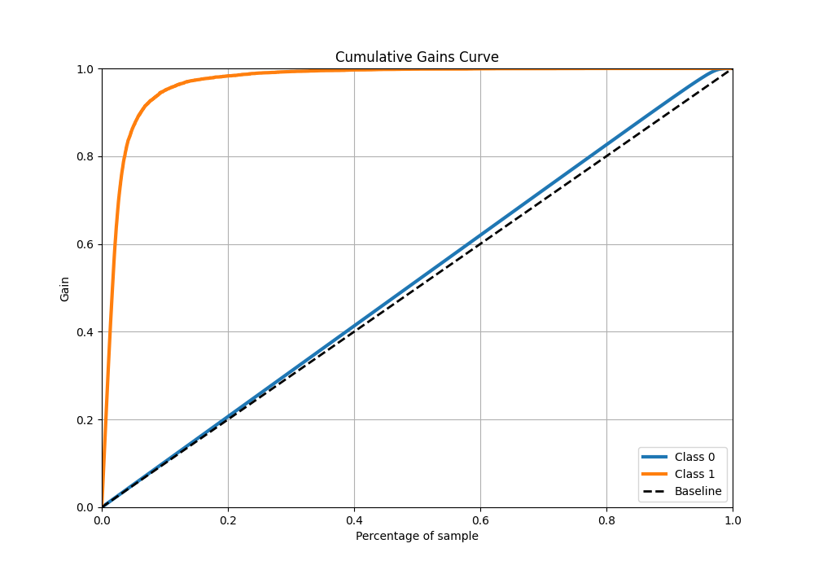
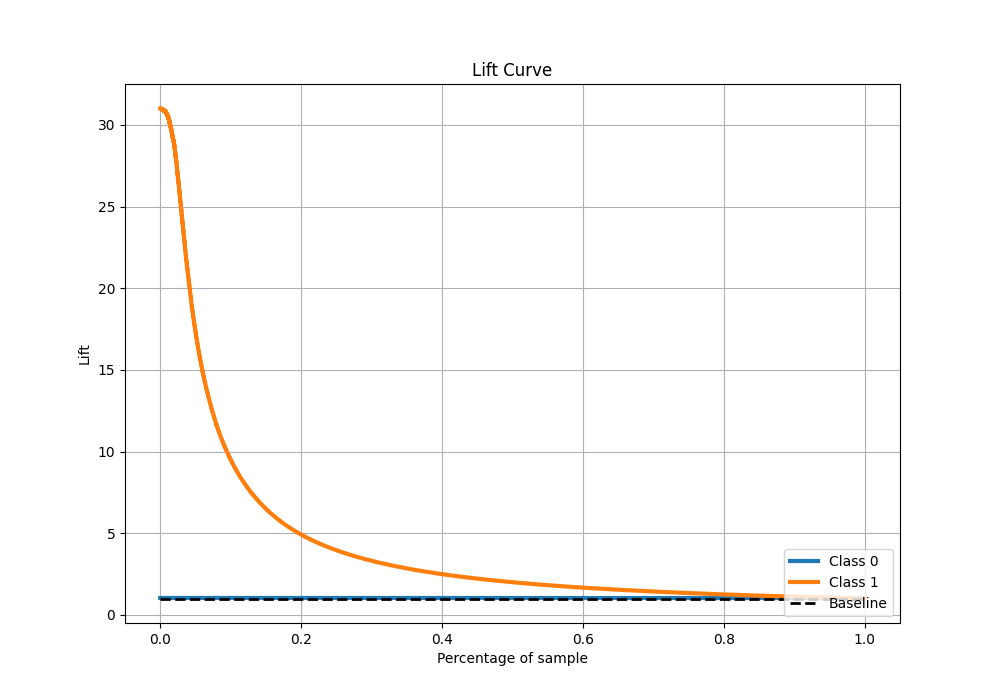

# Summary of 9_Xgboost

[<< Go back](../README.md)

## Extreme Gradient Boosting (Xgboost)
- **n_jobs**: -1
- **objective**: binary:logistic
- **eta**: 0.1
- **max_depth**: 4
- **min_child_weight**: 25
- **subsample**: 0.7
- **colsample_bytree**: 0.7
- **eval_metric**: f1
- **explain_level**: 0

## Validation
 - **validation_type**: kfold
 - **k_folds**: 4
 - **shuffle**: False
 - **stratify**: True

## Optimized metric
f1

## Training time

156.5 seconds

## Metric details
|           |     score |     threshold |
|:----------|----------:|--------------:|
| logloss   | 0.0408637 | nan           |
| auc       | 0.985631  | nan           |
| f1        | 0.76769   |   0.358887    |
| accuracy  | 0.986155  |   0.497096    |
| precision | 0.849427  |   0.497096    |
| recall    | 1         |   1.69669e-05 |
| mcc       | 0.760819  |   0.497096    |

## Metric details with threshold from accuracy metric
|           |     score |   threshold |
|:----------|----------:|------------:|
| logloss   | 0.0408637 |  nan        |
| auc       | 0.985631  |  nan        |
| f1        | 0.763761  |    0.497096 |
| accuracy  | 0.986155  |    0.497096 |
| precision | 0.849427  |    0.497096 |
| recall    | 0.693791  |    0.497096 |
| mcc       | 0.760819  |    0.497096 |

## Confusion matrix (at threshold=0.497096)
|              |   Predicted as 0 |   Predicted as 1 |
|:-------------|-----------------:|-----------------:|
| Labeled as 0 |           274271 |             1129 |
| Labeled as 1 |             2811 |             6369 |

## Learning curves

## Confusion Matrix

## Normalized Confusion Matrix

## ROC Curve

## Kolmogorov-Smirnov Statistic

## Precision-Recall Curve

## Calibration Curve

## Cumulative Gains Curve

## Lift Curve

[<< Go back](../README.md)
