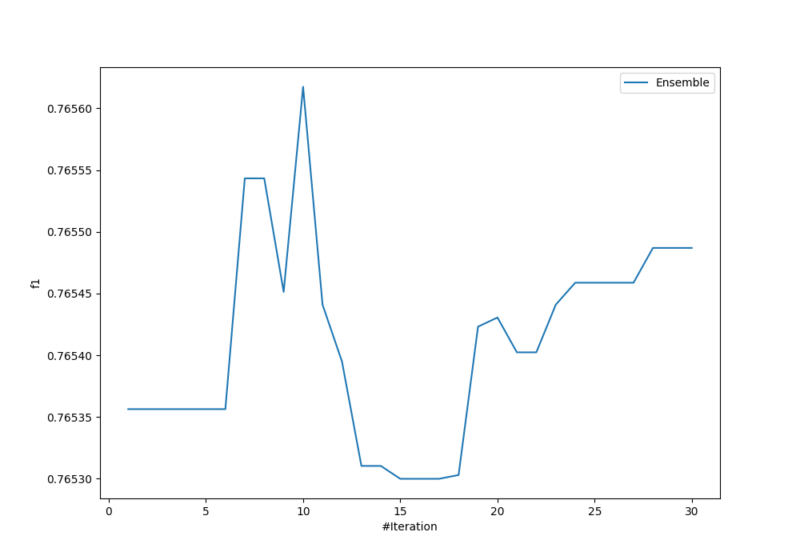
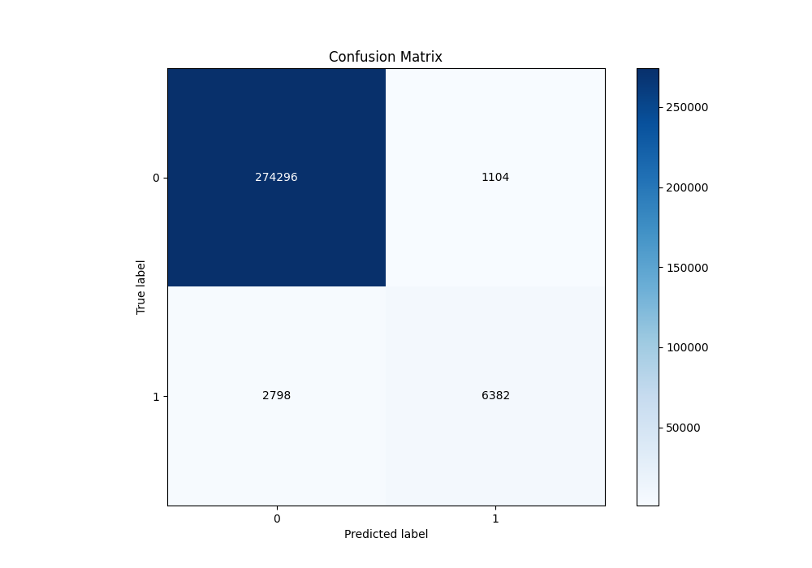
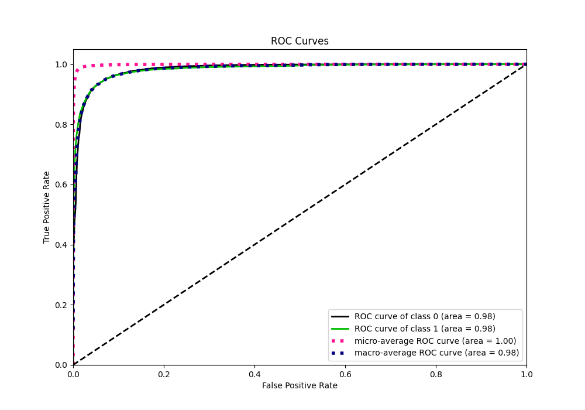
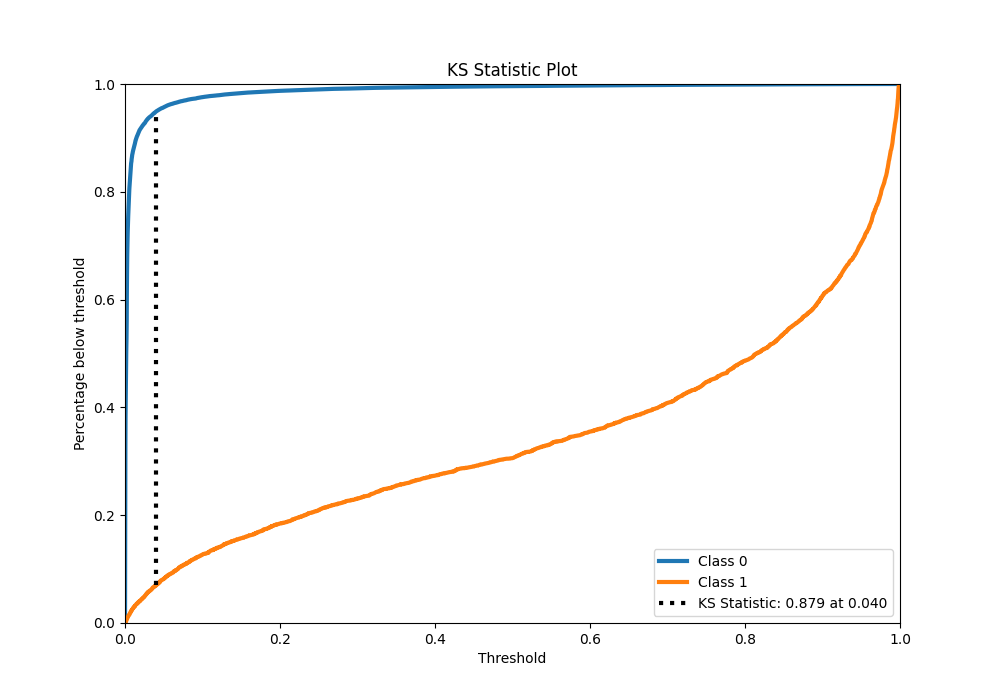
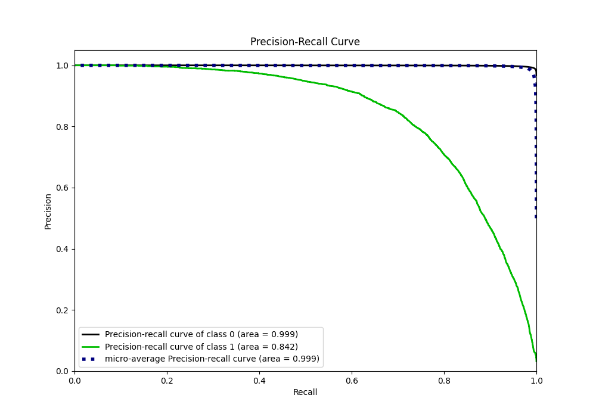
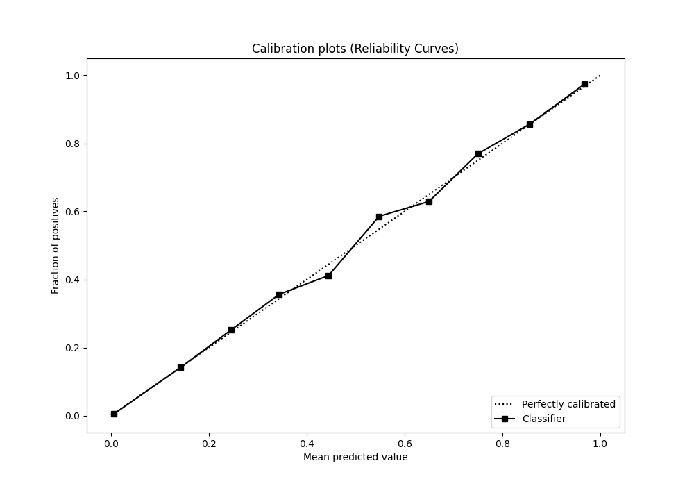
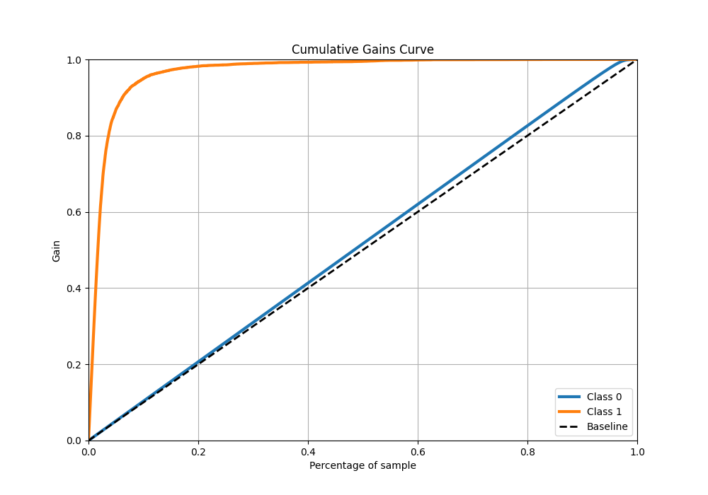
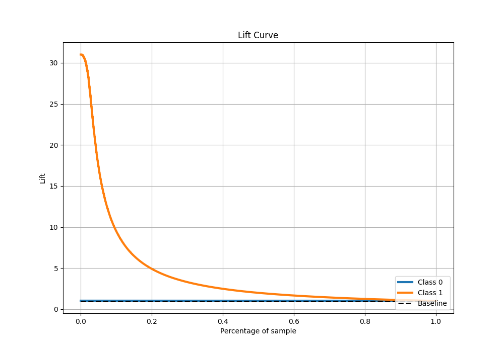

# Summary of Ensemble

[<< Go back](../README.md)

## Ensemble structure
| Model              |   Weight |
|:-------------------|---------:|
| 27_CatBoost        |        1 |
| 29_CatBoost        |        1 |
| 3_Default_CatBoost |        7 |
| 5_Xgboost          |        1 |

## Metric details
|           |     score |     threshold |
|:----------|----------:|--------------:|
| logloss   | 0.0413738 | nan           |
| auc       | 0.984294  | nan           |
| f1        | 0.767841  |   0.362213    |
| accuracy  | 0.986289  |   0.495048    |
| precision | 0.852525  |   0.495048    |
| recall    | 1         |   1.39368e-05 |
| mcc       | 0.763075  |   0.495048    |

## Metric details with threshold from accuracy metric
|           |     score |   threshold |
|:----------|----------:|------------:|
| logloss   | 0.0413738 |  nan        |
| auc       | 0.984294  |  nan        |
| f1        | 0.765871  |    0.495048 |
| accuracy  | 0.986289  |    0.495048 |
| precision | 0.852525  |    0.495048 |
| recall    | 0.695207  |    0.495048 |
| mcc       | 0.763075  |    0.495048 |

## Confusion matrix (at threshold=0.495048)
|              |   Predicted as 0 |   Predicted as 1 |
|:-------------|-----------------:|-----------------:|
| Labeled as 0 |           274296 |             1104 |
| Labeled as 1 |             2798 |             6382 |

## Learning curves

## Confusion Matrix

## Normalized Confusion Matrix

## ROC Curve

## Kolmogorov-Smirnov Statistic

## Precision-Recall Curve

## Calibration Curve

## Cumulative Gains Curve

## Lift Curve

[<< Go back](../README.md)
