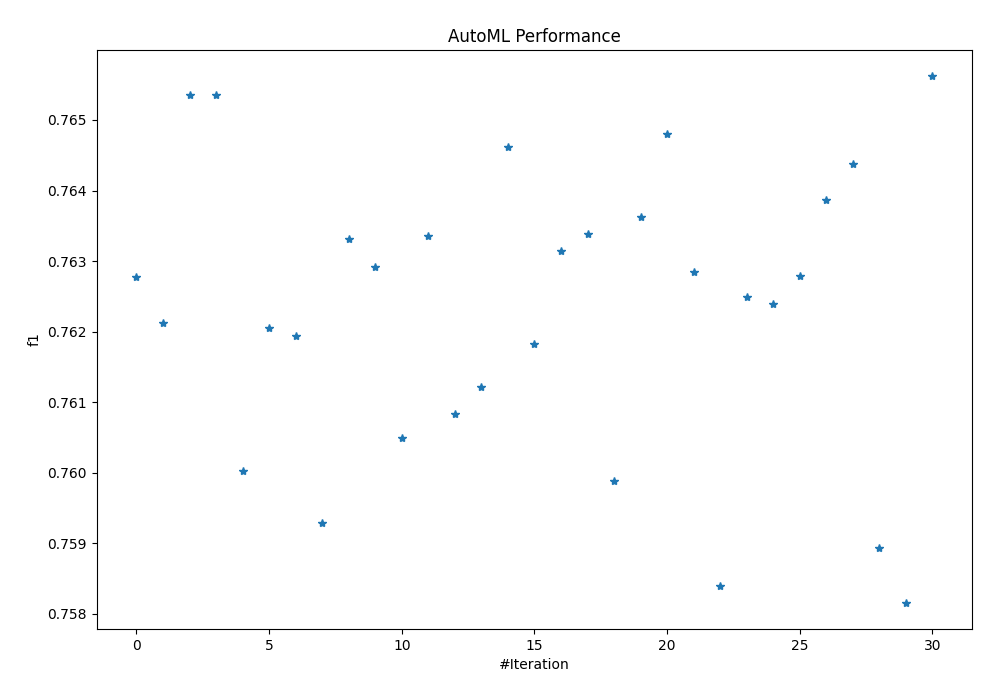
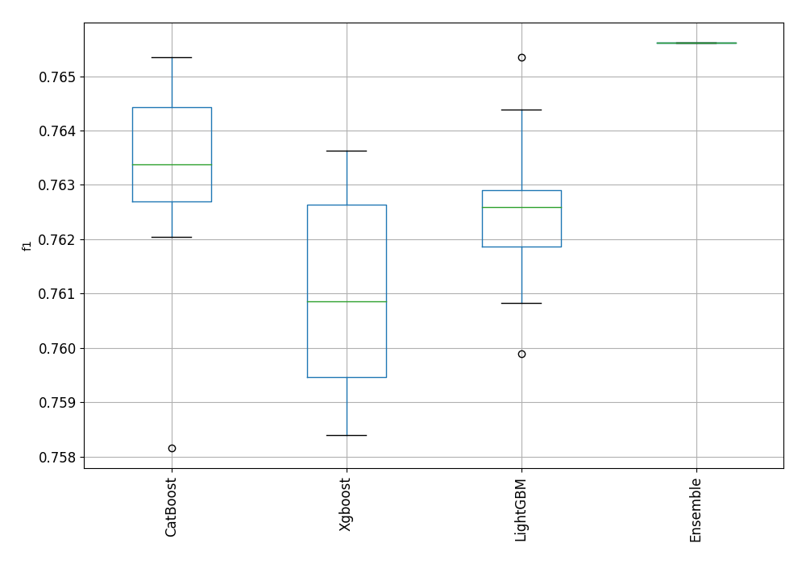
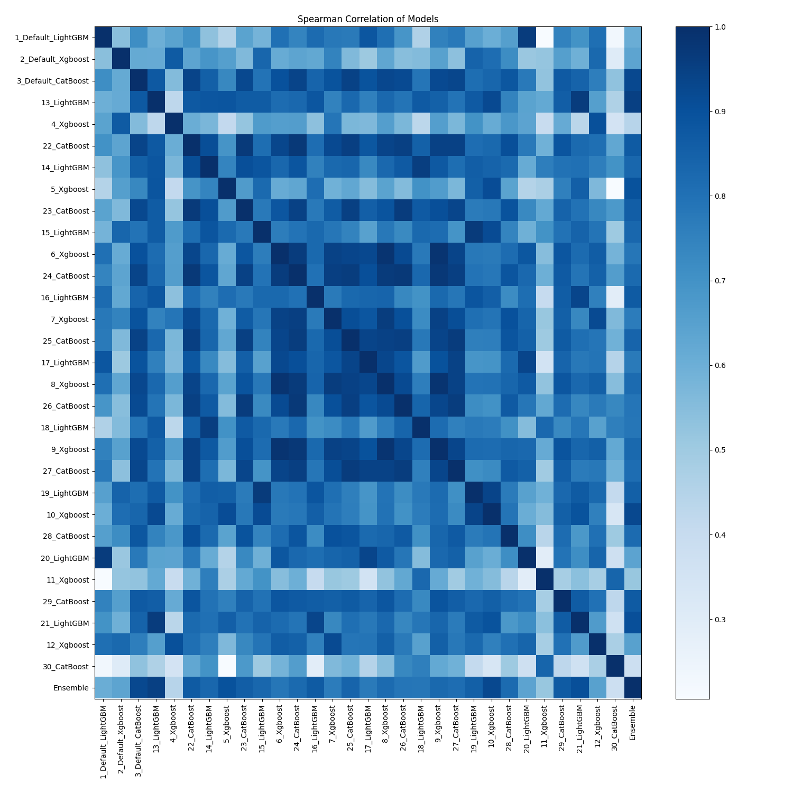

# AutoML Leaderboard

| Best model   | name                                               | model_type   | metric_type   |   metric_value |   train_time |
|:-------------|:---------------------------------------------------|:-------------|:--------------|---------------:|-------------:|
|              | [1_Default_LightGBM](1_Default_LightGBM/README.md) | LightGBM     | f1            |       0.762782 |       130.73 |
|              | [2_Default_Xgboost](2_Default_Xgboost/README.md)   | Xgboost      | f1            |       0.762128 |       111.62 |
|              | [3_Default_CatBoost](3_Default_CatBoost/README.md) | CatBoost     | f1            |       0.765356 |        73.37 |
|              | [13_LightGBM](13_LightGBM/README.md)               | LightGBM     | f1            |       0.765351 |       149.07 |
|              | [4_Xgboost](4_Xgboost/README.md)                   | Xgboost      | f1            |       0.760019 |       123.34 |
|              | [22_CatBoost](22_CatBoost/README.md)               | CatBoost     | f1            |       0.762048 |        97.53 |
|              | [14_LightGBM](14_LightGBM/README.md)               | LightGBM     | f1            |       0.761945 |        94.81 |
|              | [5_Xgboost](5_Xgboost/README.md)                   | Xgboost      | f1            |       0.759285 |       132.18 |
|              | [23_CatBoost](23_CatBoost/README.md)               | CatBoost     | f1            |       0.763316 |        82.2  |
|              | [15_LightGBM](15_LightGBM/README.md)               | LightGBM     | f1            |       0.762914 |       139.92 |
|              | [6_Xgboost](6_Xgboost/README.md)                   | Xgboost      | f1            |       0.760494 |       148.69 |
|              | [24_CatBoost](24_CatBoost/README.md)               | CatBoost     | f1            |       0.763361 |        91.38 |
|              | [16_LightGBM](16_LightGBM/README.md)               | LightGBM     | f1            |       0.760832 |       132.93 |
|              | [7_Xgboost](7_Xgboost/README.md)                   | Xgboost      | f1            |       0.761216 |       141.42 |
|              | [25_CatBoost](25_CatBoost/README.md)               | CatBoost     | f1            |       0.764618 |        70    |
|              | [17_LightGBM](17_LightGBM/README.md)               | LightGBM     | f1            |       0.76183  |        86.55 |
|              | [8_Xgboost](8_Xgboost/README.md)                   | Xgboost      | f1            |       0.763142 |       138.42 |
|              | [26_CatBoost](26_CatBoost/README.md)               | CatBoost     | f1            |       0.76338  |        71.73 |
|              | [18_LightGBM](18_LightGBM/README.md)               | LightGBM     | f1            |       0.759886 |       164.68 |
|              | [9_Xgboost](9_Xgboost/README.md)                   | Xgboost      | f1            |       0.763632 |       158.22 |
|              | [27_CatBoost](27_CatBoost/README.md)               | CatBoost     | f1            |       0.764808 |        71.99 |
|              | [19_LightGBM](19_LightGBM/README.md)               | LightGBM     | f1            |       0.762851 |       134.87 |
|              | [10_Xgboost](10_Xgboost/README.md)                 | Xgboost      | f1            |       0.758392 |       171.95 |
|              | [28_CatBoost](28_CatBoost/README.md)               | CatBoost     | f1            |       0.762485 |        95.25 |
|              | [20_LightGBM](20_LightGBM/README.md)               | LightGBM     | f1            |       0.762396 |       118.43 |
|              | [11_Xgboost](11_Xgboost/README.md)                 | Xgboost      | f1            |       0.762796 |       103.11 |
|              | [29_CatBoost](29_CatBoost/README.md)               | CatBoost     | f1            |       0.76386  |        79.72 |
|              | [21_LightGBM](21_LightGBM/README.md)               | LightGBM     | f1            |       0.764382 |       141.98 |
|              | [12_Xgboost](12_Xgboost/README.md)                 | Xgboost      | f1            |       0.758932 |       195.26 |
|              | [30_CatBoost](30_CatBoost/README.md)               | CatBoost     | f1            |       0.758161 |       103.79 |
| **the best** | [Ensemble](Ensemble/README.md)                     | Ensemble     | f1            |       0.765617 |       108.94 |

### AutoML Performance

### AutoML Performance Boxplot

### Spearman Correlation of Models

